 
# 25 high-yield graph-theory proofs

Hub: [[Graph Theory]] · Source notes: [[Revision Sheet]] · Ranking: [[Bare Minimum]] · Non-proof questions: [[Short Questions]]

This is one write-from-memory proof bank for the questions most likely to be set, selected from the dated class notes and Tutorial 1. In every question, G is a finite simple graph unless the question says otherwise.

Questions 1 to 15 cover everything up to 19 August, which was the declared scope of the 12 September quiz. Questions 16 to 22 are the connectivity block from the 31 August class, taught before that quiz but deliberately left off it, so they are the one part of the course that has been taught and never assessed. Questions 23 to 25 were added afterwards, because two of them turned out to be on the quiz and were missing here. The section at the end records what the quiz asked.

## Notation used repeatedly

The short list is below. The full one is at the very end of the file, under "Everything in one place": every term with a one line definition, every formula, and every named theorem stated in a line. Go there when you want to look something up rather than read a proof.

- n = ∣V(G)∣, m = ∣E(G)∣, and δ(G) is the minimum degree.
- A matching M is a set of pairwise vertex-disjoint edges. A vertex is free when no edge of M touches it.
- N(S) is the set of all neighbours of vertices in S.
- α′(G) is the size of a largest matching; β(G) is the size of a smallest vertex cover.
- odd(H) is the number of connected components of H having an odd number of vertices.
- κ(G) is the vertex connectivity and λ(G) the edge connectivity. A cut vertex is one whose deletion increases the number of components.
- Two x to y paths are internally vertex disjoint when the only vertices they share are x and y.
- Subdividing an edge ab means replacing it by a new vertex w with the two edges aw and wb. Suppressing w is the reverse.

How the two direction proofs are labelled. For a statement of the form "if and only if", the forward direction assumes the left hand side and proves the right hand side, and the backward direction goes the other way. Each two direction question below writes both statements out in full rather than naming them with letters, because P and Q are already taken: in questions 2, 3, 12, 17 and 18 they are the names of paths. Every question below that has two directions opens with a short note saying what each one assumes and what it has to produce, and each claim heading says which direction it belongs to. Watch for two traps. Some proofs take the directions in the opposite order to the statement, and some prove a direction by contrapositive, which means the claim looks like it is proving the reverse. Both are flagged where they happen.

---

## Three tiers for the midsem, with the asked questions taken out

Twenty five is more than anyone revises properly, so here they are cut down and ranked for the midsem specifically.

Four questions are off the list because the 12 September paper already used them. Questions do not repeat, so question 6 Berge, question 8 Hall, question 24 the β vertices and question 25 the even cycle bound are all spent as predictions.

Off the list is not the same as do not know. Question 7 cannot be proved without Berge, and question 9 cannot be proved without Hall. Both remain prerequisites, and you will meet them inside other proofs whether or not they are ever set again. What has gone is only the chance of being asked for them by name.

Two more get demoted rather than removed, because the examiner has just mined the ground next to them. Question 23 is what question 24 strengthens, and question 24 was on the paper. Question 2 is question 25 read backwards, and question 25 was on the paper. Neither is worth a full pass now.

Three things drive what is left. A midsem normally covers everything taught so far, so the whole course is back in scope and the quiz's 19 August cut off no longer protects you. Connectivity is the one block that has been taught and never assessed, so it is overdue and weighted up throughout. And some of these proofs are six lines while others take an hour, and both earn the same.

Every question heading further down carries its tier as stars, so you can see where you are without coming back here. Three stars is tier one, two stars is tier two, one star is tier three. The four that were already asked carry a note instead of stars, since a tier would be misleading for them.

### Tier one, six questions, learn these properly

Full write ups, both directions, able to reproduce the figures from memory.

| Q | Why it is in tier one |
|---|---|
| 18 Whitney | The flagship of the untested block, and question 20 cannot start without it. |
| 7 König | The one big matchings theorem the quiz left standing, and the hinge between matchings and covers. |
| 22 Open ear decomposition | Named on the syllabus as its own topic, untested, and both directions are about ten lines. |
| 13 Tutte | The largest named theorem never assessed. Learn the statement, the bad set idea and the easy direction first; the hard direction can wait for tier two time. |
| 21 Blocks and the block tree | Short, quotable, untested, and the definition is a trap worth having straight. |
| 16 Minimum degree forces connectedness | Three lines of counting, it opens the connectivity block, and it earns what Tutte earns. |

### Tier two, seven questions, know the argument without drilling it

Able to say what the proof does and write its skeleton, without having rehearsed every line.

Ranked inside the tier, because seven is still too many to treat as one lump. The order runs connectivity first, since that is the untested block, then the shared machinery, then the early course named theorems, then the corollaries.

| Order | Q | Why it sits here |
|---|---|---|
| 1 | 20 Subdivision, and what it buys | Untested block, follows straight on from Whitney, and one trick gives four results. The lowest cost per result in the file. Do it in the same sitting as question 18. |
| 2 | 19 Adding a vertex | Untested block, two cases of a few lines each, and question 22 in tier one leans on it. The cheapest way to make a tier one question easier. |
| 3 | 3 Long path theorem | Not connectivity, but it is the extremal engine the whole course runs on, and question 17 is the same proof again. Machinery pays twice. |
| 4 | 17 Dirac | A named theorem from the connectivity class. It is question 3 plus one claim, so done in the same sitting as question 3 it costs almost nothing. |
| 5 | 5 Euler circuits | Named theorem, untested, and the maximal trail proof is short. Below the others only because it is 27 July material and the course has plainly moved on. |
| 6 | 9 Regular bipartite graphs | Counting a set from both ends is the most reused argument in the matchings unit, and that reuse is the real value. As a question on its own it is less likely, since the paper already took two from matchings. |
| 7 | 14 Petersen | Not a proof of its own, just a verification of Tutte's condition. Last on its own merits, but nearly free once question 13 is done. |

Three of these seven are riders rather than separate jobs. Question 20 rides on 18, question 17 rides on 3, and question 14 rides on 13. Attach each to its parent and you get three of the tier for very little extra, which is most of the reason the tier is ordered this way.

### Tier three, eight questions, the one line table is enough

Learn these from the recall table at the end of the file rather than from the full write ups. For each of them the one line is close to the entire proof.

| Q | Why it is in tier three |
|---|---|
| 23 A vertex in every maximum matching | Demoted, not weak. Question 24 strengthens it and question 24 was on the paper. |
| 2 Minimum degree three gives an even cycle | Demoted for the same reason. Question 25 is this read backwards and was on the paper. |
| 12 Two longest paths meet | One pigeonhole step. |
| 15 Girth at least five | One counting step, and the Petersen graph is the whole of the example. |
| 4 Bipartite graphs and odd cycles | Colour by parity, both directions, and you already use it everywhere. |
| 1 Handshake lemma | Count vertex and edge pairs two ways. Nothing else to it. |
| 10 Induced P₃ | Three lines. |
| 11 Shortest paths are induced | Two lines. |

The one thing not to do is read in numerical order. Questions 1 to 15 were written against the quiz's scope, which is not the midsem's.

The one thing not to do is read in numerical order. Questions 1 to 15 were written against the quiz's scope, which is not the midsem's.

---

## The proof techniques used in this file

Eight patterns cover all twenty two questions, and each question names its own under "How the proof runs". Learn to tell them apart, because writing "suppose not" at the top of a proof that is really a direct construction loses marks and wastes time.

Direct. Assume the hypothesis and walk forward to the conclusion. Nothing is assumed false along the way.

Double counting. Count one single quantity in two different ways, then set the answers equal or compare them. Questions 1, 9, 15 and 16.

Contradiction. Assume the conclusion is false, derive something impossible, and conclude it was true after all. You end on a sentence like "which is impossible". Questions 11, 12, 13, 16 and 21.

Contrapositive. Instead of proving "if P then Q", prove "if not Q then not P". Questions 6 and 8.

Those last two get mixed up constantly, so here is the difference. In a contrapositive you assume not Q and honestly walk forward to not P, and nothing impossible ever happens; it is a direct proof of a rearranged statement. In a contradiction you assume P and not Q at the same time and crash into something false. If your proof never crashes, it was a contrapositive, and you should say so at the top rather than calling it a contradiction.

Induction. Prove a base case, assume the statement for smaller instances, extend to the next. Only two questions here use it: 18, inducting on the distance between two vertices, and 22, inducting on the number of ears. Say out loud what you are inducting on, because in this course it is almost never n.

Extremal choice. Take a longest path, a maximal trail, a shortest connector, a maximal counterexample, then ask what the fact that it cannot be improved forces. Questions 2, 3, 5, 12, 13 and 17. This is the signature technique of the whole course.

Construction. Build the object the theorem asks for, explicitly, rather than arguing it must exist. Questions 4, 6, 7, 8 and 22.

Case analysis. Split into cases that between them cover everything, and handle each. Questions 3, 7, 13, 14, 18, 19 and 20. The marks are in checking the cases really do cover everything.

### Which questions lean on which

Four of these are not self contained, so do not attempt them before the one they need.

Question 8 uses König from question 7. Question 9 uses Hall from question 8. Question 14 checks Tutte's condition from question 13 rather than proving anything from scratch. Question 20 uses Whitney from question 18. Question 17 does not strictly depend on question 3, but it repeats its machinery, so do 3 first regardless.

---

## 1. Handshake lemma and the odd-degree corollary ★☆☆

> Question. Prove that Σ deg(v) = 2m over all vertices v. Deduce that the number of odd-degree vertices is even.

Symbols here. V(G) is the vertex set and E(G) the edge set. deg(v) counts the edges touching the vertex v, and m = ∣E(G)∣ is the total number of edges. Σ over v means add the quantity up over every vertex of G. An incidence is a pair consisting of a vertex and an edge touching it.

How the proof runs. Direct, by double counting. You count one set, the vertex and edge incidences, in two different ways and set the answers equal. Claim 1.2 is direct too: split the sum by parity and read off what is left. No induction and no contradiction anywhere.

### Claim 1.1 — Handshake lemma

> Claim. The sum of all vertex degrees is 2m.

Proof. Count incidences of the form “a vertex is an end of an edge” in two ways.

- Counting vertex by vertex gives Σ deg(v), since a vertex contributes once for every incident edge.
- Counting edge by edge gives 2m, since every edge has exactly two ends.

These count the same set of incidences, so Σ deg(v) = 2m.

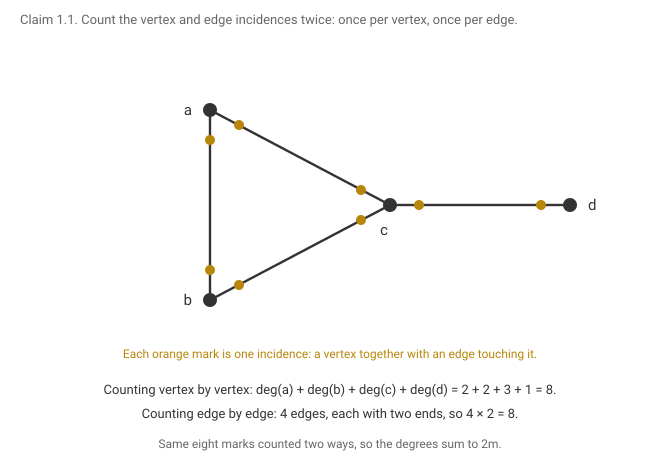

Running example for question 1: a triangle abc with a pendant d. Every orange mark is one incidence. Eight of them, counted either way.

### Claim 1.2 — Odd-degree vertices occur in pairs

> Claim. The number of vertices of odd degree is even.

Proof. By Claim 1.1, the sum of all degrees is even. The sum of the even degrees is even. Therefore the sum of the odd degrees is also even. A sum of an odd number of odd integers is odd, so there must be an even number of odd degrees.

Therefore both statements hold.

---

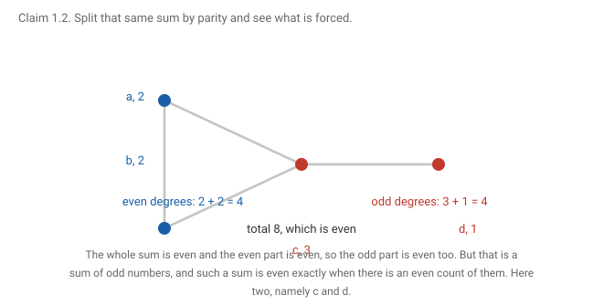

The same graph, now split by parity. Two odd degree vertices, c and d, and two is even.

## 2. Minimum degree at least three gives an even cycle ★☆☆

> Question. Prove that if δ(G) ≥ 3, then G contains an even cycle.

Symbols here. δ(G) is the minimum degree, the smallest number of neighbours any one vertex has. P = v₀v₁…vᵣ is a path, v₀ and vᵣ its two endpoints, and r its length, meaning its number of edges. The vertices vᵢ, vⱼ and vℓ are the ones sitting at positions i, j and ℓ along P, where i < j < ℓ. An even cycle is one whose number of edges is even.

How the proof runs. Extremal choice, then contradiction. Take a maximal path, which is the extremal object. Claim 2.1 is a contradiction: an outside neighbour would let you extend the path. Claim 2.2 is a second contradiction: suppose all three cycles were odd, and parity refuses.

The route: Claim 2.1 a maximal path traps the neighbours of an endpoint; Claim 2.2 three resulting cycles cannot all be odd.

### Why a maximal path exists

The graph itself is given; we are not proving that a graph exists. The hypothesis δ(G) ≥ 3 says that every vertex of this given graph has at least three neighbours. In particular, the graph has at least one vertex, so it has at least a one-vertex path.

Because G is finite, it has only finitely many paths. Choose one with the largest possible number of vertices and call it P = v₀v₁…vᵣ. A longer extension of P would be another path with more vertices, which is impossible by this choice. Therefore P is maximal. Now Claims 2.1 and 2.2 may use it.

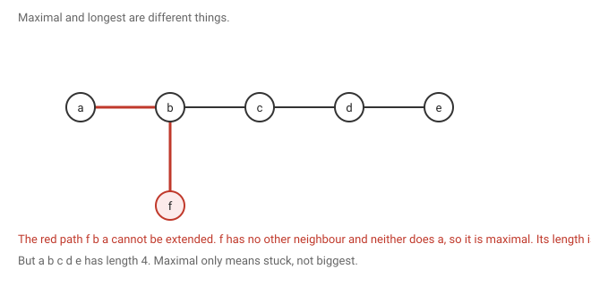

Maximal and longest are different things. Maximal only means you are stuck, and that is all this proof ever needs.

### Claim 2.1 — Three neighbours lie on one path

> Claim. If P = v₀v₁…vᵣ is a maximal path, then v₀ has at least three neighbours on P.

Proof. If v₀ had a neighbour outside P, that neighbour could be attached to the beginning of P, contradicting maximality. Thus every neighbour of v₀ lies on P. Since deg(v₀) ≥ 3, choose three of them in path order: vᵢ, vⱼ, vℓ, where i < j < ℓ.

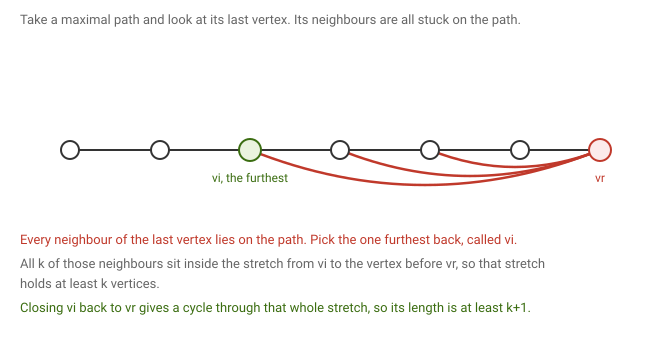

A maximal path traps its endpoint's neighbours on the path, because an outside neighbour could be tacked on.

### Claim 2.2 — One of three cycles is even

> Claim. The three neighbours in Claim 2.1 create an even cycle.

Proof. The edges v₀vᵢ, v₀vⱼ, and v₀vℓ, together with suitable portions of P, form three cycles. Put a = j−i and b = ℓ−j. Their lengths are a+2, b+2, and a+b+2.

Suppose all three lengths were odd. Adding 2 changes no parity, so a, b, and a+b would all be odd. But odd plus odd is even, so a+b is even: a contradiction. Hence at least one of the cycles is even.

Combining Claims 2.1 and 2.2, G contains an even cycle.

---

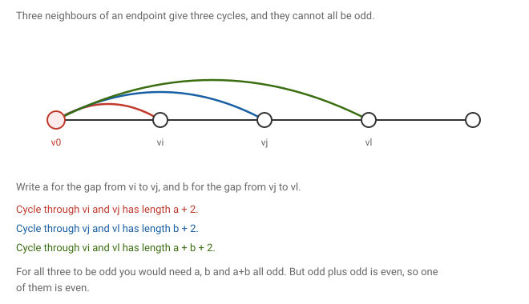

Three neighbours give three cycles of lengths a+2, b+2 and a+b+2. If a and b were both odd then a+b would be even, so they cannot all be odd.

## 3. Long-path theorem ★★☆

> Question. Let G be connected, with n vertices. Prove that G has a path of length at least min{2δ(G), n−1}.

Symbols here. n is the number of vertices and δ(G) the minimum degree. P = v₀v₁…vᵣ is a longest path, with length r. E(G) is the edge set, so v₀vᵢ ∈ E(G) says v₀ and vᵢ are adjacent. A and B are sets of positions along P, not sets of vertices, and ∣A∣ means how many positions A holds. The notation min{a, b} is whichever of the two numbers is smaller.

How the proof runs. Extremal choice, pigeonhole, then contradiction, with a case split on top. Take a longest path. Split into the case r = n−1, which is immediate, and the case r ≤ n−2, which is the work. Inside that case, pigeonhole forces the two index sets to overlap, and Claim 3.4 derives a contradiction by building a path longer than the longest one.

The route: Claim 3.1 the endpoints of a longest path are trapped on it; Claim 3.2 two large index sets must overlap if the path is short; Claim 3.3 an overlap folds the path into a cycle through all its vertices; Claim 3.4 an outside vertex then creates a longer path.

Because G is finite, choose a path with the largest possible number of vertices and write it as P = v₀v₁…vᵣ. Its length is r. This path is longest, so neither endpoint can be extended. A path uses no vertex twice, so it has at most n vertices and r ≤ n−1. Thus either r = n−1, or r ≤ n−2.

### Claim 3.1 — Endpoint trapping

> Claim. Every neighbour of v₀ and of vᵣ lies on P.

Proof. A neighbour outside P could be attached to the appropriate endpoint, making a longer path. That contradicts the choice of P.

If r = n−1, the required bound is immediate. Assume from now on that r ≤ n−2. We prove r ≥ 2δ(G).

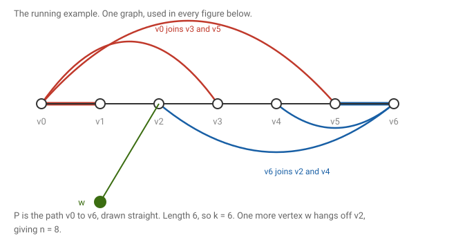

Running example for question 3: the path v₀ to v₆ with extra edges, so k = 6 and n = 8.

### Claim 3.2 — The index sets overlap

> Claim. If r ≤ 2δ(G)−1, then there is an index i such that both v₀vᵢ and vᵣvᵢ₋₁ are edges.

Proof. Define

$$
A=\{i\in\{1,\dots,r\}:v_0v_i\in E(G)\},
\qquad
B=\{i\in\{1,\dots,r\}:v_rv_{i-1}\in E(G)\}.
$$

By Claim 3.1, all neighbours of the endpoints are recorded in these sets, so ∣A∣ ≥ δ(G) and ∣B∣ ≥ δ(G). Both are subsets of a box of only r positions. If r ≤ 2δ(G)−1, then ∣A∣+∣B∣ > r, so A ∩ B ≠ ∅. Any i ∈ A ∩ B has the required two edges.

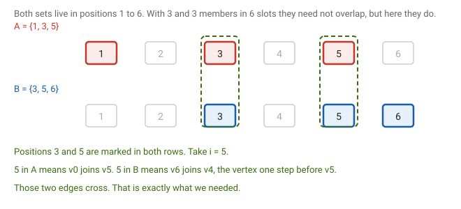

Both index sets live in positions 1 to 6. Once their sizes add past 6 they are forced to share a position.

### Claim 3.3 — The overlap makes a cycle

> Claim. The index i from Claim 3.2 gives a cycle containing all r+1 vertices of P.

Proof. Follow

$$
v_0,v_1,\dots,v_{i-1},v_r,v_{r-1},\dots,v_i,v_0.
$$

The first and last jumps are the two edges supplied by Claim 3.2. Every vertex of P appears exactly once before returning to v₀, so this is a cycle through all r+1 vertices.

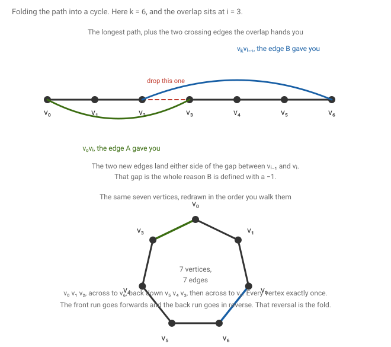

The picture is drawn with r written as k, since question 17 performs the identical fold and shares this figure. Walk the front run v₀ up to vᵢ₋₁ forwards, cross to vᵣ, walk the back run down to vᵢ in reverse, and cross back to v₀. The dashed edge vᵢ₋₁vᵢ is the only path edge the cycle gives up, and the two new edges straddle exactly that gap, which is what the −1 in the definition of B buys you.

### Claim 3.4 — The cycle contradicts longestness

> Claim. The assumption r ≤ 2δ(G)−1 is impossible.

Proof. Since r ≤ n−2, the cycle in Claim 3.3 misses at least one vertex of G. As G is connected, some vertex of the cycle has an edge to a vertex outside the cycle: take a shortest route from a missed vertex to the cycle and use its last edge.

Delete one cycle edge at that cycle vertex. This opens the cycle into a path containing its r+1 vertices and ending at that vertex. Attach the outside vertex with the edge just found. The result is a path of length r+1, longer than P, a contradiction.

Thus r ≥ 2δ(G) when r ≤ n−2, while the other case gave r = n−1. Therefore P has length at least min{2δ(G), n−1}.

---

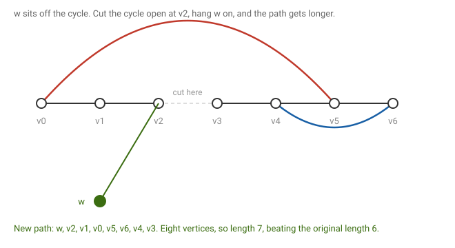

The contradiction. Cut the cycle open at a vertex with an outside neighbour, hang that vertex on, and the path is now longer than the longest.

## 4. Bipartite graphs and odd cycles ★☆☆

> Question. Prove that G is bipartite if and only if it has no odd cycle.

Symbols here. V(G) is the vertex set. A and B are the two sides of the bipartition, meaning every edge runs from one to the other. The vertex r is a chosen root, and the distance from r to a vertex is the number of edges on a shortest path between them. A cycle is odd when its number of edges is odd.

Two directions. The theorem is an if and only if, so there are two separate statements to prove.

Forward direction. The statement being proved is: if G is bipartite, then G has no odd cycle. That is Claim 4.1.

Backward direction. The statement being proved is: if G has no odd cycle, then G is bipartite. That is Claim 4.2.

The claims come in the same order as the statement here, which is not true everywhere in this file.

How the proof runs. Forward is direct: walk around the cycle and watch the sides alternate. Backward is a direct construction: build the bipartition by colouring each vertex with the parity of its distance from a root, then use one contradiction to rule out an edge inside a part. No induction.

### Claim 4.1 (forward direction) — Bipartite graphs have no odd cycle

Proof. Let V(G) = A ∪ B be a bipartition. Every edge goes from A to B or from B to A. While walking around a cycle, the side must alternate at every step. Returning to the starting vertex therefore takes an even number of steps. Hence no cycle is odd.

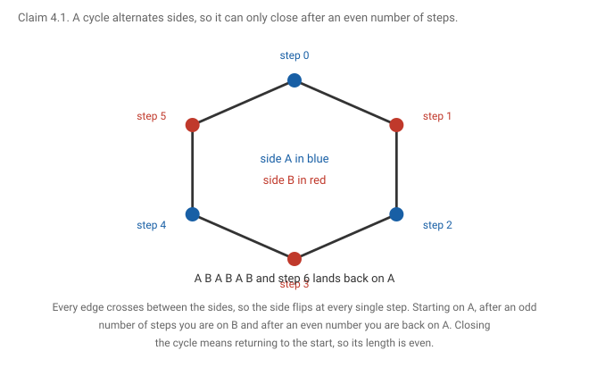

Six steps round the cycle, and the side flips at every one. You can only land back where you started after an even number.

### Claim 4.2 (backward direction) — No odd cycle gives a bipartition

Proof. It is enough to colour each connected component separately. Fix a root r in one component. Put in A the vertices whose distance from r is even, and in B those whose distance from r is odd.

To make the path between two vertices unambiguous, choose one shortest root-to-vertex path for every vertex. These chosen paths form a rooted spanning tree. Suppose an edge xy had both ends in the same part. Their tree distances from r have the same parity. Therefore the unique tree path from x to y has even length. Adding the edge xy to that tree path makes an odd cycle, contradicting the hypothesis. Thus every edge goes between A and B, so the component is bipartite.

Claims 4.1 and 4.2 prove the equivalence.

---

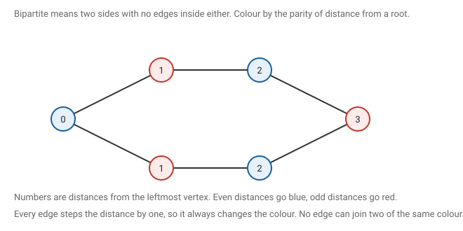

The converse, built rather than observed: colour every vertex by the parity of its distance from a root.

## 5. Euler circuit theorem ★★☆

> Question. Prove that G has an Euler circuit if and only if it has at most one non-trivial component and every vertex has even degree.

Symbols here. deg(v) is the number of edges at the vertex v. A trail is a walk that repeats no edge, and it is closed when it starts and ends at the same vertex. T is a trail chosen with as many edges as possible. A component is a maximal connected piece, and it is non-trivial when it has at least one edge. An Euler circuit is a closed trail using every edge of the graph.

Two directions. The theorem is an if and only if, so there are two separate statements to prove.

Forward direction. The statement being proved is: if G has an Euler circuit, then G has at most one non-trivial component and every vertex has even degree. That is Claim 5.1.

Backward direction. The statement being proved is: if G has at most one non-trivial component and every vertex has even degree, then G has an Euler circuit. That is Claims 5.2 and 5.3 together, which need two steps because the circuit has to be built rather than merely observed.

How the proof runs. Forward is direct: pair up the edges at each visit. Backward is extremal choice plus contradiction: take a trail with as many edges as possible, then Claims 5.2 and 5.3 each suppose the trail falls short and derive a contradiction with its maximality. This is the alternative to the textbook induction on edges, and it is shorter.

### Claim 5.1 (forward direction) — An Euler circuit forces both conditions

> Claim. An Euler circuit forces the stated component and parity conditions.

Proof. An Euler circuit is one continuous closed trail, so it cannot jump from one component containing edges to another. Since it uses every edge, there can be at most one non-trivial component.

At each visit to a vertex, the circuit arrives by one edge and leaves by another. Those edges pair up. At the starting vertex, pair the first edge with the final return edge. Since every edge is used exactly once, all incident edges are paired; every degree is even.

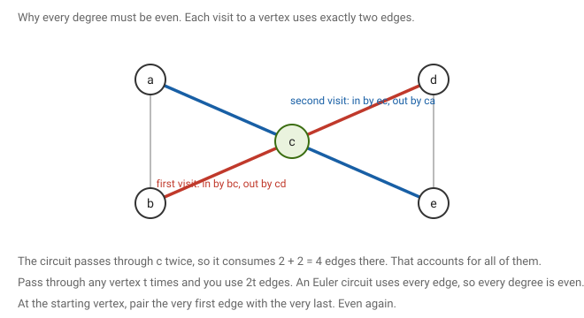

Each visit to a vertex arrives on one edge and leaves on another, so the edges at that vertex pair up.

### Claim 5.2 (backward direction, first step) — A maximal trail is closed

> Claim. Under the stated conditions, the chosen maximal trail T is closed.

Proof. If G has no edges, the empty closed trail is already an Euler circuit. Otherwise, among all trails in G, choose one with as many edges as possible. Call it T. Such a choice is possible because G is finite, and T lies in the unique non-trivial component.

Suppose T ends at a different vertex v from where it starts. Each internal visit to v uses incident edges in pairs, but the final arrival uses one unpaired trail edge. Hence T uses an odd number of edges incident with v. Since deg(v) is even, some incident edge at v is unused. It extends T, contradicting maximality. Thus T is closed.

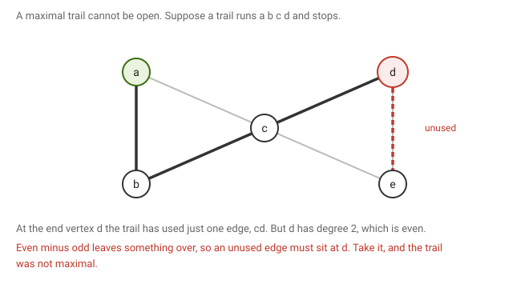

Why a maximal trail has to be closed. An open one uses an odd number of edges at its final vertex.

### Claim 5.3 (backward direction, second step) — A maximal trail uses every edge

> Claim. The closed maximal trail T contains every edge of G.

Proof. Suppose an unused edge exists. It lies in the unique non-trivial component, which contains T. There is therefore an unused edge e with an endpoint z on T: if no unused edge already touches T, take a shortest path from an unused edge to T. Its final edge is unused, since all earlier vertices of that path lie off T, and it touches T.

Because T is closed, start it at z, go around it once, and then traverse e. No edge repeats, so this is a longer trail, contradicting maximality. Thus no edge is unused.

Claims 5.2 and 5.3 make T a closed trail using every edge, namely an Euler circuit. With Claim 5.1, the theorem follows.

---

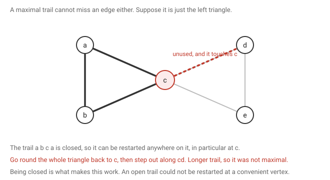

And why it cannot miss an edge. Being closed, it can be restarted anywhere, so a leftover edge touching it would extend it.

## 6. Berge’s theorem  (asked on 12 September, still needed for question 7)

> Question. Prove that a matching M is maximum if and only if there is no M-augmenting path.

Symbols here. M and N are matchings, meaning sets of edges no two of which share a vertex. ∣M∣ is the number of edges in M. A vertex is free when no edge of M touches it. An M-augmenting path is a path whose edges alternate outside and inside M and whose two endpoints are both free.

Two directions. The theorem is an if and only if, so there are two separate statements to prove.

Forward direction. The statement being proved is: if M is maximum, then there is no M-augmenting path.

Backward direction. The statement being proved is: if there is no M-augmenting path, then M is maximum.

A trap here: neither claim below is written in that form, because both are done by contrapositive. Claim 6.1 proves "if there is an M-augmenting path, then M is not maximum", which is the forward direction turned around. Claim 6.2 proves "if M is not maximum, then there is an M-augmenting path", which is the backward direction turned around. Each is logically the same statement as the direction it belongs to, but neither reads like the theorem.

How the proof runs. Both directions by contrapositive, and each contrapositive is then proved directly by construction. Claim 6.1 constructs a bigger matching from an augmenting path. Claim 6.2 constructs an augmenting path from a bigger matching, by superimposing the two matchings and counting components. Nothing here is a contradiction, even though it can feel like one.

### Claim 6.1 (forward direction, by contrapositive) — An augmenting path enlarges a matching

Proof. Along an M-augmenting path, edges alternate outside and inside M, and both ends are free. Hence the path has one more edge outside M than inside M. Replace the M-edges on the path by the non-M-edges. Interior vertices merely change partners; the free endpoints become matched. The result is a matching of size ∣M∣+1.

Swapping along an augmenting path. The edges that were out come in, the ones that were in go out, and the count goes up by exactly one.

### Claim 6.2 (backward direction, by contrapositive) — A larger matching supplies an augmenting path

> Claim. If some matching N has more edges than M, then there is an M-augmenting path.

Proof. First delete from both matchings every edge they share. A shared edge contributes one to both sizes, so this does not change the difference ∣N∣−∣M∣. Call the remaining matchings (M') and (N'). We still have ∣N′∣ > ∣M′∣.

Now draw the graph containing exactly the edges of (M') and (N'). A vertex can touch at most one (M')-edge and at most one (N')-edge, because each is a matching. So every vertex has degree at most 2. Therefore every component is an isolated vertex, a path, or a cycle.

Inside a nontrivial component, the colours must alternate: two edges next to each other cannot both belong to (M'), and cannot both belong to (N'), because same-matching edges cannot share a vertex.

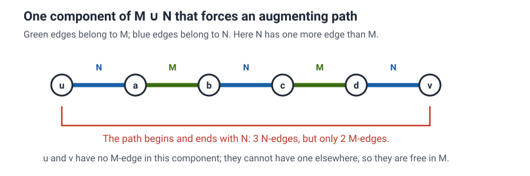

Now count the two colours one component at a time.

| Component | Number of (M')-edges versus (N')-edges |
|---|---|
| cycle | Equal: alternation returns to the starting colour. |
| even-length path | Equal: it starts in one colour and ends in the other. |
| odd-length path | One colour occurs once more: it starts and ends in that colour. |

The total number of (N')-edges is larger than the total number of (M')-edges. Cycles and even paths always contribute equally, so some odd path must have one more (N')-edge. Its first and last edges both lie in (N').

Let (u) and (v) be the endpoints of that path. Neither has an (M')-edge: otherwise the path would continue through that edge. Neither can have a shared edge that we deleted: such an edge belongs to (M), but an (M)-edge cannot share (u) or (v) with the incident (N')-edge. Thus (u) and (v) are free in the original matching (M). The path alternates between edges outside and inside (M), and its endpoints are free in (M). It is an (M)-augmenting path.

If an augmenting path exists, Claim 6.1 says M is not maximum. If M is not maximum, a larger N exists and Claim 6.2 supplies an augmenting path.

	---

Superimposing the two matchings. Every degree is at most two, so the pieces are paths and even cycles with the colours alternating.

## 7. König's theorem ★★★

> Question. Prove that in a bipartite graph G, α′(G) = β(G).

Symbols here. G is bipartite with sides A and B, so every edge runs from A to B. A matching is a set of edges no two of which share a vertex, and M denotes a maximum one, with ∣M∣ its number of edges. A vertex cover is a set of vertices meeting every edge. α′(G) is the matching number, the size of a largest matching, and β(G) is the vertex cover number, the size of a smallest vertex cover. A vertex is matched when some edge of M touches it, and its partner is the vertex at the other end of that edge. A₀ is the set of vertices of A that M misses, Zₐ and Zᴮ are the sets of vertices reached by the search below, and C is the cover being built.

How the proof runs. The first inequality is direct counting. The second is a direct construction: you build one specific cover rather than reasoning about all covers. Claims 7.3 and 7.4 then verify it, and both are direct case analysis. Exactly one contradiction appears anywhere in the question, inside Claim 7.4, where Berge's theorem from question 6 rules out an unmatched vertex on the B side.

### Two inequalities, not two directions

This one is an equation rather than an if and only if, so there is no forward and backward. Instead you prove two inequalities and squeeze. Be clear which is which before starting, because they are wildly different in length.

First inequality, α′ ≤ β. The statement being proved is: every vertex cover of G has at least α′(G) vertices. That is Claim 7.1 and it takes two lines.

Second inequality, β ≤ α′. The statement being proved is: there exists a vertex cover of G with exactly α′(G) vertices. Since β is a minimum, one such cover is enough to pin it down. So it is enough to build a single cover with exactly ∣M∣ vertices, and then β ≤ ∣M∣ = α′. Everything from the worked example to Claim 7.4 is building that one cover.

Put the two together and α′ ≤ β ≤ α′, which forces equality.

### Claim 7.1 (first inequality, α′ ≤ β) — Every cover has at least ∣M∣ vertices

Proof. The edges of M are pairwise disjoint. A vertex cover must meet every one of them, and no single vertex can meet two disjoint edges. So a cover needs at least one vertex for each of the ∣M∣ edges of M, and those are ∣M∣ distinct vertices. Taking the smallest cover, β(G) ≥ ∣M∣ = α′(G).

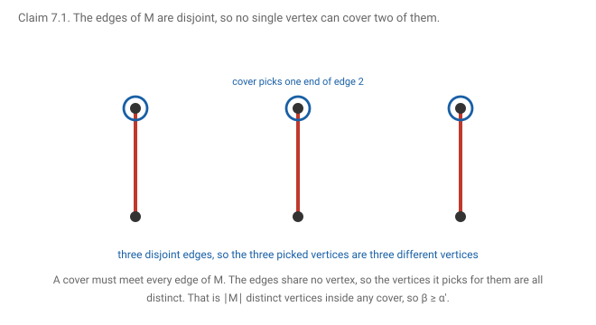

The matching edges share no vertex, so the cover has to spend a separate vertex on each one.

### A worked example, to fix the idea before the general proof

Take A = {a₁, a₂, a₃, a₄} and B = {b₁, b₂, b₃}, with the five edges a₁b₁, a₂b₁, a₂b₂, a₃b₂ and a₄b₃.

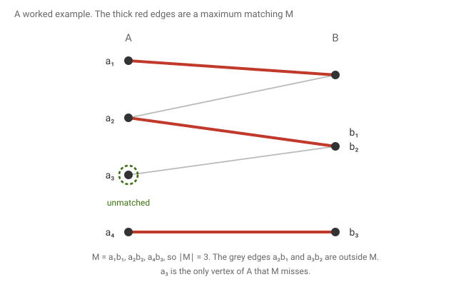

A maximum matching is M = {a₁b₁, a₂b₂, a₄b₃}, of size 3. It cannot be bigger, since B has only three vertices. The vertex a₃ is the only vertex of A left unmatched, so A₀ = {a₃}.

Now run the search. Start at every unmatched vertex of A and alternate: leave A along an edge outside M, come back to A along an edge inside M, and repeat.

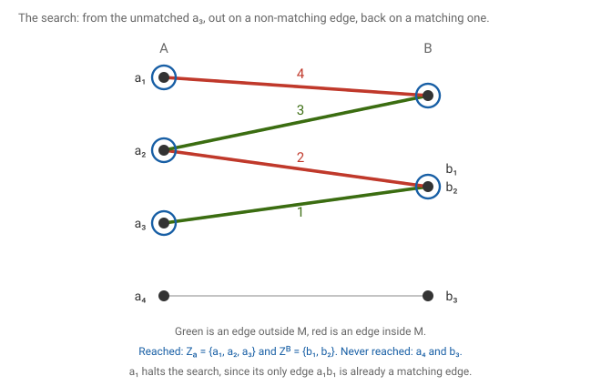

Step by step. From a₃ the edge a₃b₂ is outside M, so b₂ is reached. From b₂ the matching edge b₂a₂ takes us back, so a₂ is reached. From a₂ the edge a₂b₁ is outside M, so b₁ is reached. From b₁ the matching edge b₁a₁ takes us back, so a₁ is reached. From a₁ there is nowhere left to go, because its only edge a₁b₁ is a matching edge and matching edges are for coming back, not for leaving.

So Zₐ = {a₁, a₂, a₃} and Zᴮ = {b₁, b₂}, while a₄ and b₃ were never reached.

Now build the cover. Take every vertex of B that was reached, and every vertex of A that was not.

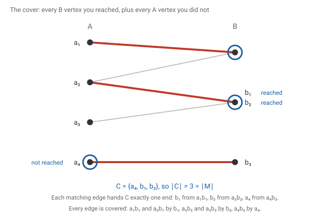

That gives C = {a₄} ∪ {b₁, b₂} = {a₄, b₁, b₂}, of size 3, which is exactly ∣M∣.

Check it covers. The edge a₁b₁ is covered by b₁, a₂b₁ by b₁, a₂b₂ by b₂, a₃b₂ by b₂, and a₄b₃ by a₄. Every edge is met.

Check the size. Look at the three matching edges one at a time. From a₁b₁ the cover took b₁ and not a₁. From a₂b₂ it took b₂ and not a₂. From a₄b₃ it took a₄ and not b₃. Exactly one end of each, never both, never neither. Three matching edges, three cover vertices.

The two checks you have just done on numbers are Claims 7.3 and 7.4, and the general proofs say the same thing with letters. Both belong to the second inequality: together they show the cover you just built really is a cover and really has ∣M∣ vertices.

### What 7.2, 7.3 and 7.4 are really doing

Before the formal versions, here is the whole construction in one idea, because the three claims read as three separate arguments and they are not.

You have a matching M with ∣M∣ edges, and you want a cover with ∣M∣ vertices. Every matching edge has two ends. So there is only one way this can possibly work: take exactly one end from each matching edge. Take fewer and you cannot cover those edges, take both ends of any edge and you go over budget. So the entire question is which end, and the search is nothing more than the rule that decides.

Think of the search as something spreading. The unmatched vertices of A are where it starts. From a vertex of A it spreads along free edges, meaning edges outside M. From a vertex of B it spreads back along that vertex's own matching edge, to its partner. Keep going until nothing new lights up. The file calls the vertices it got to reached, and the rest unreached.

Now the fact that makes everything else fall out. Look at any matching edge ab.

If b is reached, then a is reached too, because a reached B vertex always spreads to its partner, and a is that partner.

If b is unreached, then a is unreached too. Suppose a were reached. How? Not by being a starting point, since starting points are unmatched and a has the partner b. So it was reached along its own matching edge, which is ab, arriving from b, which would make b reached.

So every matching edge has both ends reached or neither. Never one of each. That single sentence is the load bearing one, and both Claim 7.3 and Claim 7.4 are corollaries of it.

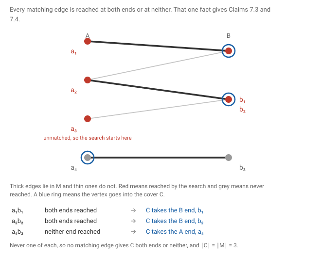

The worked example again, sorted by what the search touched. Two matching edges are reached at both ends and one at neither, and C takes the B end of the first kind and the A end of the second.

Read the definition of C against that. C is the reached B vertices plus the unreached A vertices, so a fully reached matching edge donates its B end and a fully unreached one donates its A end. One vertex per matching edge, exactly as the budget demanded.

Claim 7.4, the count, is then almost nothing. Since C takes one end per matching edge, ∣C∣ = ∣M∣, and the only thing left to rule out is a vertex of C that sits on no matching edge at all. On the A side that is easy, since the unmatched A vertices are precisely the starting points and are therefore reached, so an unreached A vertex must be matched. On the B side it needs Berge, and that is the only place any real work happens in 7.4.

Claim 7.3, the covering, is the same fact read backwards. An edge escapes the cover only if neither end was taken, which means a reached A end and an unreached B end. If that edge is free, the spreading would have crossed it and the B end would be reached. If it is a matching edge, we have just shown its two ends agree. Neither is possible, so nothing escapes.

That is the proof. What follows is the same three steps written out properly.

### Claim 7.2 (second inequality, the construction) — The search, stated in general

Let M be a maximum matching and let A₀ be the set of vertices of A that M misses. Starting from A₀, repeatedly step from A to B along an edge outside M and from B back to A along an edge inside M. Let Zₐ be the set of vertices of A reached this way, including A₀ itself, and let Zᴮ be the set of vertices of B reached. Define

$$
C=(A\setminus Z_A)\cup Z_B .
$$

That formula looks worse than it is. Go through the vertices one at a time and apply a rule with two lines.

A vertex of A goes into C when the search did not reach it. A vertex of B goes into C when the search did reach it. Nothing else is in C.

So C is the B vertices you reached together with the A vertices you missed, and the only thing needing explanation is why the rule points one way on one side and the opposite way on the other.

Here is why, and it is the whole of Claim 7.3 in advance. Take any edge ab at all. Either the search missed a, in which case a is in C and the edge is caught on the A side. Or the search reached a, and then it reached b as well, since from a reached vertex of A the search crosses every free edge, and a matching edge is reached at both ends or at neither. Then b is in C and the edge is caught on the B side. So the rule says: catch each edge on whichever side the search ran out of room. There is always exactly one such side, which is why the definition is not symmetric.

There is a second description of the same set, and it is the one to carry into the exam. Once Claim 7.4 shows that every vertex of C is matched, C amounts to taking exactly one end of every matching edge: the B end if the search reached that edge, the A end if it did not. That version cannot be the definition, because it needs 7.4 to make sense, but it is what C actually is.

The same search as in the worked example above, now described in general. Out of A on a non-matching edge, back into A on a matching one.

### Claim 7.3 (second inequality, showing C is a cover) — C covers every edge

Proof. Take any edge ab, with a in A and b in B. Split on the one thing the definition of C cares about, namely whether the search reached a.

If it did not, then a lies in A ∖ Zₐ, so a is in C and ab is covered.

If it did, then it reached b as well. When ab is outside M, the search standing at a crosses every free edge, so it crossed this one. When ab is inside M, the two ends of a matching edge are reached together or not at all, so b came with a. Either way b lies in Zᴮ, so b is in C and ab is covered.

The two cases exhaust the possibilities, so every edge is covered and C is a vertex cover.

Worth noticing how this is written. Nothing was assumed false anywhere, so this is a direct proof by cases, not a proof by contradiction, and saying so at the top costs nothing and reads better. The older way of putting it is to suppose an edge escapes and derive a clash, which is the same argument wearing a disguise.

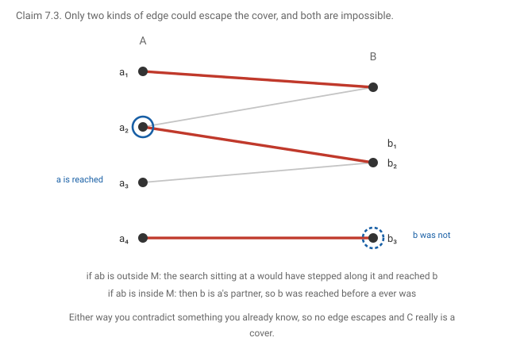

The case that cannot happen. An escaping edge would need a reached A end and an unreached B end, and neither kind of edge can manage that.

### Claim 7.4 (second inequality, counting C) — C has exactly ∣M∣ vertices

Proof in two parts: every vertex of C sits on a matching edge, and no two of them sit on the same one.

First, every vertex of C is matched. Take b in Zᴮ and suppose it were unmatched. The search reached b starting from an unmatched vertex of A, and the route it took alternates outside M, inside M, outside M, and so on, ending on an edge outside M as it arrives at b. That route is a path with both endpoints unmatched and edges alternating, which is an M-augmenting path. By Berge's theorem, question 6, that contradicts M being maximum. Now take a in A ∖ Zₐ. The unmatched vertices of A are exactly A₀, and A₀ sits inside Zₐ, so a cannot be unmatched.

Second, no matching edge gives C both of its ends. Read the rule again: C takes the A end of an edge only when that end is unreached, and the B end only when that end is reached. A matching edge is reached at both ends or at neither, so those two conditions can never hold at once. The same sentence rules out an edge giving neither end, since one of the two conditions always holds.

So the vertices of C sit on matching edges, one per edge, and no edge is used twice. Hence ∣C∣ = ∣M∣.

Each matching edge hands the cover exactly one of its two ends, never both and never neither.

### Putting the two inequalities together

Claim 7.3 says C is a cover and Claim 7.4 says ∣C∣ = ∣M∣ = α′(G). Since β(G) is the size of a smallest cover, β(G) ≤ ∣C∣ = α′(G). Claim 7.1 gives α′(G) ≤ β(G). Therefore α′(G) = β(G).

### Where bipartiteness was used

Only in taking for granted that every edge runs from A to B, which is what lets the search alternate sides in a fixed rhythm and what lets Claim 7.4 say a matching edge has one end on each side. The theorem is false without it: the triangle has α′ = 1 and β = 2.

## 8. Hall’s theorem  (asked on 12 September, still needed for question 9)

> Question. Let G be bipartite with sides A, B. Prove that G has a matching saturating A if and only if ∣N(S)∣ ≥ ∣S∣ for every S ⊆ A.

Symbols here. G is bipartite with sides A and B. For a set S of vertices, N(S) is the set of all vertices adjacent to something in S, and ∣S∣ is the number of members of S. A matching saturates A when every vertex of A is matched. α′(G) is the matching number and K denotes a minimum vertex cover.

Two directions. The theorem is an if and only if, so there are two separate statements to prove.

Forward direction. The statement being proved is: if G has a matching saturating A, then ∣N(S)∣ ≥ ∣S∣ for every S ⊆ A. That is Claim 8.1, done directly.

Backward direction. The statement being proved is: if ∣N(S)∣ ≥ ∣S∣ for every S ⊆ A, then G has a matching saturating A.

A trap here: Claim 8.2 does not build a matching. It proves the contrapositive instead, namely "if G has no matching saturating A, then some S ⊆ A has ∣N(S)∣ < ∣S∣". Same statement, read the other way round.

How the proof runs. Forward is direct. Backward is by contrapositive, and the contrapositive is then proved directly by construction: it starts from a minimum vertex cover, supplied by König from question 7, and builds the starved set out of it. So question 8 depends on question 7, and you cannot write this proof without that one.

### Claim 8.1 (forward direction) — A saturating matching forces Hall's condition

Proof. Suppose a matching saturates A. For any S ⊆ A, its vertices are matched to ∣S∣ distinct vertices of B, all in N(S). Hence ∣N(S)∣ ≥ ∣S∣.

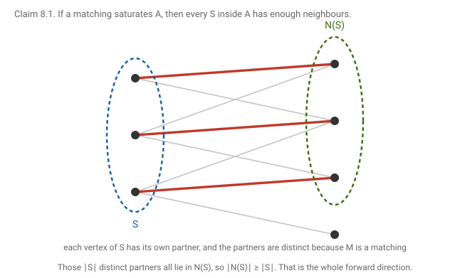

A saturating matching gives every vertex of S its own private partner inside N(S).

### Claim 8.2 (backward direction, by contrapositive) — Failure to saturate A violates Hall’s condition

Proof. Suppose no matching saturates A. Then α′(G) < ∣A∣. By König’s theorem, take a vertex cover K with ∣K∣ = α′(G) < ∣A∣.

Set S = A ∖ K. Every edge leaving S must be covered by its B-end, because no vertex of S lies in K. Thus N(S) ⊆ K ∩ B. Therefore

$$
|N(S)|\le |K\cap B|=|K|-|K\cap A|
<|A|-|K\cap A|=|S|.
$$

So Hall’s condition fails.

Claim 8.2 is the contrapositive of sufficiency. Together with Claim 8.1, it proves Hall’s theorem.

---

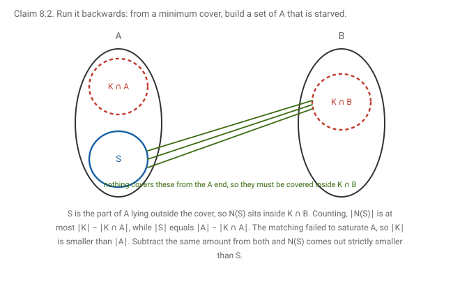

The contrapositive. Take a minimum cover and let S be the part of A lying outside it.

## 9. Regular bipartite graphs have perfect matchings ★★☆

> Question. Prove that every k-regular bipartite graph, with k ≥ 1, has a perfect matching.

Symbols here. G is bipartite with sides A and B, and k-regular means every vertex has degree exactly k. N(S) is the set of all neighbours of vertices in S. E(G) is the edge set, so ∣E(G)∣ counts the edges. A perfect matching is one covering every vertex.

How the proof runs. Direct, by double counting, twice. Claim 9.1 counts the edges leaving a set from both ends. Claim 9.2 counts all the edges from both sides. Then Hall's theorem from question 8 finishes it, so this proof depends on that one.

Let A ∪ B be the bipartition.

### Claim 9.1 — Hall’s condition holds

Proof. Take S ⊆ A. Exactly k∣S∣ edges leave S, because every vertex of S has degree k. All these edges end in N(S). Each vertex of N(S) has degree k, so it can receive at most k of those edges. Therefore

$$
k|S|\le k|N(S)|.
$$

As k ≥ 1, ∣S∣ ≤ ∣N(S)∣. Hall’s condition holds.

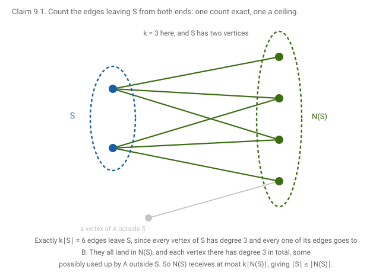

Drawn with k = 3. The count out of S is exact, the count into N(S) is only a ceiling, and the gap between them is Hall's condition.

### Claim 9.2 — The two sides have equal size

Proof. Count all edges from each side. Since the graph is k-regular, k∣A∣ = ∣E(G)∣ = k∣B∣. As k ≥ 1, ∣A∣=∣B∣.

Hall gives a matching saturating A. By Claim 9.2 it also saturates B, so it is perfect.

---

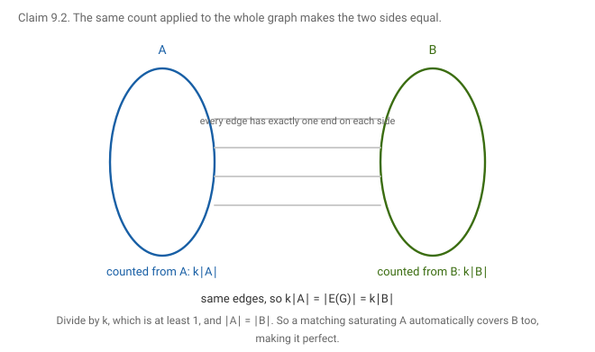

The same count run over the whole graph rather than over one set.

## 10. A connected non-complete graph contains an induced P₃ ★☆☆

> Question. Prove that a connected non-complete graph contains vertices a, b, c such that ab, bc ∈ E(G) but ac ∉ E(G).

Symbols here. E(G) is the edge set, so ab ∈ E(G) says a and b are adjacent and ac ∉ E(G) says they are not. Complete means every two vertices are adjacent. The vertices u and w are a chosen non-adjacent pair, and a, b, c are the first three vertices of a shortest path between them.

How the proof runs. Direct construction, with one contradiction. You construct the three vertices by taking a shortest path, then show the third edge is absent by contradiction, since it would give a shorter path.

Proof. Since G is not complete, choose non-adjacent vertices u, w. Since G is connected, there is a path from u to w. Take a shortest one, and call its first three vertices a, b, c.

The consecutive pairs a, b and b, c are edges. If a and c were adjacent, that edge would replace the two-edge stretch a, b, c, producing a shorter u-to-w path. This contradicts shortestness. Thus ac is not an edge, so a, b, c induce a path of length two.

---

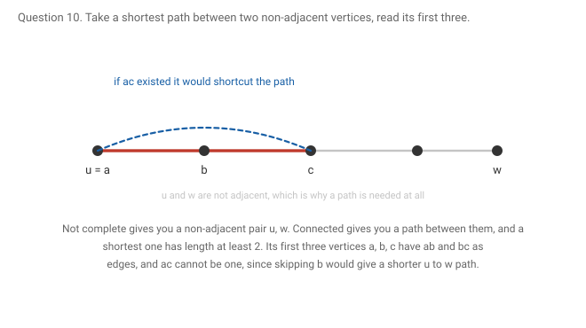

The two hypotheses each do one job. Not complete supplies the non-adjacent pair, connected supplies a path between them.

## 11. Shortest paths are induced ★☆☆

> Question. Prove that every shortest path is induced.

Symbols here. P = v₀v₁…vᵣ is a path with endpoints v₀ and vᵣ. A chord of P is an edge vᵢvⱼ joining two vertices of P that are not consecutive along it, so j ≥ i+2. A path is induced when it has no chord.

How the proof runs. Pure contradiction. Suppose a chord exists, use it to build a shorter path, and contradict the choice of a shortest one. Two lines, and the shortest proof in the file.

Proof. Let P = v₀v₁…vᵣ be a shortest path between v₀ and vᵣ. Suppose a chord vᵢvⱼ exists, where j ≥ i+2. The section of P from vᵢ to vⱼ uses at least two edges, while the chord uses one. Replacing that section by the chord gives a shorter path between v₀ and vᵣ, a contradiction. Therefore P has no chord and is induced.

### A worked example, to make the test concrete

Induced is the same word as in induced subgraph. A path is induced when the induced subgraph on its vertices is exactly that path and nothing more, and a chord is precisely the "something more". So chordless and induced mean the same thing, and the test is mechanical: list every pair of path vertices that are not consecutive along the path, and check that none of those pairs is an edge of G.

The short version to carry: an induced path has no shortcut midway. Walking it, the only place you can go next among its own vertices is the next one along. Note that midway means between any two vertices of the path, not just the two ends. In the path a, b, c, d, e the extra edge bd is a chord even though it touches neither endpoint, because it skips c.

Take the graph on a, b, c, d, e, f with edges ab, bc, ac, cd, ce, de and ef. It is two triangles, abc and cde, sharing the vertex c, with f hanging off e.

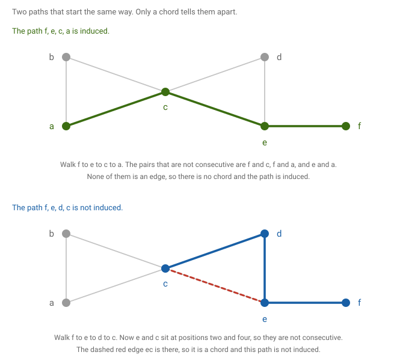

Two paths, both starting f then e, and only one of them induced.

The path f, e, c, a is induced. The non-consecutive pairs are f and c, f and a, and e and a, and none of the three is an edge.

The path f, e, d, c is not. Its non-consecutive pairs are f and d, f and c, and e and c, and that last one is an edge of the graph. So ec is a chord, and the path takes four vertices to do what f, e, c does in three.

Notice that the second one is not a shortest path from f to c, which is exactly what Claim 11 predicts. Walking f, e, c costs two edges and f, e, d, c costs three, and the chord ec is what makes the shortcut available.

### Induced does not mean shortest

Worth separating, because the two get run together and only one implication is true.

What induced rules out is a shortcut through the path's own vertices. Since the induced subgraph on those vertices is exactly the path, the path is the only route between its endpoints inside that vertex set, so there is nothing to shorten it with. That is a statement about the path alone.

Shortest is a statement about the whole graph: nothing anywhere in G joins the two endpoints in fewer edges. A shorter route is free to leave the path's vertices entirely, and being induced says nothing about routes that do.

So shortest implies induced, which is Claim 11, and the converse fails.

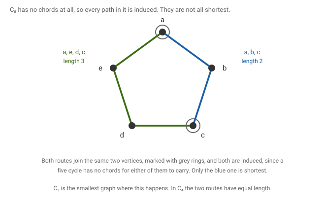

In C₅ both arcs between the same two vertices are induced, and one is longer.

The five cycle is the smallest witness. It has no chords at all, so every path in it is induced, yet between two vertices at distance 2 the long way round has length 3. In C₄ the two arcs have equal length, so nothing goes wrong there. The example graph in the previous section is no use here either: every induced path in it happens to be shortest, which is why the five cycle is the one to remember.

---

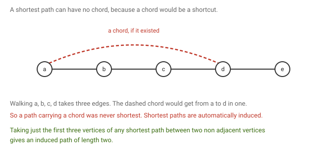

A chord would let you cross in one step what the path spends at least two on, so a path carrying a chord was never shortest.

## 12. Two longest paths meet ★☆☆

> Question. Prove that any two longest paths in a connected graph share a vertex.

Symbols here. P and Q are two longest paths, and m is their common length, meaning their number of edges. R is a connecting path, running from a vertex p on P to a vertex q on Q. An interior vertex of R is one that is not an endpoint of R. The notation ⌈x⌉ means x rounded up to the nearest integer.

How the proof runs. Contradiction, with an extremal choice inside it. Suppose the two paths are disjoint. Take a shortest connecting path, which is the extremal choice and is what keeps its interior clean, then build a path longer than the maximum.

Let P, Q be longest paths. They have the same length m, because “longest” means having the maximum possible length.

### Claim 12.1 — A shortest connector has clean interior

> Claim. If P and Q were disjoint, a shortest path R from P to Q has no interior vertex on P ∪ Q.

Proof. If an interior vertex lay on P or Q, the relevant proper subpath of R would be a shorter connector.

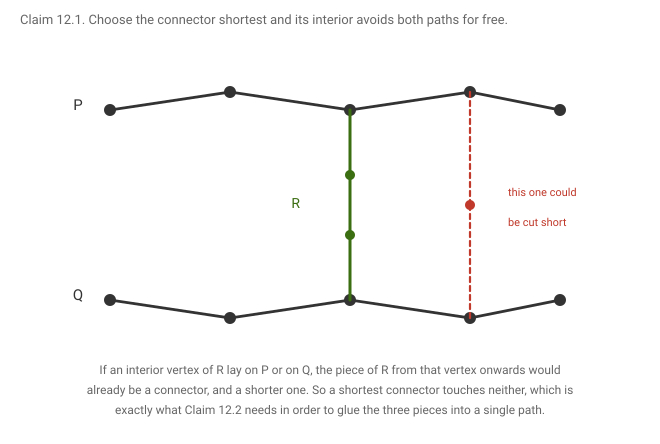

Choosing the connector shortest is what keeps its interior off both paths, and that is what lets the three pieces glue into one path.

### Claim 12.2 — Disjoint longest paths create a longer path

Proof. Suppose P, Q are disjoint. Connectivity supplies a path R from a vertex p ∈ P to a vertex q ∈ Q; choose it shortest. Each of p, q splits its longest path into two portions whose lengths add to m. Choose the longer portion in each path. Each has length at least m/2, rounded up.

By Claim 12.1, concatenate the chosen portion of P, then R, then the chosen portion of Q. This is a path. Its length is at least

$$
\lceil m/2\rceil+1+\lceil m/2\rceil>m,
$$

contradicting that m was maximum.

Thus P and Q cannot be disjoint, so they share a vertex.

---

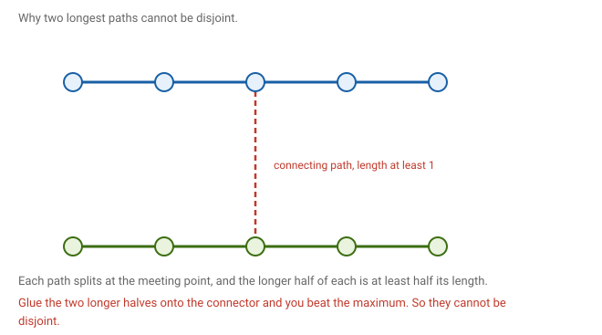

Glue the longer half of each path onto the connector and you beat the maximum, which is impossible.

## 13. Tutte’s 1-factor theorem ★★★

> Question. Prove that G has a perfect matching if and only if ∣S∣ ≥ odd(G − S) for every S ⊆ V(G).

Symbols here. V(G) is the vertex set. M and N are matchings, and a perfect matching covers every vertex. For a vertex set S, the graph G − S is what is left after deleting S and every edge touching it, and odd(G − S) counts the components of G − S having an odd number of vertices. H is a maximal counterexample, a supergraph of G with no perfect matching to which no further edge can be added. U is the set of vertices of H adjacent to every other vertex, and q = odd(H − U). The graph H + ac means H with the edge ac added.

Two directions. The theorem is an if and only if, so there are two separate statements to prove.

Forward direction. The statement being proved is: if G has a perfect matching, then ∣S∣ ≥ odd(G − S) for every S. That is Claim 13.1, and it takes a few lines.

Backward direction. The statement being proved is: if ∣S∣ ≥ odd(G − S) for every S, then G has a perfect matching. That is Claims 13.2 to 13.4, and they carry almost all the length.

Note that the backward direction is a contradiction rather than a contrapositive. It assumes P and not Q at once, meaning the condition holds and yet no perfect matching exists, and crashes into an impossibility.

How the proof runs. Forward is direct. Backward is contradiction by maximal counterexample, which is the hardest pattern in the file: assume the condition holds but no perfect matching exists, add edges until one more would create one, then show every possible shape of that counterexample produces a perfect matching after all. A case split on whether H−U is a union of cliques carries the last part, and Claim 13.2 is itself a small contradiction.

### Claim 13.1 (forward direction) — A perfect matching forces the condition

> Claim. If a perfect matching exists, then ∣S∣ ≥ odd(G − S) for every S.

Proof. Let M be a perfect matching and delete S. Every odd component of G−S has an odd number of vertices. Its vertices cannot all be matched internally, so at least one vertex in that component must be matched by M to a vertex of S. Different components require different vertices of S, since M is a matching. Thus S has at least as many vertices as there are odd components.

Triangles hanging off a small hub. Each odd component has to export a vertex into S, and different ones need different targets.

### Claim 13.2 (backward direction, first step) — A maximal counterexample keeps the condition

> Claim. Suppose G satisfies the condition but has no perfect matching. Add edges until reaching a supergraph H that is maximal without a perfect matching. Then H also satisfies the condition.

Proof. If some S violated the condition in H, then odd(H − S) would exceed ∣S∣. Removing edges from H−S to obtain G−S can only split components. When an odd component splits, at least one resulting piece is odd, because a sum of even integers cannot be odd. Hence odd(G − S) ≥ odd(H − S), so the same S would violate the condition in G, a contradiction.

Let U be the vertices of H adjacent to every other vertex.

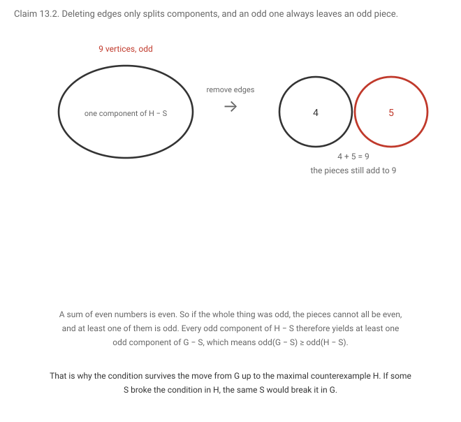

Removing edges can only break a component into pieces, and the pieces of an odd component cannot all be even.

### Claim 13.3 (backward direction, case one) — If H−U is a union of cliques, then H has a perfect matching

Proof. The order of H is even: otherwise S = ∅ violates the condition. Let q = odd(H−U). Since the total order is even, ∣U∣ and q have the same parity: each odd component contributes one to the parity of the vertex total.

The condition says ∣U∣ ≥ q. Match one chosen vertex from each odd clique of H−U to a distinct vertex of U. The remaining vertices in every clique now have even order, so pair them internally. The unused vertices of U number ∣U∣−q, which is even, and U is itself a clique. Pair them internally. This is a perfect matching of H, a contradiction.

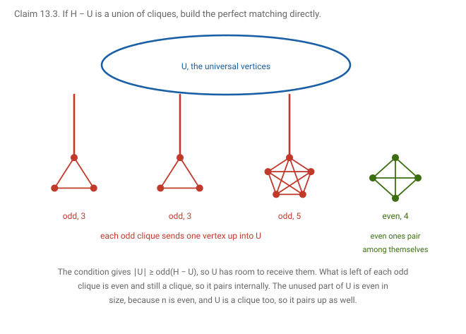

Case one. Each odd clique sends one vertex up into U, and everything left over pairs internally.

### Claim 13.4 (backward direction, case two) — If H−U is not a union of cliques, then H has a perfect matching

Proof. Some component of H−U is not complete. Choose non-adjacent vertices in it at minimum distance. The first three vertices of a shortest path between them are an induced path a, b, c: ab, bc are edges and ac is not.

Since b ∉ U, choose a vertex x not adjacent to b. By maximality of H, each missing edge produces a perfect matching when added. Thus H+ac has a perfect matching M using ac, and H+bx has a perfect matching N using bx; each must use its added edge, otherwise it would already be a perfect matching of H.

Ignore the edges common to M and N; each is already an edge of H and is already matched in both. The remaining components are alternating even cycles.

Case 1: ac and bx lie on different cycles. Exchange M-edges for N-edges on the cycle containing ac. This removes the only added edge on that cycle, namely ac; the other added edge bx is on a different cycle. The result is therefore a perfect matching using only edges of H, contradicting the choice of H.

Case 2: ac and bx lie on the same cycle. Delete these two edges from that cycle. Two alternating paths remain. There are two possible endpoint pairings.

- If the paths run from a to b and from c to x, take the N-edges on the first path and the M-edges on the second. They cover every vertex of the cycle except b and c. Add the edge bc, which belongs to H.
- If the paths run from a to x and from c to b, take the M-edges on the first path and the N-edges on the second. They cover every vertex of the cycle except a and b. Add the edge ab, which belongs to H.

In either subcase we have a perfect matching of that cycle using only edges of H. Keep the matching edges on every other component. This gives a perfect matching of H, again a contradiction.

Claims 13.3 and 13.4 exhaust all possibilities for H−U, so the assumed counterexample cannot exist. With Claim 13.1, Tutte’s theorem follows.

---

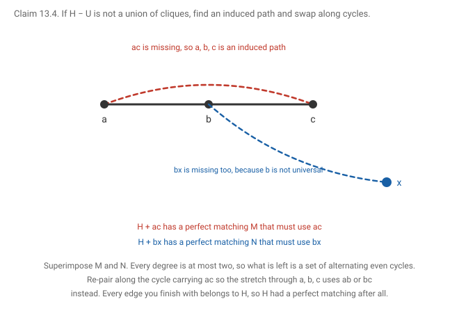

Case two. The induced path a, b, c and the vertex x not adjacent to b are what let you build two matchings and swap between them.

## 14. Petersen’s theorem ★★☆

> Question. Prove that every bridgeless cubic graph has a perfect matching.

Symbols here. Cubic means every vertex has degree exactly 3, and bridgeless means no single edge removal disconnects the graph. V(G) is the vertex set and S a set of vertices, so G − S is G with S deleted and odd(G − S) counts the odd components of what remains. C denotes one such odd component, ∣V(C)∣ and ∣E(C)∣ count its vertices and edges, and e(C, S) counts the edges running from C to S. A 1-factor is another name for a perfect matching.

How the proof runs. Direct verification of somebody else's criterion. You are not proving Petersen from scratch; you are checking Tutte's condition from question 13 and letting that theorem do the work. A case split on whether S is empty, plus a parity argument, is all the machinery needed.

Proof. We verify Tutte’s condition. Let G be cubic and bridgeless, and let S ⊆ V(G).

### Claim 14.1 — The case S = ∅

Proof. In any component C, the handshake lemma gives 3∣V(C)∣ = 2∣E(C)∣. The right-hand side is even, so ∣V(C)∣ is even. Thus G has no odd component, and odd(G) = 0.

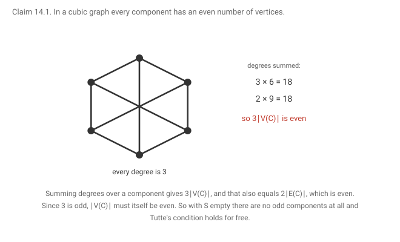

With S empty there is nothing to check, because a cubic graph has no odd component at all.

### Claim 14.2 — Every odd component of G−S sends out at least three edges

Proof. Let C be an odd component of G−S. Count the degrees of its vertices in the original graph:

$$
3|V(C)|=2|E(C)|+e(C,S).
$$

The left side is odd and the first term on the right is even, so e(C, S) is odd. It cannot equal 1, because the sole edge leaving C would be a bridge. Therefore e(C, S) ≥ 3.

The parity argument. Three times an odd number is odd, the edges inside contribute an even amount, so the edges leaving must be odd.

### Claim 14.3 — Tutte’s condition holds

Proof. If S ≠ ∅, Claim 14.2 shows that at least 3·odd(G − S) edges run from odd components of G−S into S. But each vertex of S has degree 3, so at most 3∣S∣ edges can leave S. Hence

$$
3\cdot\operatorname{odd}(G-S)\le 3|S|,
$$

and so odd(G − S) ≤ ∣S∣.

Claims 14.1 and 14.3 verify Tutte’s condition for every S. By Tutte’s theorem, G has a perfect matching.

---

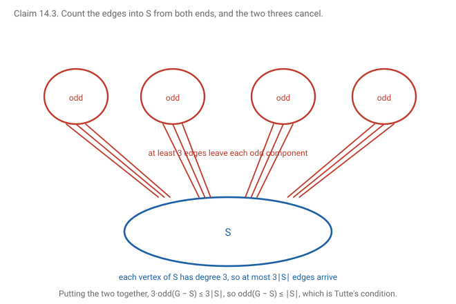

At least three edges out of each odd component, at most three into each vertex of S. The threes cancel.

## 15. Girth at least five forces many vertices ★☆☆

> Question. Prove that a nonempty k-regular graph of girth at least 5 has at least k²+1 vertices.

Symbols here. k-regular means every vertex has degree exactly k. The girth is the length of a shortest cycle, so girth at least 5 rules out cycles of length 3 and 4. N(v) is the set of vertices adjacent to v. The vertex v is a fixed starting vertex, u one of its neighbours, and w an outer vertex reached from a neighbour.

How the proof runs. Direct counting, with two contradictions used to keep the groups disjoint. Claim 15.2 rules out a triangle and Claim 15.3 rules out a four cycle, both by contradiction with the girth hypothesis. Then you add the three group sizes.

Proof. Fix a vertex v. We count three disjoint groups.

### Claim 15.1 — The first two groups

Proof. There is v itself, and it has exactly k distinct neighbours because the graph is k-regular. This gives 1+k vertices.

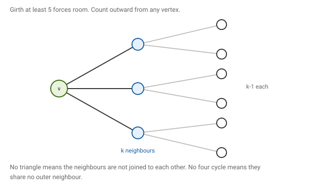

Running example for question 15: count outward from v in three groups, and the girth keeps them apart.

### Claim 15.2 — Each neighbour contributes k−1 new vertices

Proof. Let u be a neighbour of v. Apart from the edge uv, u has k−1 other neighbours. None is another neighbour of v, since that would create a triangle. Thus each neighbour of v contributes k−1 vertices outside {v}∪N(v).

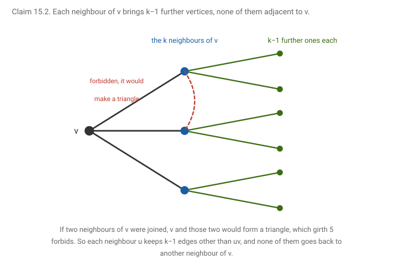

No triangle means two neighbours of v are never joined, so each keeps k−1 edges pointing further out.

### Claim 15.3 — These outer groups do not overlap

Proof. If distinct neighbours u₁, u₂ of v shared an outer neighbour w, then v, u₁, w, u₂, v would be a 4-cycle. Girth at least 5 forbids this.

Claims 15.1–15.3 give at least

$$
1+k+k(k-1)=k^2+1
$$

distinct vertices.

---

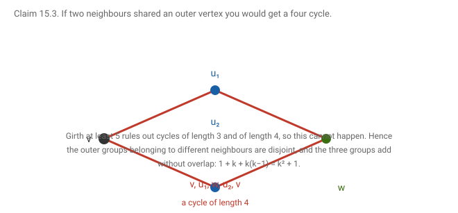

No four cycle means two neighbours never share an outer vertex, so the outer groups do not overlap.

## 16. Minimum degree forces connectedness ★★★

> Question. Prove that if δ(G) ≥ (n−1)/2 then G is connected, and show that the bound cannot be lowered.

Symbols here. n is the number of vertices and δ(G) the minimum degree. N(x) is the set of vertices adjacent to x, and ∣N(x)∣ counts them. The set {x} holds the single vertex x. Connected means every two vertices are joined by a path.

How the proof runs. Contradiction, then a witness. Claims 16.1 and 16.2 suppose two vertices have no common neighbour and count to an impossibility. Claim 16.3 is not a proof at all but an example, which is how you show a bound is sharp: you exhibit one graph that sits just below it and fails.

### Claim 16.1 — Four sets that would have to be disjoint

Proof. Suppose x and y are non-adjacent and have no common neighbour. Then {x}, N(x), {y} and N(y) are pairwise disjoint, for three separate reasons. First, x ∉ N(x) and y ∉ N(y), because the graph is simple and no vertex is its own neighbour. Second, x ∉ N(y) and y ∉ N(x), because x and y are not adjacent. Third, N(x) and N(y) do not meet, which is the assumption.

Running example for question 16. Three separate reasons keep these four sets apart: a vertex is not its own neighbour, x and y are not adjacent, and by assumption they share no neighbour.

### Claim 16.2 — The count is impossible

Proof. Disjoint sets of vertices cannot together hold more than n vertices, so

$$
1+|N(x)|+1+|N(y)|\le n.
$$

Each neighbourhood has at least (n−1)/2 members, so the left side is at least 2+(n−1)=n+1, giving n+1 ≤ n.

So every pair of vertices is adjacent or has a common neighbour, and a common neighbour supplies a path of length two. Hence G is connected.

The same picture, now read as arithmetic. Each neighbourhood holds at least (n−1)/2, so the four sets hold at least 1 + (n−1)/2 + (n−1)/2 + 1 = n + 1 vertices, in a graph that only has n.

### Claim 16.3 — The bound is sharp

Proof. For n even, take two disjoint copies of the complete graph on n/2 vertices. Every vertex has degree n/2 − 1, which is (n−2)/2, one notch below the bound, and the graph is disconnected.

---

Sharpness is shown by an example, not an argument. Two disjoint copies of K on n/2 vertices sit one notch below the bound at δ = (n−2)/2, and they are plainly disconnected.

## 17. Dirac's theorem ★★☆

> Question. Prove that if n ≥ 3 and δ(G) ≥ n/2 then G has a Hamiltonian cycle.

Symbols here. n is the number of vertices, δ(G) the minimum degree, and deg(v) the degree of the vertex v. P = v₀v₁…vₖ is a longest path, of length k. E(G) is the edge set. A and B are sets of positions along P rather than sets of vertices. A Hamiltonian cycle is a cycle passing through every vertex exactly once.

How the proof runs. Identical machinery to question 3, extremal choice plus pigeonhole plus contradiction, with one more contradiction at the end in Claim 17.4 to drag every stray vertex onto the cycle. If you have written question 3, you have written most of this.

The route: Claim 17.1 the endpoints of a longest path are trapped; Claim 17.2 two index sets must overlap; Claim 17.3 the overlap folds the path into a cycle; Claim 17.4 nothing can lie outside that cycle.

### Claim 17.1 — Endpoint trapping

Proof. G is connected by question 16, since n/2 ≥ (n−1)/2. Let P = v₀v₁…vₖ be a longest path. A neighbour of v₀ lying off P could be attached to the front, producing a longer path, so every neighbour of v₀ lies on P. The same holds at vₖ.

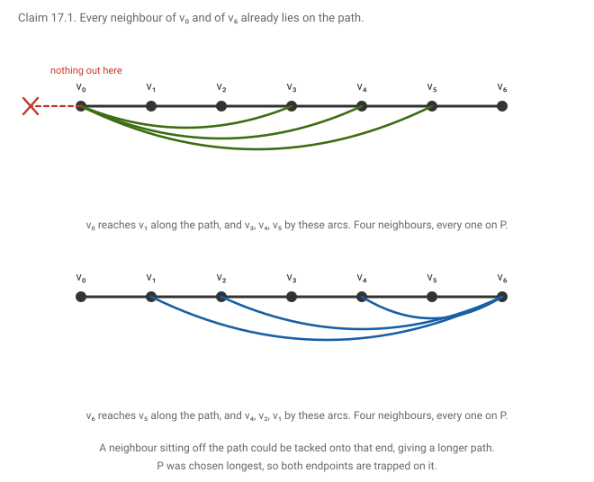

All four figures for this question use one running example: the path v₀ … v₆, so k = 6. The picture shows the four neighbours of each endpoint, and every one of them is on the path. Note that being trapped is a claim about the two endpoints only. The interior vertices are free to have neighbours wherever they like.

### Claim 17.2 — The two index sets overlap

Proof. Put

$$
A=\{i\in\{1,\dots,k\}: v_0v_i\in E(G)\},
\qquad
B=\{i\in\{1,\dots,k\}: v_kv_{i-1}\in E(G)\}.
$$

By Claim 17.1 every neighbour of v₀ is some vᵢ with 1 ≤ i ≤ k, so ∣A∣ ≥ deg(v₀) ≥ n/2, and every neighbour of vₖ is some vᵢ₋₁ with 1 ≤ i ≤ k, so ∣B∣ ≥ n/2. Both sets lie inside a box of k positions, and a path repeats no vertex, so k ≤ n−1. Then ∣A∣+∣B∣ ≥ n > n−1 ≥ k, so by pigeonhole A ∩ B ≠ ∅.

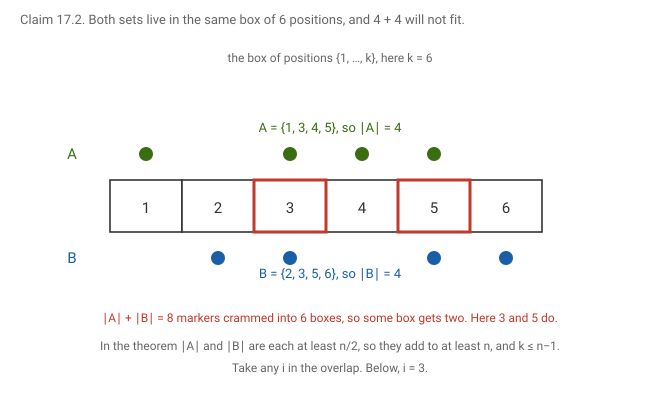

On the running example A = {1, 3, 4, 5} and B = {2, 3, 5, 6}, so eight markers are being pushed into six boxes and two boxes take a double. Those doubles are the overlap, here at 3 and at 5, and either will do. The one thing to keep straight is that A and B hold positions along the path, not vertices.

### Claim 17.3 — The overlap gives a cycle through all of P

Proof. Take i ∈ A ∩ B, so v₀vᵢ and vₖvᵢ₋₁ are both edges. Then

$$
v_0,v_1,\dots,v_{i-1},v_k,v_{k-1},\dots,v_i,v_0
$$

uses each of v₀ through vₖ exactly once and returns to v₀, so it is a cycle on all k+1 vertices of P.

Reading that sequence off the picture, with k = 6 and i = 3. Walk the front run forwards, v₀ v₁ v₂, which is v₀ up to vᵢ₋₁. Cross on the edge vᵢ₋₁vₖ to reach v₆. Walk the back run in reverse, v₅ v₄ v₃, which is vₖ down to vᵢ. Cross back on the edge v₀vᵢ.

Three things are worth seeing in the picture rather than in the formula. The single path edge vᵢ₋₁vᵢ, drawn dashed, is the one edge of P the cycle does not use, and it is exactly the gap the two new edges straddle. That is the whole reason B is defined with a −1 rather than with i: the two crossing edges have to land on opposite sides of one gap, or they would not close up. And the back half of the path is traversed backwards, which is why this is called folding.

### Claim 17.4 — Nothing lies outside that cycle

Proof. Since A sits inside a box of size k, k ≥ ∣A∣ ≥ n/2, so the cycle carries at least n/2 + 1 vertices. Suppose w lay outside it. Outside the cycle there are n − (k+1) vertices, and excluding w that leaves at most n − (n/2+1) − 1 = n/2 − 2 candidates for neighbours of w off the cycle. But deg(w) ≥ n/2, which is larger, so w has a neighbour u on the cycle. Delete one of the two cycle edges at u. The cycle opens into a path covering all k+1 of its vertices and ending at u, and attaching w by the edge wu gives a path of length k+1, longer than P, a contradiction.

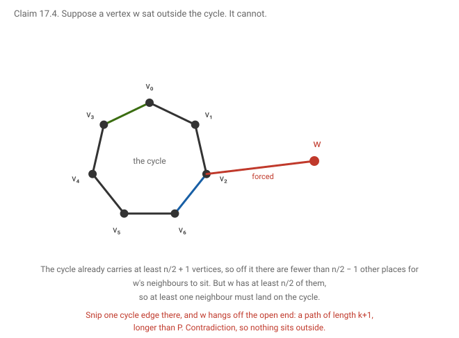

This is the step that is not in question 3, and it is the whole difference between the two theorems. The counting is the point: the cycle is already so big that there is not enough room left outside it to hold all of w's neighbours, so one of them is forced onto the cycle. Once w has a neighbour there, the snip turns the cycle back into a path and w extends it.

Hence the cycle passes through every vertex of G, so it is a Hamiltonian cycle.

---

## 18. Whitney's theorem ★★★

> Question. Prove that a graph on at least three vertices is 2-connected if and only if every pair of vertices has two internally vertex disjoint paths between them.

Symbols here. n is the number of vertices. Two x to y paths are internally vertex disjoint when the only vertices they share are x and y themselves. A graph is 2-connected when it has more than two vertices and no single vertex whose deletion disconnects it; such a vertex is a cut vertex. dist(x,y) is the number of edges on a shortest x to y path. P and Q are paths from x to v, R is a path walked back from y, and z is the first vertex of P ∪ Q that R reaches. A bridge is an edge whose removal increases the number of components.

Two directions. The theorem is an if and only if, so there are two separate statements to prove.

Forward direction. The statement being proved is: if G is 2-connected, then every pair of vertices has two internally vertex disjoint paths between them. That is Claims 18.2 to 18.5, and it is the real work.

Backward direction. The statement being proved is: if every pair of vertices has two internally vertex disjoint paths between them, then G is 2-connected. That is Claim 18.1, and it is four lines.

A trap here: the claims come in the opposite order to the statement. The short direction is proved first.

How the proof runs. Backward is direct and takes four lines. Forward is induction on the distance between the two vertices, which is the only genuine induction in this file apart from question 22. Inside the induction step there is a case split on whether y is already caught by the two paths, and Claim 18.2 is a separate small contradiction proving a 2-connected graph has no bridge.

### Claim 18.1 (backward direction) — Two disjoint paths for every pair give 2-connectedness

Proof. Delete any single vertex u and take any two surviving vertices x and y. By hypothesis two internally disjoint x to y paths exist in G. The vertex u cannot lie on both, since it would then be an internal vertex shared by two paths sharing no internal vertex. So at least one path survives whole and x and y remain joined. As u, x and y were arbitrary, no single vertex separates G.

Same running graph throughout question 18. Deleting v₁ kills the red path, and the green one carries x to y regardless. One vertex, one path, that is the whole claim.

### Claim 18.2 (forward direction, a lemma it needs) — A 2-connected graph on at least three vertices has no bridge

Proof. Suppose the edge xy were a bridge. Then G − xy has exactly two components, one holding x and one holding y. Since n ≥ 3 one of them has at least two vertices, say the one holding x. Deleting x then separates the rest of that component from y, so x is a cut vertex, contradicting 2-connectedness.

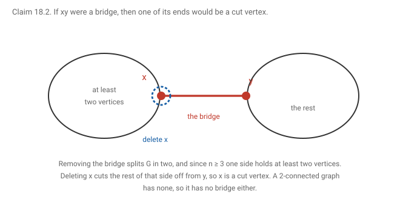

A bridge forces one of its ends to be a cut vertex, which a 2-connected graph cannot have. This is quoted twice later, in Claim 18.3 and again in Claim 20.1.

### What the induction is actually on, before Claims 18.3 and 18.4

The thing being inducted on here is the distance between the two vertices, not the number of vertices in the graph. That is unusual enough to be worth saying out loud, because writing "induct on n" out of habit would be wrong.

Here is the statement being proved, written out with its quantifiers, because that is what an examiner wants to see at the top of the proof.

> Fix G, 2-connected, on at least three vertices. For k ≥ 1 let P(k) be the statement: for every pair of distinct vertices u and w of G with dist(u,w) ≤ k, there are two internally disjoint u to w paths in G.

The base is P(1), which is the smallest distance two different vertices can be apart, and that is why the base case is about adjacent vertices. The step is P(k) implies P(k+1). Since G is connected every pair is at some finite distance, so proving P(k) for all k proves the theorem.

Three parts of that statement carry weight.

For every pair is not decoration. In the step you begin with x and y at distance k+1 and then apply the hypothesis to a different pair, x and v. If P(k) had been about one fixed pair there would be nothing to invoke.

G never changes. The induction variable is the distance, not the size of the graph, so every rung lives in the same G with the same 2-connectedness available. That is what lets Claim 18.4 say "G − v is connected" at every step rather than only at the first.

Writing "at most k" rather than "exactly k" costs nothing. The step only ever applies the hypothesis at distance exactly k, so either version works, but at most k is the safer habit.

The trap is writing "assume the result for all 2-connected graphs on fewer than n vertices". That is the reflex form of induction and it does not close here, because deleting a vertex from a 2-connected graph leaves something merely connected, so the hypothesis would not apply to what is left.

Here is the ladder climbing on one small graph, which is the same graph the rest of question 18 uses.

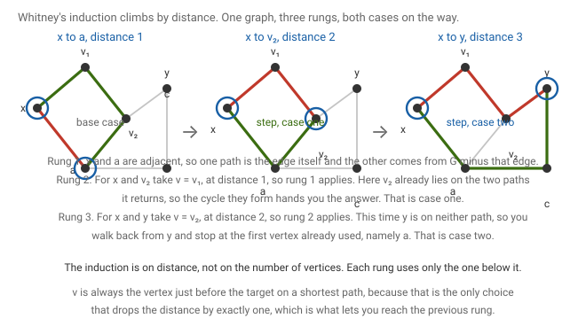

Rung one, x and a, at distance 1. They are adjacent. One path is the edge xa. For the second, delete that edge and look for an x to a path in what is left: x, v₁, v₂, a. That is Claim 18.3.

Rung two, x and v₂, at distance 2. Take a shortest path from x to v₂ and let v be the vertex just before v₂ on it, so v = v₁, which sits at distance 1 from x. Rung one applies to x and v₁ and returns two internally disjoint paths, namely the edge xv₁ and the route x, a, v₂, v₁. Now look at where v₂ is: it already lies on one of those two paths. So the cycle they form passes through v₂, and its two arcs from x to v₂ are the answer. That is case one of Claim 18.4.

Rung three, x and y, at distance 3. Take v = v₂, at distance 2, so rung two applies and hands back x, v₁, v₂ and x, a, v₂. This time y lies on neither. So delete v₂, walk back from y inside what remains, and stop at the first vertex you meet, which is a. That gives x, v₁, v₂, y and x, a, c, y. That is case two of Claim 18.4.

Two things to take from the ladder. The choice of v is not arbitrary: taking the vertex just before the target on a shortest path is the only choice that lowers the distance by exactly one, which is precisely what lets you reach the rung below. And the two cases really do cover everything, because the target either is or is not on the pair of paths the induction hands you.

### Claim 18.3 (forward direction, base case) — Adjacent vertices

Proof. Let dist(x,y) = 1, so xy is an edge. The first path is that edge itself.

The second path is the only real content here, and it needs care. You cannot simply say that G is connected so another path exists, because the only path connectivity promises you might be the edge xy over again. You have to forbid that edge first. So delete it and ask whether G − xy is still connected. By Claim 18.2 a 2-connected graph on at least three vertices has no bridge, so deleting any single edge leaves the graph connected. That gives an x to y path inside G − xy, and it cannot be the edge xy because that edge is gone.

Finally the two are internally disjoint for free, because the edge xy has no internal vertices at all, so there is nothing for the second path to clash with.

That is the whole reason Claim 18.2 is in this question. It exists only to license this one step.

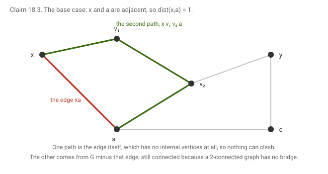

The base case on the running graph, taking the adjacent pair x and a. The edge itself is one path and has no interior at all, so disjointness is free.

### Claim 18.4 (forward direction, induction step) — Vertices at distance k+1

Proof. Assume the statement for every pair at distance at most k, and let dist(x,y) = k+1.

Take a shortest x to y path and let v be the vertex immediately before y on it. Two facts about v matter, and both come straight from it sitting on a shortest path. First, vy is an edge. Second, dist(x,v) = k exactly, one less than dist(x,y), because a shortest path from x to y passes through a shortest path from x to v.

That second fact is the entire reason for choosing v this way. The induction hypothesis only speaks about distances up to k, so you need a target at distance k, and the vertex just before y is the one that supplies it.

One note on names before the pictures. Every figure from here on draws the same small graph, the one with dist(x,y) = 3, and in that graph the vertex just before y is the one labelled v₂. So read v₂ = v throughout. The figures say v₂ because the graph is concrete, and the proof says v because it is not.

Apply the hypothesis to x and v. It returns two internally disjoint paths P and Q from x to v. Note what it does not return: it says nothing about y, which is why what happens next splits into cases.

dist(x,y) = 3 here, so v₂ is the vertex just before y and dist(x,v₂) = 2. P and Q are what the induction hypothesis hands you, and the edge v₂y is the one extra thing you get for free.

The split is on whether y already lies on P or on Q, and those two possibilities obviously cover everything.

Suppose first that y lies on P or on Q. Then P together with Q is a cycle through x and v, and y sits on it. The two arcs of that cycle between x and y are internally disjoint paths, so we are done.

Suppose instead that y lies on neither. Now we have to produce a way back from y to the paths we already have, and this is the one place in the whole proof where 2-connectedness is spent. Everything else is bookkeeping.

The object we want is a path R that starts at y, ends on P ∪ Q, and stays away from v. It exists for three reasons, in this order.

First, G − v is connected. That is what 2-connected buys: no set of fewer than two vertices separates G, so no single vertex is a cut vertex, so deleting v leaves the graph in one piece.

Second, y and x both survive that deletion, so G − v contains a path from y to x. Call it W. That y ≠ v is because vy is an edge and the graph is simple. That x ≠ v is because dist(x,v) = k, which is at least 1.

Third, W is forced to meet P ∪ Q, not by any cleverness in choosing it but because it ends at x, and x lies on both P and Q. So the vertices of W that lie in P ∪ Q form a non-empty set, and it makes sense to speak of the first one.

So follow W from y and stop at the first vertex of P ∪ Q it reaches, calling that vertex z and the piece travelled R. Two facts hold by construction: R avoids v, since all of W does, and no vertex of R except z lies on P or on Q, since z was the first hit. The truncation is the whole point here. W itself may wander in and out of P ∪ Q several times, and keeping all of it would leave you with nothing disjoint; cutting at the first hit is exactly what makes the second fact true, and that fact is what Claim 18.5 leans on.

Nothing here claims R is unique, and nothing needs it to be. Without loss of generality z lies on Q. Put

$$
P_1 = x\,P\,v + vy,
\qquad
P_2 = x\,Q\,z + z\,R\,y .
$$

The awkward case, where y is on neither path. Walk back from y along R and stop at the first vertex already used, marked z. Here z turns out to be a, which lies on Q.

One edge case, since it looks alarming and is not. z may be x itself, if W avoids P ∪ Q right up to the end. Then the stretch "x along Q to z" is the trivial path on one vertex and P₂ is simply R. The argument does not care, and neither do the three checks below.

### Claim 18.5 (forward direction, finishing the step) — Those two paths are internally disjoint

Proof. Write down what the two interiors actually are. P₁ walks along P to v and then takes one edge to y, so its interior is the interior of P together with v. P₂ walks along Q to z and then along R to y, so its interior is the stretch of Q strictly between x and z, together with the interior of R.

Three checks, and between them they cover every way the two could collide.

One. The P part misses the Q part, since P and Q are internally disjoint. That is exactly what the induction hypothesis promised, and it is the only thing it promised.

Two. The interior of R misses both, since R was stopped at the first vertex of P ∪ Q it reached, so nothing strictly before z lies on either.

Three. v lies on neither piece of P₂. It is not on R, because R was built inside G − v. And the stretch of Q used stops at z, which is a vertex of R and therefore also not v.

So P₁ and P₂ meet only at x and y.

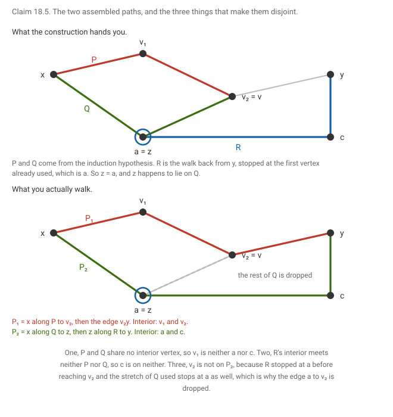

The top panel is the raw material and the bottom panel is the assembly. Notice what gets thrown away: the part of Q beyond z is never walked, and that is what keeps v₂ off P₂.

Claims 18.1 and 18.3 to 18.5 give both directions.

## 19. Adding a vertex keeps a graph k-connected ★★☆

> Question. Let G be k-connected and let H be obtained by adding one new vertex u joined to at least k vertices of G. Prove that H is k-connected.

Symbols here. A separator, also called a vertex cut or a separating set, is a set S of vertices whose deletion leaves the graph disconnected; a cut vertex is a separator of size one. G is k-connected, meaning it has more than k vertices and no set of fewer than k vertices separates it. V(G) is the vertex set, u is the new vertex, and H is the enlarged graph. H − S is H with S deleted, and S ∖ {u} is S with u removed.

One word about S, because it is where this kind of proof goes wrong. S below is a candidate separator: an arbitrary small set that we are testing, not a separator we have been handed. Candidate is not standard terminology, it is just a reminder. The job in every k-connectedness proof is to take any set of fewer than k vertices and show it fails to cut the graph, so if you read S as "the separator" you will start assuming H − S is disconnected, which is precisely the thing being refuted.

How the proof runs. Direct, by case analysis. Two cases, on whether the new vertex lies in the candidate set or not, and each case is a couple of lines. No contradiction and no induction.

### Claim 19.1 — The size condition

Proof. G is k-connected so it already has more than k vertices, and H has one more than that.

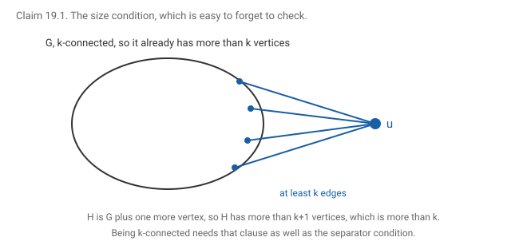

Easy to skip, but k-connectedness is two conditions and this is the second one.

### Claim 19.2 — Small sets containing u fail to separate

Proof. Let S be a set of at most k−1 vertices of H with u ∈ S. Then H − S is exactly G − (S ∖ {u}), which removes at most k−2 vertices from G. Since G is k-connected, what remains is connected.

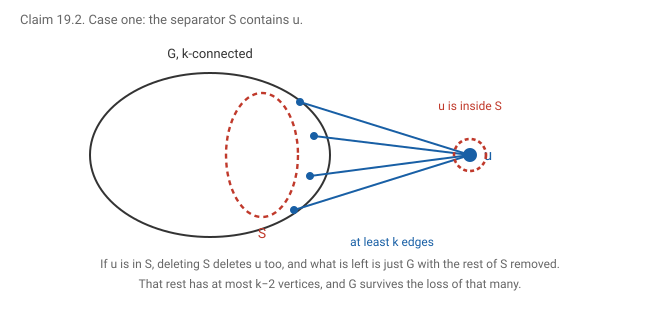

When u sits inside S, deleting S takes u with it, and only k−2 vertices are actually removed from G.

### Claim 19.3 — Small sets avoiding u fail to separate

Proof. Let S have at most k−1 vertices with u ∉ S, so S ⊆ V(G) and G − S is connected. The vertex u has at least k neighbours in G, and at most k−1 of them can lie in S, so at least one survives. Therefore u is joined by an edge to the connected graph G − S, and H − S is connected.

No set of at most k−1 vertices separates H, so H is k-connected. The hypothesis is used exactly once, in Claim 19.3; joining u to only k−1 vertices would let S be precisely those neighbours.

---

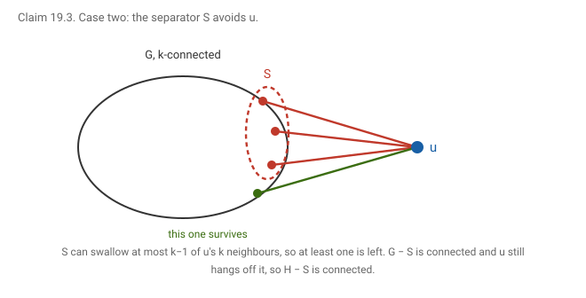

The case the hypothesis is for. S has at most k−1 vertices and u has at least k neighbours, so one always survives to hold u on.

## 20. Subdivision, and what 2-connectedness buys ★★☆

> Question. Prove that subdividing an edge does not change whether a graph is 2-connected. Deduce that in a 2-connected graph any two vertices lie on a common cycle, and so do a vertex and an edge, and two edges.

Symbols here. Subdividing the edge e = ab means deleting it and adding a new vertex w together with the two edges aw and wb; H denotes the result. Suppressing w is the reverse, replacing the path a, w, b by the single edge ab. V(G) is the vertex set, and G − u is G with the vertex u deleted while G − e is G with only the edge e deleted. A pendant vertex is one of degree 1.

How this one splits. Claim 20.1 is itself an if and only if. Its forward direction proves the statement: if G is 2-connected, then the subdivision H is 2-connected. Its backward direction proves the statement: if H is 2-connected, then G is 2-connected. Both live inside the one proof and are labelled there. Claims 20.2 to 20.4 are not directions of anything; they are three consequences drawn afterwards, each using Claim 20.1 as a tool.

How the proof runs. Claim 20.1 is direct, by case analysis on which vertex gets deleted, in both of its directions. Claims 20.2 to 20.4 are direct deductions that use Claim 20.1 as a tool, together with Whitney from question 18. So this proof depends on question 18.

### Claim 20.1 (both directions, in one proof) — Subdividing preserves 2-connectedness

Proof. Let the edge e = ab be subdivided by a new vertex w, giving H. This claim is an if and only if in its own right, so it has two halves, and both are done here.

Forward direction: assume G is 2-connected and show H is. Delete one vertex of H. If the deleted vertex is w, what remains is G − e, which is connected because a 2-connected graph has no bridge, by Claim 18.2. If it is a, then w keeps only the edge wb, so what remains is G − a with a pendant vertex hanging at b, and G − a is connected. The case of b is symmetric. For any other vertex u, what remains is G − u with e still subdivided, connected because G − u is.

Backward direction: assume H is 2-connected and show G is. Take u ∈ V(G). Then H − u is connected, and suppressing w, which replaces the path a, w, b by the single edge ab, leaves it connected. That graph is G − u.

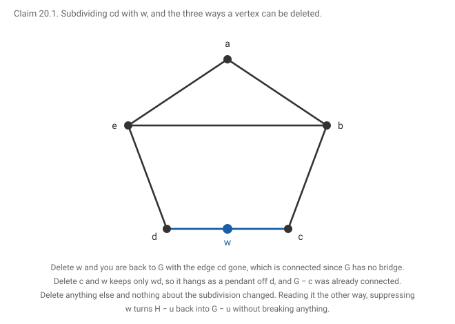

One running graph for all of question 20: the five cycle a b c d e with the chord be. Here cd has been subdivided by w.

### Claim 20.2 — Two vertices lie on a common cycle

Proof. By Whitney there are two internally disjoint x to y paths, and two internally disjoint paths with the same endpoints glue into a cycle through both endpoints.

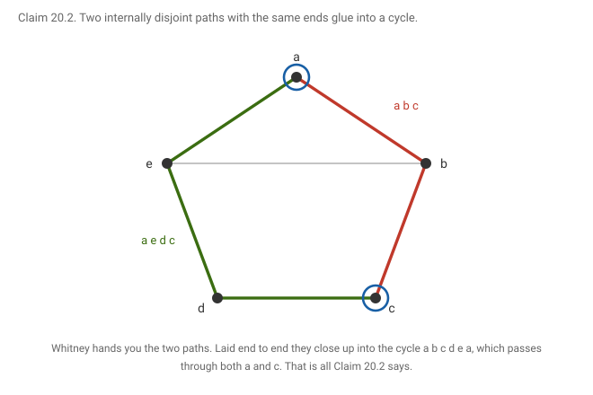

Two internally disjoint paths with the same two ends are a cycle already, just drawn apart.

### Claim 20.3 — A vertex and an edge lie on a common cycle

Proof. Subdivide e = ab with a new vertex w, giving G′, which is 2-connected by Claim 20.1. By Claim 20.2 some cycle of G′ passes through x and w. The vertex w has degree exactly two in G′, so any cycle through it uses both aw and wb. Suppress w and that stretch becomes the edge ab, leaving a cycle of G through x and e.

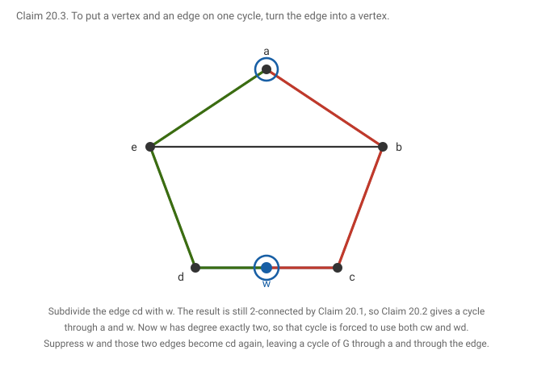

The trick in one picture: an edge becomes a vertex, you apply Claim 20.2, then you undo the subdivision.

### Claim 20.4 — Two edges lie on a common cycle

Proof. Subdivide e with a vertex w and f with a vertex w′, apply Claim 20.2 to w and w′, then suppress both.

The pattern is worth naming: subdividing turns an edge into a vertex, so every one of these reduces to the two vertex case.

---

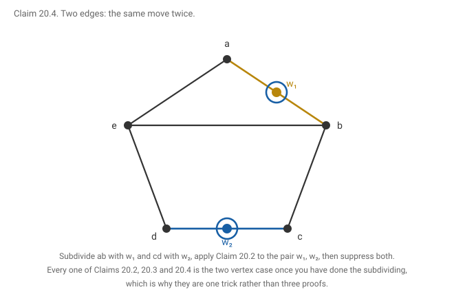

Two edges, so subdivide twice. Nothing new happens.

## 21. Blocks and the block tree ★★★

> Question. Define a block, and prove that the block graph of a connected graph is a tree.

> Definition. A block of G is a maximal connected subgraph with no cut vertex. A bridge together with its two ends is a block, and so is an isolated vertex, so a block need not be 2-connected. The block graph of G has one node for each block and one for each cut vertex, with a cut vertex node joined to a block node when that cut vertex lies in that block.

The example those claims refer to. B₂ and B₄ are single edges, so neither is 2-connected, which is precisely why a block is not defined as a maximal 2-connected subgraph.

Symbols here. A cut vertex is a vertex whose deletion increases the number of components. B and B′ denote blocks, and B₁, c₁, B₂, c₂, …, Bᵣ, cᵣ is an alternating sequence of block nodes and cut vertex nodes. A subgraph is maximal for a property when no larger subgraph containing it also has that property. A tree is a connected acyclic graph.

How the proof runs. Connectedness is direct. Acyclicity is by contradiction: suppose the block graph has a cycle, and show the blocks on it would merge into one, contradicting maximality. Claim 21.1 is a contradiction of the same shape.

### Claim 21.1 — Two blocks share at most one vertex

Proof. Suppose blocks B and B′ shared two vertices. Their union is connected, and it has no cut vertex: deleting any single vertex leaves B and B′ each still connected, since neither has a cut vertex, and they still share at least one of their two common vertices, which glues the two pieces. So the union is a connected subgraph with no cut vertex properly containing B, contradicting the maximality of B.

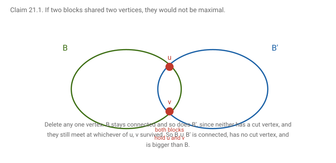

Two blocks sharing two vertices would glue into something bigger with still no cut vertex, which maximality forbids.

### Claim 21.2 — The block graph is connected

Proof. G is connected, so any two of its vertices are joined by a path. Reading that path off, it passes through a sequence of blocks with consecutive ones meeting at cut vertices, and that sequence is a walk in the block graph.

The block graph of the example above, alternating between block nodes and cut vertex nodes.

### Claim 21.3 — The block graph is acyclic

Proof. A cycle in the block graph alternates block nodes and cut vertex nodes, say B₁, c₁, B₂, c₂, …, Bᵣ, cᵣ and back to B₁. Take the union of B₁ through Bᵣ inside G. Deleting any cᵢ leaves that union connected, because the cycle supplies a second route round the other way. Deleting any other vertex leaves each block connected, since no block has a cut vertex, and the blocks remain glued at the cᵢ. So the union is connected with no cut vertex and properly contains B₁, contradicting maximality.

Connected and acyclic, so the block graph is a tree.

A corollary used elsewhere: two vertices of a connected graph lie in a common block exactly when no single cut vertex separates them. If they lay in different blocks, the block tree path between them would pass through a cut vertex node, and that vertex separates them in G.

---

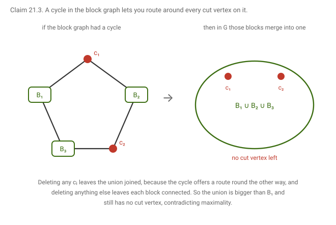

A cycle in the block graph would give a second route around every cut vertex on it, so those blocks would merge.

## 22. Open ear decomposition ★★★

> Question. Define an ear decomposition and prove that a graph on at least three vertices is 2-connected if and only if it has an open ear decomposition.

> Definition. An ear of a subgraph H is a path whose two endpoints lie in H and whose internal vertices do not. It is trivial when it has no internal vertices, open when its two endpoints differ, and closed when they coincide. An ear decomposition partitions the edges of G into E₁, E₂, …, Eₖ where E₁ is a cycle and each later Eᵢ is an ear of E₁ ∪ … ∪ Eᵢ₋₁. It is open when every ear after the first is open.

Trivial or not asks whether the ear has an interior. Open or closed asks whether its two ends are different vertices. They are independent questions, and only the second one appears in the theorem.

A trivial ear is where most of the confusion sits, so read it off the picture: it is an edge of G that runs between two vertices you already have, added without bringing anything new. The proof of Claim 22.3 uses exactly this case first, since if such an edge exists you take it and move on.

Symbols here. δ(G) is the minimum degree and n the number of vertices. H denotes a subgraph. A cut vertex is one whose deletion disconnects the graph. The letters a and b are the two endpoints of the ear currently being added.

The two families of letters are different kinds of thing, and mixing them up is the usual way to get lost here. Each Eᵢ is a set of edges, namely one ear. Each Gᵢ is a whole graph, namely E₁ ∪ E₂ ∪ … ∪ Eᵢ, everything built after i ears. So Gᵢ grows as i grows, while Eᵢ is just the one piece you added at step i.

Two directions. The theorem is an if and only if, so there are two separate statements to prove.

Forward direction. The statement being proved is: if G is 2-connected, then G has an open ear decomposition. That is Claim 22.3.

Backward direction. The statement being proved is: if G has an open ear decomposition, then G is 2-connected. That is Claim 22.1.

A trap here too: the claims come in the opposite order to the statement. Claim 22.2 belongs to neither direction; it explains why the word open is in the theorem at all.

How the proof runs. Backward is induction on the number of ears, with a case split inside on where the deleted vertex sits. Forward is an algorithmic construction: keep finding ears until none is left, and finiteness guarantees it stops. That termination argument is doing real work and is easy to forget to write.

### What Gᵢ₋₁ and Gᵢ actually are

This is the part that trips people, so here it is on a named example before any proof starts.

Take the graph on vertices a to h with these ten edges, split into three ears.

| i | the ear Eᵢ | its two ends | its interior |
|---|---|---|---|
| 1 | ab, bc, cd, de, ea | none, it is a cycle | none |
| 2 | df, fg, gc | d and c | f and g |
| 3 | ah, hb | a and b | h |

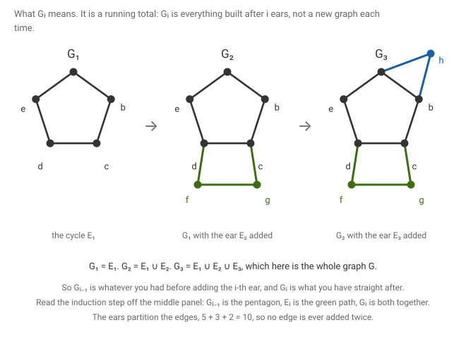

Now read off the running totals.

G₁ is E₁ alone, the five cycle on a, b, c, d, e.

G₂ is E₁ ∪ E₂, so the cycle plus the path d f g c hanging below it. Seven vertices, eight edges.

G₃ is E₁ ∪ E₂ ∪ E₃, which is the whole graph G. Eight vertices, ten edges.

So Gᵢ is not a fresh object at each step. It is a running total, the way a partial sum is. Gᵢ₋₁ means whatever you had built before adding the i-th ear, and Gᵢ means what you have immediately after adding it. In one line, Gᵢ = Gᵢ₋₁ together with Eᵢ.

When Claim 22.1 says "suppose Gᵢ₋₁ is 2-connected and Eᵢ is an open ear of it", read that off the middle panel with i = 2. Gᵢ₋₁ is the pentagon, Eᵢ is the green path d f g c, and Gᵢ is the two of them together. The claim is then asking you to check that the right hand panel is still 2-connected given that the left hand one was.

Two small things worth noticing on the example. The ears partition the edges, 5 + 3 + 2 = 10, so no edge is ever added twice and nothing is left over. And the ends of each ear are already present when you add it, while its interior vertices are brand new, which is what makes the count work.

Verified: G₁, G₂ and G₃ are each 2-connected, both ears are open with their ends in the previous stage and their interiors outside it, and the three ears partition all ten edges.

### Claim 22.1 (backward direction) — An open ear decomposition forces 2-connectedness

Proof. Induct on the number of ears, writing Gᵢ for E₁ ∪ … ∪ Eᵢ. The base G₁ is a cycle, which is 2-connected. Suppose Gᵢ₋₁ is 2-connected and Eᵢ is an open ear with distinct endpoints a and b. Take any vertex u of Gᵢ. If u is internal to the ear, deleting it leaves Gᵢ₋₁ untouched with two stubs hanging off a and off b, so what remains is connected. If u lies in Gᵢ₋₁, then Gᵢ₋₁ − u is connected, and since a ≠ b at least one end of the ear survives, holding its interior on. Either way Gᵢ − u is connected, so Gᵢ is 2-connected.

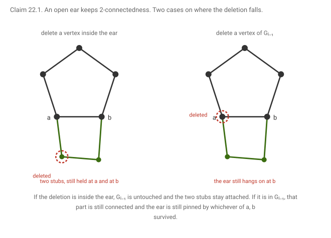

The induction step, split on where the deleted vertex falls. Both cases leave the graph in one piece.

### Claim 22.2 (neither direction, a remark) — Openness is exactly what Claim 22.1 needs

Proof. A closed ear has a = b. Deleting that single vertex detaches the entire interior of the ear from the rest, so the second case of Claim 22.1 fails. This is the whole reason the theorem says open.

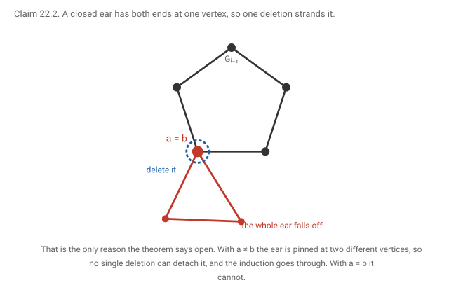

Why the word open is in the theorem. A closed ear is pinned at one vertex, and deleting that vertex takes the whole ear with it.

### Claim 22.3 (forward direction) — A 2-connected graph has an open ear decomposition

Proof. Since G is 2-connected, δ(G) ≥ 2, so G contains a cycle; take one and call it E₁. Now suppose Gᵢ has been built and is not yet all of G.

If some edge of G has both endpoints in Gᵢ without being in Gᵢ, take it. It is a trivial ear, and it is open because a simple graph has no loops.

Otherwise some vertex lies outside Gᵢ. Since G is connected, some vertex a of Gᵢ has a neighbour v outside it. Delete a. Since G is 2-connected, G − a is connected, so inside G − a there is a path from v back to Gᵢ; follow it and stop at the first vertex b of Gᵢ it reaches. Then a, v, then along to b is an ear whose interior lies outside Gᵢ, and b ≠ a because the path avoided a, so the ear is open.

Each step consumes at least one new edge and G is finite, so the process halts, and it can only halt when Gᵢ is all of G.

---

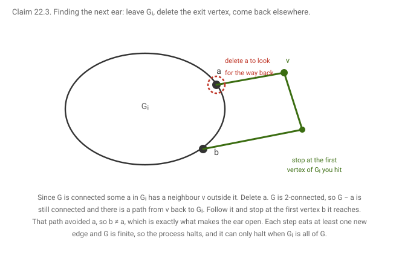

The step that finds the next ear. Deleting a before looking for the way back is what forces b ≠ a, which is what makes the ear open.

---

## 23. A vertex in every maximum matching ★☆☆

> Question. Let G be bipartite with at least one edge. Prove that some vertex of G lies in every maximum matching.

Symbols here. G is bipartite. M and N denote maximum matchings, and a vertex is matched when some edge of the matching touches it. ∣M∣ is the number of edges in M.

Watch the quantifiers, because swapping them changes the claim entirely. The statement is that one single vertex works for all maximum matchings at once. It is not the far weaker claim that each maximum matching contains some vertex, which is obvious.

How the proof runs. Contradiction. Assume no vertex works, pick a vertex and a maximum matching missing it, superimpose two maximum matchings, and crash into an odd cycle, which bipartiteness forbids.

### Claim 23.1 — An odd cycle has no such vertex

Proof. An odd cycle looks identical from each of its vertices, and every maximum matching leaves exactly one vertex out. So whichever vertex you name, you can rotate a maximum matching until that vertex is the one left over.

Verified: C₃, C₅, C₇ and C₉ each have zero such vertices, while every even cycle has all n of them. This is why the question says bipartite.

### Claim 23.2 — In a tree a leaf's parent qualifies

Proof. Let u be a leaf with neighbour p. If some maximum matching missed p, then u would be unmatched too, since p is its only possible partner, and adding the edge up would give a larger matching.

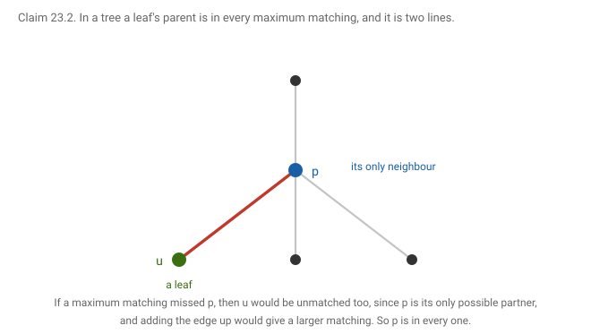

Worth contrasting with the weaker fact from question 6's territory: a leaf's edge lies in some maximum matching, while a leaf's parent lies in every one. Different quantifier, stronger statement.

### Claim 23.3 — Every bipartite graph with an edge has one

Proof. Suppose not. Pick any vertex u and a maximum matching M missing it, and let x be a neighbour of u. Then x must be matched by M, since otherwise M plus the edge ux would be larger. Pick a maximum matching N missing x.

Superimpose M and N. Every degree is at most two, and the two matchings have equal size, so every component is an even path or an even cycle. Both u and x have degree one there, so each is the end of a path. Swap along the path ending at u: both matchings stay maximum, and u becomes unmatched by the new N.

If x is also unmatched by it, the edge ux augments, which is impossible. If x is matched, then x lay on that path, so the path runs from u to x with even length, and adding ux closes an odd cycle. A bipartite graph has none.

Bipartiteness is used in exactly one place, that last sentence. Everything before it holds in any graph, which is precisely why the odd cycle of Claim 23.1 is the only obstruction.

---

## 24. At least β vertices in every maximum matching  (asked on 12 September)

> Question. Let G be bipartite with β(G) = k. Prove that at least k vertices lie in every maximum matching.

Symbols here. β(G) is the vertex cover number, the size of a smallest vertex cover, and α′(G) is the matching number. G − v is G with the vertex v deleted along with its edges.

A warning before anything else. This statement is false without bipartiteness, so if the question is set without that word, say so. The five cycle has β = 3 and not a single vertex lies in every maximum matching, so the count is 3 against 0. Verified: C₅ and C₇ both give zero, while 561 random bipartite graphs gave no failures.

How the proof runs. Induction on k, with König used once at the start to convert the hypothesis, and question 23 used inside the step to supply the vertex you peel off.

### Claim 24.1 — König first, to make the hypothesis usable

Proof. The hypothesis is about covers and the conclusion is about matchings, so they have to be connected. G is bipartite, so König gives α′(G) = β(G) = k, meaning every maximum matching has exactly k edges.

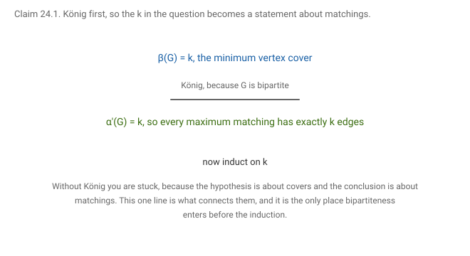

Now induct on k. When k = 0 there are no edges and nothing to prove.

### Claim 24.2 — Peel off one vertex and the matching number drops by exactly one

Proof. By question 23 there is a vertex v lying in every maximum matching. Let G′ = G − v.

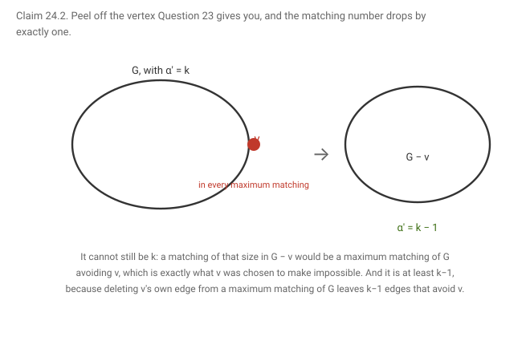

The matching number of G′ is exactly k−1. It cannot be k, because a matching of that size in G′ would be a maximum matching of G avoiding v, which is what v was chosen to rule out. And it is at least k−1, because deleting v's own edge from a maximum matching of G leaves k−1 edges that avoid v.

Since G′ is still bipartite, König applies again and β(G′) = k−1 too.

### Claim 24.3 — The induction closes, and v is a new vertex

Proof. By the induction hypothesis at least k−1 vertices lie in every maximum matching of G′.

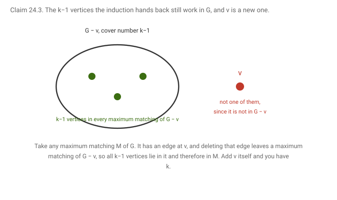

Those same vertices work for G. Take any maximum matching M of G. It contains an edge at v, and removing that edge leaves a matching of G′ with k−1 edges, which is therefore maximum there. So each of the k−1 vertices lies in it, and hence in M.

None of them is v, because they live in G′ and v does not. Adding v gives at least k vertices, which is what was wanted.

Checking the count on a small case: the path on three vertices has β = 1, its two maximum matchings are the two edges, and the middle vertex is in both. Exactly one, as promised.

---

## 25. No even cycle bounds the number of edges  (asked on 12 September)

> Question. Prove that a graph with no even cycle has at most 2n edges.

Symbols here. n is the number of vertices and m the number of edges. δ(H) is the minimum degree of a subgraph H. An even cycle is one whose number of edges is even.

How the proof runs. Direct, by repeated stripping, and it is really question 2 read backwards. The whole content is that the hypothesis forbids minimum degree three, so there is always a cheap vertex to delete.

### Claim 25.1 — Every subgraph also has no even cycle

Proof. A subgraph contains only vertices and edges of G, so any cycle inside it was already a cycle of G. Deleting things never creates a cycle.

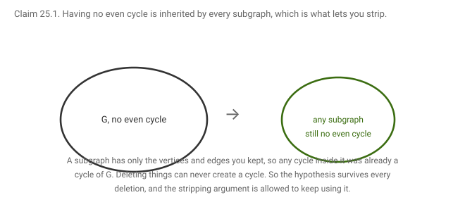

This is the step that makes the stripping legal. Without it you could only apply the hypothesis once, to G itself.

### Claim 25.2 — So every subgraph has a vertex of degree at most 2

Proof. This is question 2 in contrapositive. That question proves that δ ≥ 3 forces an even cycle, so a graph with no even cycle has δ ≤ 2. By Claim 25.1 the same applies to every subgraph.

Verified over 1688 even-cycle-free random graphs: not one had minimum degree 3 or more.

In the language of Level 3, this says G is 2-degenerate.

### Claim 25.3 — Strip them one at a time and count

Proof. Repeatedly delete a vertex of degree at most 2, which Claim 25.2 guarantees exists at every stage. Each deletion removes one vertex and at most two edges.

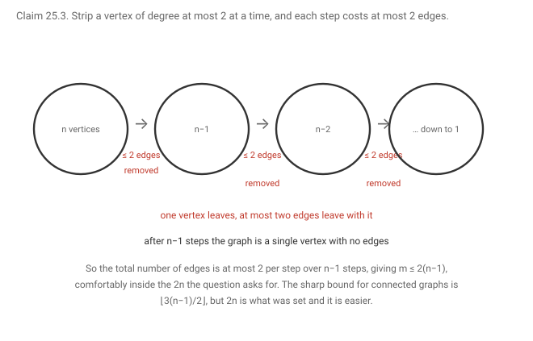

After n−1 deletions a single vertex is left with no edges, so the total number of edges removed, which is all of them, is at most 2(n−1). That is below 2n, so the bound asked for holds with room to spare.

Verified over 2904 even-cycle-free graphs: none exceeded 2n. The sharp bound for connected graphs is ⌊3(n−1)/2⌋, because every block turns out to be a single edge or an odd cycle, but 2n is what was asked and the stripping argument is much shorter.

---

## What the 12 September exam asked, and what it does not tell you

Start with the obvious caveat, because it matters more than the table. Questions do not repeat. Nothing below is a prediction, and revising these five specifically would be a mistake. What the paper is good for is telling you what this examiner's questions look like.

| Question | What it was | Was it in the bank |
|---|---|---|
| 1 | not recorded | |
| 2 | Hall's theorem | yes, question 8 |
| 3 | augmenting paths, so Berge | yes, question 6 |
| 4 | if β(G) = k, show k vertices lie in every maximum matching | no, now question 24 |
| 5 | no even cycle implies at most 2n edges | no, now question 25 |

Four of the five are pinned down, and three things follow.

The paper was three quarters matchings. Hall, Berge and the β vertices question all sit in the same unit, and only the even cycle bound came from anywhere else. Weighting revision by how much class time a topic got, rather than spreading evenly, would have been right. Applied to what is taught now, that says connectivity should get the same share of your attention that matchings got, since it has had comparable class time.

The split was half bookwork, half consequences. Hall and Berge are statements of named theorems you can prepare word for word. Questions 4 and 5 are not: each takes a class result and applies it to a statement you have not seen. Question 5 in particular is nothing more than "δ ≥ 3 forces an even cycle" read backwards, and it is about six lines. A bank made only of named theorems would have covered two of the four, which is why questions 23 to 25 are now here and why it is worth reading the consequences sections of each class note rather than only the theorems.

Cheap questions carry the same marks. Question 5 costs a fraction of what Tutte costs to learn and was worth the same. When time is short, take the short proofs first, which is what [[Bare Minimum]] already orders things by.

Connectivity was taught before this quiz and still left off it. The connectivity class was 31 August and the quiz was 12 September, so the material existed, but the quiz's declared scope stopped at 19 August. That is worth separating from the topic weighting above. The absence of connectivity questions says nothing at all about whether the examiner likes connectivity, because it was never eligible. What it does say is that questions 16 to 22 cover the one block that has been taught and never assessed, so they are ranked purely on the syllabus naming 2-connected graphs and ear decomposition as topics, with no evidence behind them either way.

One more gap. Question 1 is still unrecorded, so a fifth of the evidence is missing.

One correction worth carrying into the next paper. Question 4 as it was quoted to me is false without bipartiteness: the five cycle has β = 3 and not one vertex lies in every maximum matching. Either the paper said bipartite and it did not get written down, or the question was loose. If something similar appears, write the hypothesis in yourself and say where you use it.

## Final recall checklist

How to use this. Cover the right hand column and work down the claims, writing each one line proof from memory. Then take the ones you got and try to expand them into the full argument on paper. A line that does not reconstruct the proof is the one to reread; a line you could not recall at all is worse, and that question needs a full pass. Do this the evening before rather than rereading the proofs, because recall and recognition are different skills and only one of them is tested.

If the full proof deserts you in the exam, write the one line anyway. Most of these claims are worth something on their own, and several of them are the entire idea of the proof compressed into a sentence.

The numbering matches the claims in the questions above, so 14.2 here is Claim 14.2 there.

### Every claim, with a one line proof

Sixty nine claims, one line each. The point of this table is partial credit: if the full argument has gone, write the line and you have still said the thing that makes the claim true. Cover the right hand column and work down.

| Claim | One line that proves it |
|---|---|
| 1.1 Handshake lemma | Count the pairs made of a vertex and an edge touching it, once vertex by vertex and once edge by edge. The first gives Σ deg(v), the second gives 2m. |
| 1.2 Odd degrees come in pairs | The whole sum is even and the even degree part is even, so the odd degree part is even, and a sum of odd numbers is even only when there are evenly many of them. |
| 2.1 Three neighbours lie on one path | A neighbour off the maximal path could be tacked on the end, so all of them lie on it, and δ ≥ 3 supplies three. |
| 2.2 One of three cycles is even | The three lengths are a+2, b+2 and a+b+2. If the first two were odd then a and b are odd, so a+b is even and the third one is even. |
| 3.1 Endpoint trapping | A neighbour off the path could be attached to that end, giving a longer path and contradicting the choice of P. |
| 3.2 The index sets overlap | Both sets have at least δ members inside the same box of r positions, so if r ≤ 2δ−1 their sizes add past r and pigeonhole forces a shared position. |
| 3.3 The overlap makes a cycle | The two crossing edges let you run v₀ up to vᵢ₋₁, jump to vᵣ, walk back down to vᵢ, then jump home, using every vertex of P once. |
| 3.4 The cycle contradicts longestness | From r ≤ n−2 some vertex sits off the cycle, connectivity gives it an edge in, so snip the cycle there and hang it on for a longer path. |
| 4.1 Bipartite graphs have no odd cycle | Every edge crosses between the sides, so the side flips at each step, and returning to where you began takes an even number of steps. |
| 4.2 No odd cycle gives a bipartition | Colour each vertex by the parity of its distance from a root; an edge inside one part would close a cycle of odd length. |
| 5.1 An Euler circuit forces both conditions | Each visit arrives on one edge and leaves on another, so the edges at a vertex pair up; and one continuous trail cannot jump between components. |
| 5.2 A maximal trail is closed | An open trail uses an odd number of edges at its last vertex, which clashes with even degree, so a spare edge is sitting there to extend it. |
| 5.3 A maximal trail uses every edge | Being closed it can be restarted at any of its own vertices, so a leftover edge touching it would extend it. |
| 6.1 An augmenting path enlarges a matching | Swap the path's edges in and out. Interior vertices only change partner, both ends were free, and the count goes up by one. |
| 6.2 A larger matching supplies an augmenting path | Superimpose the two matchings. Degrees are at most two, so the pieces are alternating paths and even cycles, and only an odd path can hold the surplus. |
| 7.1 Every cover has at least ∣M∣ vertices | The edges of M share no vertex, so a cover has to spend a separate vertex on each one. |
| 7.2 The search, stated in general | Start at the unmatched vertices of A, leave on a non-matching edge and return on a matching one. Then C is the reached B vertices plus the unreached A vertices, which amounts to one end of every matching edge. |
| 7.3 C covers every edge | Take any edge. If its A end was unreached, that end is in C. If its A end was reached, so was its B end, since the search crosses every free edge and a matching edge is reached at both ends or neither. |
| 7.4 C has exactly ∣M∣ vertices | Every vertex of C is matched, and no matching edge donates both ends, because a reached B vertex is always matched back into the reached part of A. |
| 8.1 A saturating matching forces Hall's condition | Each vertex of S has its own partner, the partners are distinct, and all of them lie in N(S). |
| 8.2 Failure to saturate violates Hall's condition | Take a minimum cover K and put S = A ∖ K. Every edge out of S is covered on the B side, so N(S) sits inside K ∩ B, and the count makes N(S) smaller than S. |
| 9.1 Hall's condition holds | Exactly k∣S∣ edges leave S and at most k∣N(S)∣ can land in N(S), so ∣S∣ ≤ ∣N(S)∣. |
| 9.2 The two sides have equal size | Counting all the edges from each side gives k∣A∣ = ∣E(G)∣ = k∣B∣, then divide by k. |
| 10 Induced path on three vertices | Take a shortest path between two non-adjacent vertices. Its first three give two edges, and the third is missing because it would shortcut the path. |
| 11 Shortest paths are induced | A chord crosses in one step what the path spends at least two on, so a path carrying a chord was never shortest. |
| 12.1 A shortest connector has clean interior | If an interior vertex of R lay on P or on Q, the rest of R would already be a shorter connector. |
| 12.2 Disjoint longest paths create a longer path | Each meeting point splits its path in two, and gluing the longer half of each onto the connector beats the maximum. |
| 13.1 A perfect matching forces the condition | Each odd component has to send a vertex out into S, and different components need different targets because M is a matching. |
| 13.2 A maximal counterexample keeps the condition | Deleting edges only splits components, and an odd component cannot split into pieces that are all even, so an odd one always survives. |
| 13.3 H−U a union of cliques | Match one vertex of each odd clique into U, pair the rest of each clique internally, and pair what is left of U among itself, which works because the parities agree. |
| 13.4 H−U not a union of cliques | Maximality gives perfect matchings using ac and using bx. Superimpose them and re-pair along the even cycles so the stretch through a, b, c uses ab or bc instead. |
| 14.1 The case S = ∅ | Summing degrees in a component gives 3∣V(C)∣ = 2∣E(C)∣, which is even, so ∣V(C)∣ is even and no component is odd. |
| 14.2 Odd components send out three edges | 3∣V(C)∣ = 2∣E(C)∣ + e(C,S) has an odd left side, so e(C,S) is odd. It cannot be 1, since that edge would be a bridge, so it is at least 3. |
| 14.3 Tutte's condition holds | At least 3 edges leave each odd component and at most 3 arrive at each vertex of S, so 3·odd(G − S) ≤ 3∣S∣ and the threes cancel. |
| 15.1 The first two groups | There is v itself, and it has exactly k neighbours because the graph is k regular, giving 1 + k. |
| 15.2 Each neighbour contributes k−1 | Each neighbour u has k−1 edges besides uv, and none can reach another neighbour of v without making a triangle. |
| 15.3 The outer groups do not overlap | Two neighbours sharing an outer vertex would give a four cycle, which girth 5 forbids. |
| 16.1 Four sets that would be disjoint | If x and y were non-adjacent with no common neighbour, then {x}, N(x), {y} and N(y) are pairwise disjoint, for three separate reasons. |
| 16.2 The count is impossible | Those four disjoint sets would hold at least 1 + (n−1)/2 + (n−1)/2 + 1 = n + 1 vertices, in a graph that has only n. |
| 16.3 The bound is sharp | Two disjoint copies of the complete graph on n/2 vertices have δ = (n−2)/2 and are disconnected. |
| 17.1 Endpoint trapping | Identical to Claim 3.1: a neighbour off the longest path could be tacked on the end. |
| 17.2 The two index sets overlap | Both sets hold at least n/2 positions inside a box of k ≤ n−1, so their sizes add past k and they must share one. |
| 17.3 The overlap gives a cycle | Identical to Claim 3.3: the two crossing edges close P into a cycle passing through all of its vertices. |
| 17.4 Nothing lies outside that cycle | The cycle already holds at least n/2 + 1 vertices, leaving too few places off it for w's n/2 neighbours, so one lands on the cycle and you snip and extend. |
| 18.1 Two disjoint paths give 2-connectedness | One deleted vertex can lie on at most one of two internally disjoint paths, so the other survives whole. |
| 18.2 A 2-connected graph has no bridge | A bridge splits G in two, and with n ≥ 3 one side holds two vertices, so deleting that end of the bridge cuts them off from the other side. |
| 18.3 Base case, adjacent vertices | The edge itself is one path. G minus that edge is still connected, since there is no bridge, so it supplies a second, and an edge has no interior to clash. |
| 18.4 Induction step, distance k+1 | Take v just before y on a shortest path and get two paths to v by induction. Either y is already on them, giving a cycle, or you walk back from y and stop at the first vertex used. That walk exists because G − v is connected, which is the one place 2-connectedness is spent. |
| 18.5 The two paths are internally disjoint | P and Q share no interior, R's interior meets neither, and v lies on neither R nor the stretch of Q that gets used. |
| 19.1 The size condition | G already had more than k vertices, and H has one more than G. |
| 19.2 Small sets containing u fail to separate | If u is in S then H − S is G with at most k−2 other vertices removed, which a k-connected graph survives. |
| 19.3 Small sets avoiding u fail to separate | S can swallow at most k−1 of u's k neighbours, so one survives and holds u onto the connected G − S. |
| 20.1 Subdividing preserves 2-connectedness | Delete w and you get G − e, connected because there is no bridge; delete a and w hangs pendant off b; delete anything else and the subdivision is untouched. Suppressing w reverses it. |
| 20.2 Two vertices on a common cycle | Two internally disjoint paths with the same two ends glue into a cycle through both of them. |
| 20.3 A vertex and an edge on a cycle | Subdivide the edge and apply Claim 20.2. The new vertex has degree two, so the cycle is forced to use both its edges, and suppressing gives the edge back. |
| 20.4 Two edges on a common cycle | Subdivide both edges and apply Claim 20.2 to the two new vertices. |
| 21.1 Two blocks share at most one vertex | If they shared two, deleting any single vertex leaves both connected and still meeting, so the union has no cut vertex and beats maximality. |
| 21.2 The block graph is connected | G is connected, so a path between any two vertices runs through a chain of blocks meeting at cut vertices. |
| 21.3 The block graph is acyclic | A cycle in it gives a second route around every cut vertex on it, so those blocks merge into one and beat maximality. |
| 22.1 An open ear decomposition gives 2-connectedness | Delete a vertex inside the ear and Gᵢ₋₁ is untouched with both stubs attached. Delete one in Gᵢ₋₁ and the ear still hangs on at its other end. |
| 22.2 Openness is what makes that work | A closed ear has a = b, so deleting that single vertex takes the whole ear with it. |
| 22.3 A 2-connected graph has one | Start from any cycle. Pick a in Gᵢ with a neighbour outside, delete a, and walk back to Gᵢ; the landing vertex differs from a, so the ear is open. |
| 23.1 An odd cycle has no such vertex | An odd cycle looks the same from every vertex and each maximum matching leaves exactly one out, so you can rotate any named vertex into the leftover slot. |
| 23.2 In a tree a leaf's parent qualifies | If a maximum matching missed the parent, the leaf would be unmatched too, and adding that edge would give a larger matching. |
| 23.3 Every bipartite graph with an edge has one | Superimpose two maximum matchings, swap along the even path at u so u goes free, and then either ux augments or adding ux closes an odd cycle. |
| 24.1 König first | The hypothesis is about covers and the conclusion about matchings, so use König to turn β(G) = k into α′(G) = k before doing anything else. |
| 24.2 Peel off one vertex | Question 23 gives a vertex v in every maximum matching, and deleting it drops the matching number by exactly one, no more and no less. |
| 24.3 The induction closes | The k−1 vertices from G − v lie in every maximum matching of G too, because deleting v's edge from one leaves a maximum matching of G − v, and v itself is a new one. |
| 25.1 Subgraphs inherit the hypothesis | Any cycle in a subgraph was already a cycle of G, since deleting things never creates one. |
| 25.2 Every subgraph has a vertex of degree at most 2 | This is question 2 in contrapositive: δ ≥ 3 would force an even cycle, so δ ≤ 2, and by Claim 25.1 the same holds in every subgraph. |
| 25.3 Strip and count | Delete a vertex of degree at most 2 repeatedly. Each step costs one vertex and at most two edges, and after n−1 steps nothing is left, so m ≤ 2(n−1). |

### The techniques underneath, and what each one unlocks

Most of the twenty two are one of seven ideas wearing different clothes. If you are short of time, learn the seven and rebuild the rest.

| Technique | Questions it drives |
|---|---|
| Count one quantity two ways | 1, 9, 14, 15, 16 |
| Take an extremal object and ask what un-extendability forces | 2, 3, 5, 12, 17, and 13 in the form of a maximal counterexample |
| Superimpose two edge sets and read off the components | 6, 13, and behind the scenes in 7 |
| Alternating reachability out of the unmatched vertices | 7, 8 |
| Shortest forbids shortcuts | 10, 11, and 18 where stopping at the first touch does the same job |
| Modify the graph to reduce to an easier case | 19, 20 |
| Parity | 2, 4, 13, 14 |

### Proofs that are really the same proof twice

Knowing these pairs halves the work.

Questions 3 and 17. Dirac is the long path theorem with one extra step at the end. If you can write 3, you are four lines from 17.

Questions 10 and 11. Both are shortest forbids shortcuts, once applied to the first three vertices and once to every pair.

Questions 1, 9 and 16. All three are a single quantity counted from two sides, then compared.

Questions 19 and 20. Both add or split something to turn a hard case into a case you have already done.

### Before you write, check which direction you are in

Nine of these have two directions, and three of the traps are worth a last look.

The claims run in the opposite order to the statement in questions 18 and 22. In both, the short easy direction is stated first even though the theorem reads the other way round.

The directions are proved by contrapositive in questions 6 and 8, so those claims look like they are proving the reverse of what you expect. In question 6 both directions are contrapositives, which is why neither claim reads like Berge's theorem does. Question 13's backward direction is a contradiction rather than a contrapositive, which is a different thing: it assumes both halves at once and crashes.

Question 7 is not an if and only if at all. It is an equation, so there is no forward or backward, only two inequalities to squeeze.

---

## Everything in one place

Three lookup tables, for when you want a definition or a statement without hunting through a proof. Nothing here is argued, only stated. If a line surprises you, the question it belongs to is the one to reread.

### Every term, one line

#### Language and basic objects

| Term | One line |
|---|---|
| Graph G | A vertex set V(G) and an edge set E(G), each edge joining two vertices. |
| Simple | No loops and no repeated edges. Everything in this file is simple. |
| n and m | n = ∣V(G)∣ is the number of vertices, m = ∣E(G)∣ the number of edges. |
| Adjacent | Two vertices joined by an edge. |
| Incident | A vertex and an edge that touches it. |
| Incidence | A pair made of a vertex and an edge touching it. Counting these two ways is the handshake lemma. |
| Neighbourhood N(v) | The set of vertices adjacent to v. N(S) is everything adjacent to something in S. |
| Degree deg(v) | The number of edges at v, which in a simple graph equals ∣N(v)∣. |
| δ(G) and Δ(G) | The minimum and maximum degree over all vertices. |
| k-regular | Every vertex has degree exactly k. Cubic means 3-regular. |
| Subgraph | A graph made from some of the vertices and some of the edges. |
| Induced subgraph | Pick the vertices and every edge of G between them comes along automatically. |
| Spanning subgraph | One that uses every vertex. |
| Maximal | Cannot be extended. Cheap to find, and every proof here needs only this. |
| Maximum | None bigger exists anywhere. Usually hard to find. |
| Complete graph Kₙ | Every two vertices adjacent. |
| Empty graph | No edges. It still has vertices. |
| G − S, G − v, G − e | Delete a vertex set, a vertex with its edges, or a single edge only. |
| Component | A maximal connected piece. Non-trivial when it has at least one edge. |
| Connected | Every two vertices are joined by a path. |

#### Walks, paths and cycles

| Term | One line |
|---|---|
| Walk | Any sequence of vertices with consecutive ones adjacent. Repeats anything. |
| Trail | A walk repeating no edge. Closed when it starts and ends at the same vertex. |
| Path | A walk repeating no vertex. |
| Circuit | A closed trail. |
| Cycle | A closed path. |
| Length | The number of edges, so a path on m vertices has length m−1. |
| Endpoint and interior vertex | The two ends of a path, versus everything strictly between them. |
| Internally disjoint | Two x to y paths whose only shared vertices are x and y. |
| Chord | An edge joining two vertices of a path or cycle that are not consecutive along it, so it is a shortcut past everything between them. |
| Induced path | A path with no chord, so no edge lets you skip ahead midway. |
| dist(x,y) | The number of edges on a shortest x to y path. |
| Girth | The length of a shortest cycle. |
| Radius and diameter | The smallest and the largest eccentricity, where eccentricity is the greatest distance from a vertex to anywhere. |
| Even and odd cycle | Named by the parity of the number of edges. |
| Hamiltonian cycle | A cycle passing through every vertex exactly once. |
| Euler circuit | A closed trail using every edge of the graph. |

#### Trees and bipartite graphs

| Term | One line |
|---|---|
| Tree | Connected and acyclic. |
| Forest | Acyclic, not necessarily connected. |
| Leaf, or pendant vertex | A vertex of degree 1. |
| Bipartite | V(G) splits into two sides A and B with every edge running between them. |
| Bipartition | The pair of sides. Unique up to renaming, in a connected bipartite graph. |
| Complete bipartite K(k,l) | Every vertex of one side joined to every vertex of the other. |
| Hypercube Qₙ | Vertices are the binary strings of length n, joined when they differ in one position. |

#### Matchings and covers

| Term | One line |
|---|---|
| Matching M | A set of edges no two of which share a vertex. |
| Matched and free | A vertex touched by an edge of M, or not touched by any. |
| Partner | The vertex at the other end of a vertex's matching edge. |
| Saturates | A matching saturates A when every vertex of A is matched. |
| Perfect matching, or 1-factor | A matching covering every vertex. |
| k-factor | A spanning subgraph in which every degree is exactly k. |
| Maximum matching | One of largest size anywhere. Maximal only means no edge can be added. |
| Alternating path | A path whose edges lie alternately outside and inside M. |
| M-augmenting path | An alternating path with both endpoints free, which forces odd length. |
| Vertex cover | A set of vertices meeting every edge. |
| Edge cover | A set of edges meeting every vertex. |
| Independent set | A set of vertices no two of which are adjacent. |
| α, β, α′, β′ | Independence, vertex cover, matching, edge cover. Unprimed counts vertices and primed counts edges; α maximises and β minimises. |
| odd(G − S) | The number of components of G − S having an odd number of vertices. |
| Bad set | A set S with ∣S∣ < odd(G − S), which certifies that no perfect matching exists. |

#### Connectivity

| Term | One line |
|---|---|
| Separator, vertex cut, separating set | A set of vertices whose deletion leaves the graph disconnected. |
| Candidate separator | Not standard terminology. A small set you are testing, which the proof then shows fails to separate. |
| Cut vertex | A separator of size one. |
| Bridge | An edge whose removal increases the number of components. |
| κ(G) | Vertex connectivity, the size of a smallest separator. |
| λ(G) | Edge connectivity, the fewest edges whose removal disconnects the graph. |
| k-connected | More than k vertices, and no set of fewer than k vertices separates it. |
| 2-connected | More than two vertices and no cut vertex. |
| Block | A maximal connected subgraph with no cut vertex. Not the same as maximal 2-connected, because a bridge is a block. |
| Block graph, or block tree | Blocks and cut vertices as nodes, joined when the cut vertex lies in the block. Always a tree. |
| Subdivision | Replace the edge ab by a new vertex w and the two edges aw and wb. Suppressing w is the reverse. |
| Ear | A path or cycle added to a subgraph, meeting it only at its ends. |
| Open and closed ear | Open when its two ends differ, closed when they coincide. |
| Open ear decomposition | Building the graph from a cycle by adding open ears one at a time. |
| k-degenerate | Every subgraph has a vertex of degree at most k. |

#### Notation

| Symbol | One line |
|---|---|
| ∣S∣ | The number of members of the set S. |
| ⌊x⌋ and ⌈x⌉ | Round down and round up to the nearest integer. |
| Σ over v | Add the quantity up over every vertex of G. |
| min{a, b} | Whichever of the two numbers is smaller. |
| S ∖ {u} | S with u removed. |
| G + e | G with the edge e added. |

### Every formula, one line

| Formula | What it says |
|---|---|
| Σ deg(v) = 2m | The handshake lemma. Every edge is counted once at each end. |
| The number of odd degree vertices is even | Immediate from the handshake lemma. |
| m/n | Edge density, which is half the average degree. |
| α + β = n | Gallai. A set is independent exactly when its complement is a vertex cover. |
| α′ + β′ = n | Gallai again, for edges. Needs no isolated vertex. |
| α′ ≤ β ≤ 2α′ | The sandwich. The lower end is tight for bipartite graphs and the upper end at the triangle. |
| α′ ≤ ⌊n/2⌋ | A matching can use each vertex once. |
| κ ≤ λ ≤ δ | Vertex connectivity is the smallest of the three. |
| n − m + f = 2 | Euler's formula, for a connected plane graph. |
| m ≤ 3n − 6 | Simple planar. For bipartite planar it improves to m ≤ 2n − 4. |
| m > (n−1)(n−2)/2 forces connectedness | Sharp, and the extremal example is a Kₙ₋₁ with an isolated vertex. |
| δ ≥ (n−1)/2 forces connectedness | Sharp, and two disjoint cliques on n/2 vertices show it. |
| δ ≥ n/2 forces a Hamiltonian cycle | Dirac, for n ≥ 3. |
| Path of length at least min{2δ, n−1} | The long path theorem, for a connected graph. Allowing a cycle improves it to min{2δ, n}. |
| δ ≥ k gives a path on at least k+1 vertices | And a cycle of length at least k+1. |
| Girth at least 5 gives δ ≤ √(n−1) | So a k-regular graph of girth 5 needs at least k² + 1 vertices, tight at the Petersen graph. |
| rad ≤ diam ≤ 2·rad | And girth ≤ 2·diam + 1. |
| A tree has n − 1 edges | A forest with c components has n − c. |
| Qₙ has 2ⁿ vertices and n·2ⁿ⁻¹ edges | It is n-regular, bipartite, of diameter n and girth 4. |
| Degeneracy d gives χ ≤ d + 1 | Strip low degree vertices and colour them back in. |
| 3∣V(C)∣ = 2∣E(C)∣ + e(C,S) | The cubic count inside Petersen's theorem. |
| No even cycle gives m ≤ 2n | Question 25. |
| k∣S∣ ≤ k∣N(S)∣ | Counting the edges out of S from both ends in a k-regular bipartite graph, which is Hall's condition. |

### Every named theorem, one line

| Theorem | Statement |
|---|---|
| Handshake lemma | The degrees sum to twice the number of edges. |
| Euler, 1736 | An Euler circuit exists exactly when at most one component is non-trivial and every degree is even. |
| Euler's formula | For a connected plane graph, n − m + f = 2. |
| Gallai, 1959 | α + β = n, and α′ + β′ = n when no vertex is isolated. |
| Berge, 1957 | A matching is maximum exactly when no augmenting path exists. |
| König, 1936 | In a bipartite graph the matching number equals the vertex cover number. |
| Hall, 1935 | A matching saturating A exists exactly when ∣N(S)∣ ≥ ∣S∣ for every S inside A. |
| Defect Hall | If ∣N(S)∣ ≥ ∣S∣ − d for every S inside A, there is a matching of size at least ∣A∣ − d. |
| Regular bipartite | A k-regular bipartite graph with k ≥ 1 has a perfect matching, and splits into k of them. |
| Tutte, 1947 | A perfect matching exists exactly when odd(G − S) ≤ ∣S∣ for every vertex set S. |
| Petersen, 1891 | Every bridgeless cubic graph has a perfect matching. |
| Long path theorem | A connected graph has a path of length at least min{2δ, n−1}. |
| Dirac, 1952 | A graph on at least three vertices with δ ≥ n/2 has a Hamiltonian cycle. |
| Whitney, 1932 | A graph on at least three vertices is 2-connected exactly when every pair of vertices has two internally disjoint paths. |
| Ear decomposition | A graph on at least three vertices is 2-connected exactly when it has an open ear decomposition. |
| Menger, 1927 | For non-adjacent x and y, the fewest vertices separating them equals the most internally disjoint x to y paths. Proved in [[2026-08-31 Menger's Theorem and Dirac's Fan Lemma]], not in this file. |
| Global Menger | A graph with more than k vertices is k-connected exactly when every pair has k internally disjoint paths. |
| Dirac's fan lemma | With more than k vertices, G is k-connected exactly when every vertex x and every set U of at least k vertices has an (x,U)-fan of size k. |
| Cycle through k vertices | In a k-connected graph with k at least 2, any k vertices lie on a common cycle. |
| Greedy bound | χ ≤ Δ + 1, and χ ≤ k + 1 when every subgraph has a vertex of degree at most k. Proved in [[2026-10-05 Coloring 1 — Greedy Colouring, Degeneracy, and Lower Bounds]]. |
| Colouring lower bounds | χ ≥ ω, and χ ≥ n divided by α. |
| Moon and Moser | Bounds how many maximal independent sets a graph can have. |
