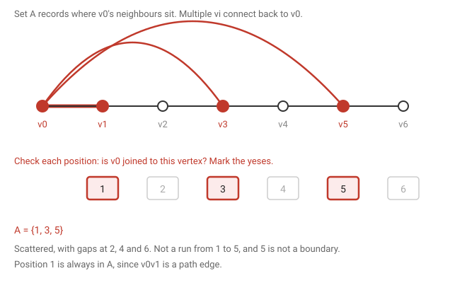
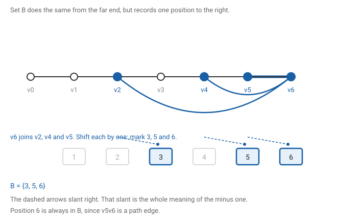
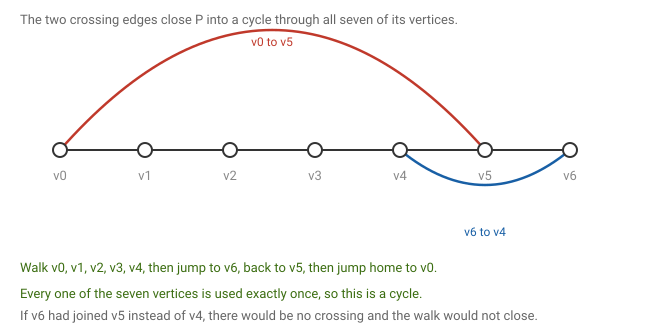

# 2 · 2026-07-24 — Long path theorem

Previous: [[2026-07-24 Preliminaries]] · Hub: [[Graph Theory]] · Next: [[2026-07-27 Euler Circuits]]

## How much this matters

Overall this note is useful rather than core. It is one theorem with a long proof, so it costs a lot of time per mark. Learn the statement and the shape first, and only commit the full argument if you have time to spare.

Know cold: the statement, and why the endpoints of a longest path are trapped. Those alone will get you started on any question of this type.

Know the idea: the six steps, in one sentence each. Two sets too big to avoid overlapping, the overlap gives crossing edges, those fold the path into a cycle, and a vertex off the cycle builds something longer.

Full proof: only if the earlier notes are already solid. This is the first thing to drop if time runs short.

## What we are proving

Theorem. Let G be a connected simple graph on n vertices. Then G contains a path of length at least min{2δ(G), n−1}.

Given: G is connected, and G is simple.
To show: somewhere in G there is a path whose length is at least that number.

Two things about the statement, because both cause trouble.

First, min{a, b} means whichever of a and b is smaller. So the theorem promises a path of length at least the smaller of 2δ and n−1. That is a weaker promise than either one alone, which is what makes it provable. If δ = 3 and n = 20, then 2δ = 6 and n−1 = 19, so you are promised length 6. If δ = 3 and n = 5, then 2δ = 6 and n−1 = 4, so you are only promised 4. Which is right, since a graph on 5 vertices has no path longer than 4 anyway.

Second, this is an existence claim. We are not proving every path is long, and we are not being asked to find the path. We only have to show one exists.

## What the symbols mean

n is the number of vertices. δ(G) is the minimum degree, the smallest number of edges touching any single vertex. Your problem sheet writes this as D(G).

The length of a path is the number of edges, not the number of vertices. A path on 5 vertices has length 4. Worth fixing now, because the whole statement is about lengths.

## One graph for the whole proof

Every picture below uses this same graph, so you can follow one example all the way through.

The path P runs v0 v1 v2 v3 v4 v5 v6, drawn as the straight line. It has 7 vertices, so its length is k = 6. On top of the path edges there are four extra edges: v0 joins v3 and v5, and v6 joins v2 and v4. One more vertex, w, hangs off v2, so the graph has n = 8 vertices altogether.

## The idea before the proof

Take the longest path in the graph. Its two endpoints cannot reach anywhere new, because if an endpoint had a neighbour that was not already on the path, you could hang that neighbour on the end and get a longer path. But you started with the longest one, so that cannot happen.

So every neighbour of each endpoint is squashed onto the path. Each endpoint has at least δ neighbours. The path has to be long enough to hold them all, and that crowding is the whole reason the bound is true.

This only works at the two ends. An interior vertex is already boxed in by its two path neighbours, so if it has a neighbour off the path, nothing breaks. A path cannot branch, so you cannot extend from the middle. That is why w is allowed to hang off v2 in the picture above.

It is also why the answer involves 2δ rather than δ. Two trapped endpoints, each contributing δ neighbours.

## Setting up

Let P = v0v1…vk be a longest path, of length k with k+1 vertices. Split into two cases on how big k is. Every whole number is either at least n−1 or at most n−2, so between them the cases cover everything. We are not deriving one from the other, just handling both.

## First case: k is at least n−1

A path cannot have more than n vertices, so k is at most n−1 and therefore equals n−1. Then k ≥ n−1 ≥ min{2δ, n−1}, and we are finished. Nothing to do here.

## Second case: k is at most n−2

Now we must show k ≥ 2δ. Suppose not, so the path is short: k ≤ 2δ−1, which is the same as 2δ > k. We will build something impossible out of that.

### Recording where v0's neighbours sit

Start from what is actually in the graph. The vertex v0 has at least δ neighbours, and by the trapped-endpoint fact every one of them already lies on the path. So there are multiple vi connecting back to v0, one edge per neighbour, dotted along the path wherever they happen to fall. The set A is just a record of their positions.

A = the set of positions i for which v0 is adjacent to vi.

Read that as a filter, not as a stretch of path. Walk along and check each position in turn. Is v0 joined to v1? To v2? To v3? Every yes gets its position written down, and A is the list of yeses.

The letter i is a dummy variable. It runs over every position from 1 to k while we test, then disappears. It does not name a fixed vertex, and it is not the last thing in A. So A does not mean that v1 through vi are all adjacent to v0. It means several separate vi each join v0, at positions that can sit anywhere with gaps between them.

In our graph v0 joins v1, v3 and v5, so A = {1, 3, 5}. Nothing at 2, 4 or 6.

### Recording where vk's neighbours sit, shifted

B = the set of positions i for which vk is adjacent to v(i−1).

Same filter, run from the far end, with one difference. When vk joins a vertex, the mark is placed one position to the right of that vertex rather than on it. In our graph v6 joins v2, v4 and v5, so the marks land on 3, 5 and 6, giving B = {3, 5, 6}.

The minus one looks arbitrary until you see what it buys. We are about to close the path into a loop, and for that we need two shortcut edges that cross: v0 reaching forward to some vi, and vk reaching back to v(i−1), the vertex one step earlier. Writing B with the shift means a single shared position hands us both edges at once. It also puts B into the same range as A, which is what lets us compare them.

Both sets sit inside {1, 2, …, k}, and each has at least δ members, since each endpoint has at least δ neighbours and every one of them is on the path.

### Making them collide

Here is the counting step. Both sets live in a row of k slots, and together they have at least 2δ members. We assumed 2δ > k. Two sets cannot hold more items than there are slots without sharing one, so some position i lies in both A and B.

If that feels slippery, drop the graph for a second. Four numbered boxes, two lists of three numbers each drawn from those boxes. Keeping the lists separate would need six different numbers in four boxes. You cannot, so they share.

In our graph A and B share positions 3 and 5. Take i = 5. Being in A means v0 joins v5. Being in B means v6 joins v4, the vertex one step before v5. Those two edges cross.

## Folding the path into a loop

Using the two crossing edges, walk v0 v1 v2 v3 v4, jump across to v6, walk back to v5, then jump home to v0. Every one of the seven path vertices is used exactly once, so this is a cycle.

Written in general, the walk is v0 → v1 → … → v(i−1) → vk → v(k−1) → … → vi → v0. Forward along the path to v(i−1), across to vk, backwards along the path to vi, then back to v0.

The offset by one is what makes it close. Had v6 joined v5 instead of v4, the same vertex v0 reaches, the reroute would leave a loose end rather than sealing.

## Why the loop is a problem

We are in the case k ≤ n−2, so the loop holds k+1 ≤ n−1 vertices while the graph has n. At least one vertex is left off it. In our graph that vertex is w.

The graph is connected, so w is not floating on its own. Following its connections inward, some vertex on the loop has an edge going outside. Here it is v2, joined to w.

Cut the loop open at that vertex. A loop has no ends, but deleting one of its two edges there springs it into a path that still contains all k+1 vertices and now has that vertex free. Hang the outside vertex on. In our graph, cutting the edge v2v3 leaves the path v2 v1 v0 v5 v6 v4 v3 ending at v2, and adding w gives w v2 v1 v0 v5 v6 v4 v3. That is 8 vertices, so length 7, against the original length 6.

A path longer than the longest path. That cannot happen.

Worth being honest about what the example is doing. Because we did find a longer path in it, P was never actually a longest path in that graph. That is not a flaw in the picture, it is the point. The proof assumes P is longest and short, then manufactures something longer, and the collision is what kills the assumption.

## Putting it together

The contradiction means k ≤ 2δ−1 was wrong, so k ≥ 2δ in the second case. The first case gave k ≥ n−1. Either way,

k ≥ min{2δ(G), n−1}.

## Checking it on real graphs

A cycle Cn has δ = 2 and its longest path has length n−1. The bound asks for min{4, n−1}, and n−1 is at least 4 once n ≥ 5.

The complete graph Kn has δ = n−1 and its longest path has length n−1. The bound asks for min{2n−2, n−1} = n−1. Exactly met, so the bound cannot be improved in general.

## What to remember

Taking the longest path is a strong move, because it traps both endpoints and forces all their edges back onto the path. Only the endpoints are trapped, never the middle. Two sets crammed into too few slots have to overlap. Two crossing edges turn a path into a loop, and reopening the loop somewhere else gives a longer path than you started with.

## Still unclear

- Where this sits in West. The PDF text layer is unreadable, so I could not find the exercise number. It is a chapter 1 exercise on degree and paths, and Bondy and Murty have a version of it.
