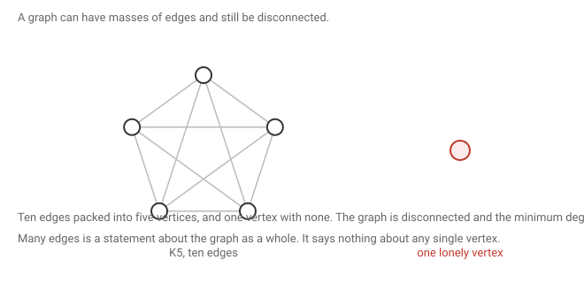
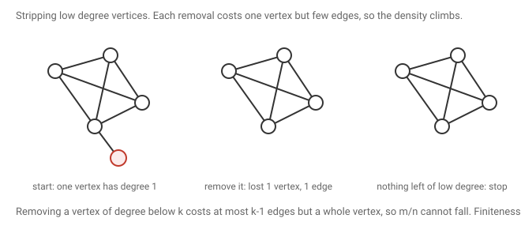

# 1 · 2026-07-24 — Preliminaries

Previous: none, this is the first note · Hub: [[Graph Theory]] · Next: [[2026-07-24 Long Path Theorem]]

Homework set in this class: Diestel chapter 1, all 23 problems. Worked in [[Assignment 1]].

## How much this matters

Overall this note is core. Not because any single result here is likely to be a whole question, but because almost everything later leans on it.

Know cold: [[2026-07-24 Preliminaries#Counting degrees|counting degrees]], [[2026-07-24 Preliminaries#What high minimum degree buys you|the three δ at least k results]], [[2026-07-24 Preliminaries#Trees|trees]], and [[2026-07-24 Preliminaries#Bipartite graphs|bipartite graphs]]. All are short and all get quoted later.

Know the statement and the idea: [[2026-07-24 Preliminaries#Large density forces a dense subgraph|large density gives a dense subgraph]], [[2026-07-24 Preliminaries#Maximal is not the same as maximum|maximal versus maximum]], and [[2026-07-24 Preliminaries#Minimum degree three forces an even cycle|minimum degree three forces an even cycle]].

Read once and move on: [[2026-07-24 Preliminaries#Cliques and independent sets|cliques]] and [[2026-07-24 Preliminaries#Does having many edges force a graph to be connected?|the many edges question]]. Worth understanding, unlikely to be asked on their own.

## What the symbols mean

n is the number of vertices and m the number of edges.

The degree of a vertex is how many edges touch it. The minimum degree over the whole graph is δ(G), and the maximum is Δ(G). Your problem sheet writes the minimum as D(G).

N(v) is the neighbourhood of v, meaning the set of vertices joined to v by an edge. Writing u ~ v just says u and v are adjacent.

A graph is simple if it has no self loops and no repeated edges. One consequence gets used constantly: a vertex is never its own neighbour, so v is not in N(v).

The length of a path or cycle is its number of edges, not its number of vertices.

## Cliques and independent sets

A clique is a set of vertices that are all pairwise adjacent, so every possible edge among them is present. A clique on r vertices is a copy of the complete graph Kr sitting inside G. The size of the largest one is written ω(G), and finding it is NP hard.

An independent set is the opposite, a set of vertices with no edges at all among them. Equivalently, the subgraph induced on that set has no edges. This is the notion behind bipartite graphs later in this note.

The two are the same problem in disguise. A set is independent in G exactly when it is a clique in the complement of G, since the complement has an edge exactly where G has none.

## Does having many edges force a graph to be connected?

No, and the counterexample is worth carrying around.

Take a complete graph on n−1 vertices, which has as many edges as you could want, and add one isolated vertex. The graph has masses of edges but it is disconnected, and its minimum degree is 0.

The lesson is that edge count is a statement about the graph as a whole. It says nothing about any individual vertex. One lonely vertex ruins connectedness and drags δ to zero no matter how dense the rest is. That is exactly why the theorem two sections down goes hunting for a subgraph instead of hoping the whole graph is well behaved.

There is a threshold, though. If m is greater than the number of edges in a complete graph on n−1 vertices, then G must be connected. To see it, suppose G were disconnected. Then the vertices split into two non empty groups with no edges between them, and all edges lie inside one group or the other. That count is largest when the split is as lopsided as possible, one vertex on one side and everything else on the other, which is exactly the complete graph on n−1 vertices. So a disconnected graph cannot have more edges than that.

The example above sits exactly at the threshold with n−1 choose 2 edges and is disconnected, so the bound cannot be improved.

## Counting degrees

Sum the degrees of all vertices and you get twice the number of edges.

The reason is that you are counting the same thing two ways. Go vertex by vertex and you count each edge once for each of its ends. Go edge by edge and each edge has exactly two ends. Same total.

A quick check on a triangle: three vertices of degree 2 sum to 6, and there are 3 edges.

From this, the average degree is the degree sum divided by n, which is 2m/n. The edge density is defined as m/n, so edge density is exactly half the average degree. The two are the same information wearing different clothes.

## Large density forces a dense subgraph

Average degree is only an average, and the picture above shows a graph can have a high average while containing a vertex of degree 0. So the honest question is whether you can always dig out a piece of the graph where every vertex has high degree.

Theorem. If the edge density of G is k, then G contains a subgraph H with δ(H) at least k.

Given: m/n equals k.
To show: some subgraph has every degree at least k.

The idea is to throw away the vertices that are causing trouble.

Repeatedly delete any vertex whose degree is below k. Deleting one costs a whole vertex but at most k−1 edges, which is proportionally fewer edges than the density demands, so the density does not fall. Working it out, if the current graph has density at least k and v has degree at most k−1, the new density is at least (m−k+1)/(n−1), and since m is at least nk this is at least k + 1/(n−1), which is above k.

The process must stop, because each step removes a vertex and the graph is finite. It also cannot strip the graph bare, because a single vertex has density 0, which is below k, and we just showed the density never drops below k. So the process halts with a real graph still standing.

It halts exactly when no vertex has degree below k. Call that graph H. Every vertex of H has degree at least k, which is what we wanted.

One subtlety worth watching. Degree here always means degree in the current graph, not in the original. Degrees shrink as you delete, so a vertex that looked fine early can become deletable later. The argument handles this because it re examines the graph at every step.

This theorem has a name that appears later in the syllabus. A graph is called d degenerate when every subgraph has a vertex of degree at most d, and the smallest such d is the degeneracy. The deletion order above is exactly a degeneracy ordering, and feeding it to greedy colouring shows the chromatic number is at most the degeneracy plus one.

## Maximal is not the same as maximum

A set is maximal for some property when no larger set containing it has that property. In words, you cannot extend it. That is not the same as being the biggest such set anywhere.

For paths, maximal means you cannot add a vertex to either end.

The red path here cannot be extended, because f has no other neighbour and neither does a, so it is maximal. Its length is 2. But the graph contains a path of length 4. So maximal and longest are genuinely different.

The practical difference matters. A maximal path is found greedily by walking until you get stuck, which takes polynomial time. Finding a longest path is NP complete, by way of the Hamiltonian path problem.

The good news is that every argument in this course only ever needs the property that the path cannot be extended. So maximal always suffices, and maximal objects are cheap and always exist.

## What high minimum degree buys you

All three results here use the same move. Take a maximal path and look at its last vertex.

Since the path is maximal, every neighbour of that last vertex already lies on the path. Otherwise you could hang the neighbour on the end and extend.

First, if δ(G) is at least k then G has a path with at least k+1 vertices. Take a maximal path ending at vr. All of its neighbours are on the path, there are at least k of them, and vr itself is not among them because the graph is simple. So the path holds at least k+1 vertices.

Second, if δ(G) is at least 2 then G contains a cycle. Take a maximal path ending at vr. It has at least two neighbours on the path, one of which is the vertex just before it. The other is some earlier vertex, and closing from there back to vr gives a cycle.

Third, if δ(G) is at least k then G contains a cycle of length at least k+1.

Take a maximal path and let vi be the neighbour of vr furthest back along it. Every neighbour of vr sits in the stretch from vi up to the vertex before vr, and there are at least k of them, so that stretch contains at least k vertices. Closing vi back to vr wraps that whole stretch into a cycle, whose length is therefore at least k+1.

## Minimum degree three forces an even cycle

The previous result gives a long cycle but says nothing about whether it is even or odd. Getting an even one needs a different trick.

Claim. If δ(G) is at least 3 then G contains a cycle of even length.

Take a maximal path starting at v0. All of v0's neighbours lie on the path, and there are at least three of them, at positions we can call vi, vj and vl reading left to right.

Each pair of those neighbours closes off a cycle. Writing a for the gap between vi and vj, and b for the gap between vj and vl, the three cycle lengths come out as a+2, b+2 and a+b+2.

Now suppose all three were odd. Adding 2 does not change parity, so that would need a, b and a+b to all be odd. But odd plus odd is even, so a+b would have to be even. Contradiction, so at least one of the three cycles is even.

Where the hypothesis was used: we needed three neighbours to get three cycles. With only two the argument dies, and rightly so, since a triangle has minimum degree 2 and its only cycle is odd.

## Trees

A tree is a connected acyclic graph.

Every tree with at least two vertices has a leaf, meaning a vertex of degree 1. To see it, note that connectedness rules out degree 0 when there are at least two vertices, and if every degree were at least 2 the earlier result would produce a cycle, which trees do not have.

A tree on n vertices has exactly n−1 edges. Induct on n. A single vertex has no edges, matching 1−1. For larger n, take a leaf and delete it along with its one edge. What remains is still acyclic, and still connected because no path between other vertices ever passed through a degree 1 vertex. So it is a tree on n−1 vertices, with n−2 edges by the induction, and putting the leaf back restores one edge.

In a tree, the path between any two vertices is unique. Connectedness gives at least one path. If there were two different paths between u and v, follow both from u and let x be the last vertex they share before separating, and y the first vertex they meet again afterwards. The two stretches from x to y share only their endpoints and are different, so gluing them gives a cycle, which a tree cannot have.

My page says the path between any two edges is unique. It should say vertices.

## Bipartite graphs

A graph is bipartite when its vertices can be split into two independent sets. Every edge then has one end in each part, and no edge lies inside a part. Another way to say the same thing is that the subgraph induced on each part has no edges.

If G contains an odd cycle then G is not bipartite. Suppose G were bipartite and take a cycle. Every edge crosses between the two sides, so the cycle alternates sides as you walk it. That means a vertex is on the starting side exactly when its position along the cycle is odd. To close up, the last vertex must be adjacent to the first, which forces it onto the opposite side, and that only happens when the cycle has even length.

The converse also holds, so a graph is bipartite exactly when it has no odd cycle. Proving it is easiest through the contrapositive, that a graph with no odd cycle is bipartite.

Handle one connected component at a time. Pick a root and measure the distance from it to every vertex. Put the even distances on one side and the odd distances on the other. Every edge changes the distance by exactly one, so it always flips the parity, meaning no edge can join two vertices on the same side.

The only thing to rule out is an edge joining two vertices at distances of the same parity. If there were one, take shortest paths from the root to each end, let w be the last vertex they share, and close up through the edge. That cycle has length equal to the two distances added, minus twice the distance to w, plus one, which is even minus even plus one, so odd. That contradicts having no odd cycle.

Colouring by parity is a trick that keeps coming back. Level parity for trees, distance parity here, and the count of ones for the hypercube in [[Tutorial 1]].

## What to remember

Edge count is global and says nothing about any single vertex, so hunt for a subgraph instead. Edge density is half the average degree. Deleting a low degree vertex raises the density, and that single observation drives the main theorem. Maximal beats longest, because can not be extended is all any of these proofs needs and it is cheap to find. The universal move is to take a maximal path, look at its endpoint, and use the fact that all its neighbours are trapped on the path. When you need an even something, build several objects and use odd plus odd is even to force one of them.

## Still unclear

- My page wrote path between any 2 edges for the tree property. It should be vertices.
- Diestel chapter 1, 23 problems, is the homework. Worked in [[Assignment 1]].
