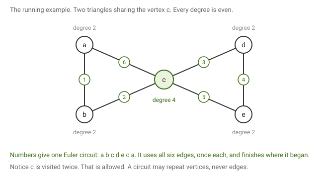
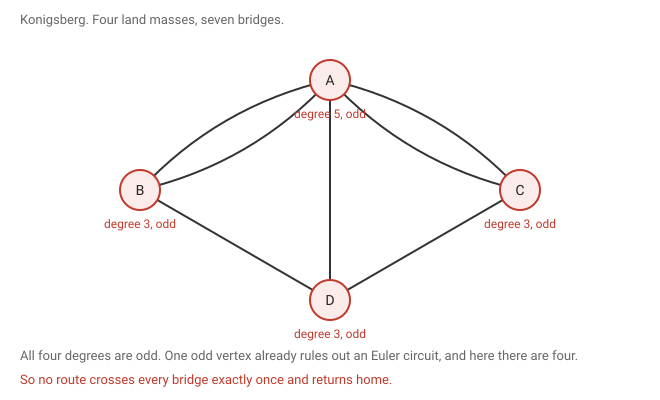

# 3 · 2026-07-27 — Euler circuits

Previous: [[2026-07-24 Long Path Theorem]] · Hub: [[Graph Theory]] · Next: [[2026-07-29 Euler by Extremal Argument, Matchings, MIS in Trees]]

## How much this matters

Overall this note is core, and it is the best value in the whole course. A named theorem with a short proof, so the marks per hour are excellent.

Know cold: [[2026-07-27 Euler Circuits#What we are proving|the statement]], [[2026-07-27 Euler Circuits#Lemma 1, the easy half|Lemma 1]] in full since it is only a few lines, and [[2026-07-27 Euler Circuits#Lemma 2, the hard half|Lemma 2]] by the maximal trail argument.

Know the idea: [[2026-07-27 Euler Circuits#Using the theorem in practice|the contrapositive]], because that is the form you actually apply, and [[2026-07-27 Euler Circuits#Konigsberg|Konigsberg]] as the standard example.

Read once: [[2026-07-27 Euler Circuits#Euler against Hamilton|Euler against Hamilton]]. Worth knowing as context, not a question on its own.

If you are short of time, learn this note before the long path theorem. It is cheaper and more likely.

## What we are proving

Theorem (Euler). A graph G has an Euler circuit if and only if G has at most one non-trivial component and every vertex of G has even degree.

An if and only if is two claims, so there are two things to show.

Going one way, assume G has an Euler circuit and show both conditions follow. That is the easy half, called Lemma 1.
Going the other way, assume both conditions hold and produce an Euler circuit. That is the hard half, called Lemma 2.

Neither half is optional. Proving only one direction leaves the theorem unproved.

## The words, which are easy to mix up

Four terms sit close together here, and getting them confused wrecks everything downstream.

| Term | May repeat vertices | May repeat edges |
|---|---|---|
| walk | yes | yes |
| trail | yes | no |
| path | no | no |
| circuit | yes | no, and it must return to its start |

So a trail is a walk that never reuses an edge, and a circuit is a trail that ends where it began. A circuit is free to pass through the same vertex many times. It just may not travel the same edge twice.

An Euler circuit is a circuit that uses every edge of the graph. In plain terms, draw the whole graph in one pen stroke without lifting the pen or retracing, and finish at your starting point.

Two more definitions. A component is a maximal connected piece of the graph. A component is trivial if it has no edges at all, meaning it is a lone vertex, and non-trivial otherwise.

The condition says at most one non-trivial component rather than connected, and the reason matters. Isolated vertices carry no edges, so an Euler circuit owes them no visit. They are allowed to float around freely. Only the part of the graph that actually holds edges has to be in one piece.

## One graph for the whole proof

Two triangles joined at c. Vertices a, b, d and e have degree 2, and c has degree 4, so every degree is even. The numbers on the edges give one Euler circuit: a b c d e c a. It uses each of the six edges exactly once and returns to a.

Look at what happens at c. The circuit passes through it twice. That is fine, because a circuit may revisit vertices. It is edges it may not repeat.

## Lemma 1, the easy half

Claim. If G has an Euler circuit, then G has at most one non-trivial component and every vertex has even degree.

Take an Euler circuit C.

For the component part, notice that a circuit is one continuous journey. Every step crosses an edge, so it can never jump between disconnected pieces. It stays inside whichever component it starts in. But an Euler circuit must contain every edge of G. If there were two non-trivial components, each would hold at least one edge, and C would have to contain edges from both. It cannot reach across. So there is at most one non-trivial component.

For the degrees, the picture is this.

Every time the circuit visits a vertex it uses exactly two edges there, one to arrive and one to leave. So the edges at a vertex pair up, one pair per visit. If the circuit passes through a vertex t times it consumes 2t edges there, and since the circuit uses every edge of G, that is all of them. So the degree is 2t, which is even.

The starting vertex needs one extra remark. The journey leaves it at the very beginning and returns to it at the very end, and those two edges look unpaired. But the circuit is closed, so pair the first edge with the last. If it also passes through the start t times in the middle, the degree is 2t + 2, still even.

An isolated vertex has degree 0, which is even too.

## Lemma 2, the hard half

Claim. If G has at most one non-trivial component and every vertex has even degree, then G has an Euler circuit.

There are two proofs of this. The class did induction on the number of edges first, then a shorter argument two days later. The shorter one is [[2026-07-29 Euler by Extremal Argument, Matchings, MIS in Trees]], and it is the one I would learn, so here it is.

Take a maximal trail Q, meaning a trail that cannot be extended at either end. Such a thing exists because trails cannot go on forever in a finite graph. We show two things about it: that it must be closed, and that it must already contain every edge. Together those make it an Euler circuit.

### A maximal trail must be closed

Suppose instead that Q is open, running from u to some different vertex v.

Count the edges of Q that touch v. Every time the trail passes through v it uses two edges, one in and one out. But the trail also finishes at v, and that final arrival uses one more. So the total is even plus one, which is odd.

The degree of v is even by hypothesis. An odd number cannot equal an even one, so Q has not used all the edges at v. At least one is left over. Take it and extend the trail, which contradicts Q being maximal.

This is what the note in class meant by calling the endpoint an odd vertex. An open trail makes its own endpoint behave as though it had odd degree.

So Q is closed, which makes it a circuit.

### A maximal trail must use every edge

Suppose some edge of G is missing from Q.

First find a missing edge that touches Q. If some missing edge already has an endpoint on Q, take it. Otherwise take any missing edge and follow a shortest path from it back to Q. The last edge of that path is missing from Q as well, because every vertex before the landing point lies off Q.

Either way we have an unused edge e with an endpoint z sitting on Q.

Now use the fact that Q is closed. A closed trail can be started at any of its vertices, so start at z, go all the way round Q and come back to z, then step out along e. No edge repeats, since e was not in Q. That is a longer trail, which again contradicts maximality.

So Q contains every edge.

Being closed is exactly what makes this work. An open trail could not be restarted at whichever vertex happened to be convenient.

### Putting the two together

Q is closed, so it is a circuit, and it contains every edge, so it is an Euler circuit. Lemma 2 is proved, and with Lemma 1 the theorem follows.

## Using the theorem in practice

The useful form is the contrapositive. Lemma 1 says

if there is an Euler circuit, then (one non-trivial component) and (all degrees even).

Negating a statement of the form P implies Q and R gives

if not Q or not R, then not P,

because the negation of Q and R is not Q or not R. That is De Morgan's law, and the and has turned into an or. In words:

if G has more than one non-trivial component, or even one vertex of odd degree, then G has no Euler circuit.

The or is what makes it practical. To rule out an Euler circuit you only need to catch a single offending vertex.

## Konigsberg

This is the problem Euler solved in 1736, usually taken as the start of graph theory. Four land masses joined by seven bridges, and the question was whether you could walk a route crossing every bridge exactly once and return home. That is asking for an Euler circuit.

Every one of the four degrees is odd. One odd vertex is already fatal, and here there are four. So the walk is impossible.

## Euler against Hamilton

Worth holding onto, because the two questions sound almost identical and are not.

An Euler circuit must cover every edge. A Hamiltonian cycle must cover every vertex. Euler's theorem settles the first completely, and you can check it by reading off degrees. The second is NP-complete, with no efficient characterisation known.

Two near mirror images, sitting on opposite sides of what is computationally reasonable.

## What to remember

Trail means no repeated edges, path means no repeated vertices, circuit means a closed trail. A visit to a vertex burns exactly two edges, which is the whole of Lemma 1. A maximal trail cannot be open, because an open trail leaves its endpoint with an odd count. A closed trail can be restarted anywhere, which is what lets you splice on a leftover edge. Isolated vertices do not matter, since an Euler circuit owes a visit only to edges.

## Still unclear

- My page states the theorem as every vertex in G has at most one non-trivial component. That is a slip. It is G that has at most one non-trivial component.
- The induction proof of Lemma 2 needs care when removing a cycle splits the graph. The maximal trail argument avoids that entirely, which is why I prefer it.
