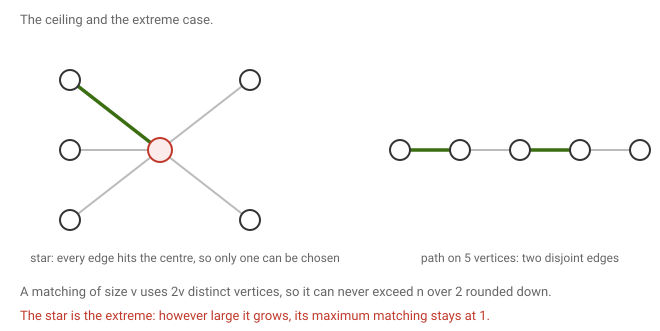
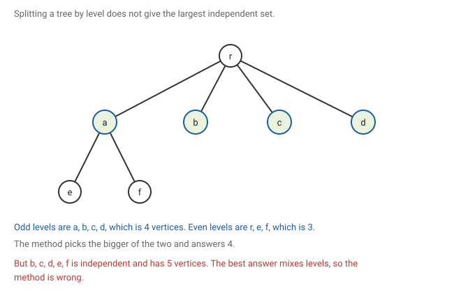
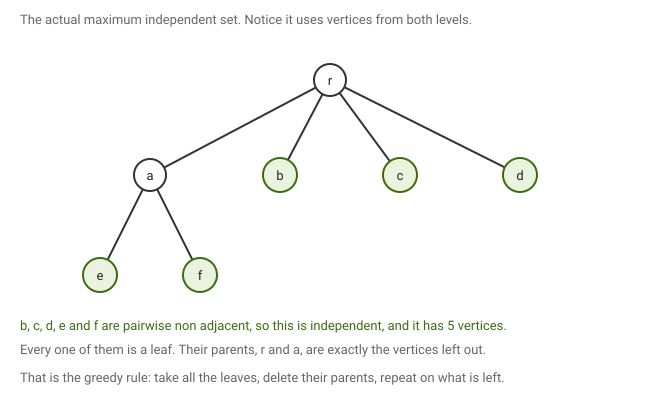
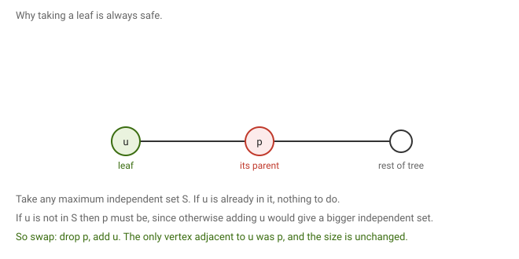

# 4 · 2026-07-29 — Euler again, matchings, and independent sets in trees

Previous: [[2026-07-27 Euler Circuits]] · Hub: [[Graph Theory]] · Next: [[2026-07-29 Matchings 2 — Berge and König]]

Three separate things this class. A second and better proof of the hard half of Euler's theorem, the definition of a matching with some basic bounds, and how to find a largest independent set in a tree.

## How much this matters

Overall this note is useful. Three loosely related things, of uneven weight.

Know cold: [[2026-07-29 Euler by Extremal Argument, Matchings, MIS in Trees#Part C, largest independent set in a tree|the exchange argument for leaves]]. It is short, and the same move justifies the matching version in the next note.

Know the statement and the numbers: [[2026-07-29 Euler by Extremal Argument, Matchings, MIS in Trees#Part B, matchings|the matching bound]] and the values for the standard families. Cheap marks.

Know the idea: the maximal trail proof in part A, though the full version lives in [[2026-07-27 Euler Circuits]] and that is where to learn it.

Read once: the dynamic program for independent sets. Worth understanding, but an algorithm is less likely to be asked than a theorem.

## Part A, Euler's hard half by a different route

The claim is the same one from [[2026-07-27 Euler Circuits]].

Claim. If G has at most one non trivial component and every vertex has even degree, then G has an Euler circuit.

The earlier proof went by induction on the number of edges. This one takes a maximal trail and shows it is already everything you wanted. It is shorter, and it avoids the awkward step where deleting a cycle shatters the graph.

The full argument, with figures, now lives in [[2026-07-27 Euler Circuits]] since that is where the theorem is stated. Two things to keep in mind.

A maximal trail must be closed. If it ended somewhere other than where it started, it would have used an odd number of edges at that endpoint, two for each pass through plus one for the final arrival. Every degree is even, so an edge would be left over and the trail could be extended.

A maximal trail must use every edge. Being closed, it can be restarted at any of its vertices, so any leftover edge touching it can be spliced on.

Two clarifications from my page. Not every cycle is a maximal trail, because a cycle can still have unused edges hanging off its vertices. And a trail in general need not be closed, it is only maximal trails that are forced to be, and only under the even degree hypothesis.

## Part B, matchings

A matching is a set of edges in which no two edges share a vertex.

From the example in class, on the graph with vertices a to g: the set containing ab, cd and ef is a matching, since all six endpoints are different. The set containing ab and ag is not, because a appears in both. The set containing gf, ad and bc is a matching.

### How large can a matching be

A matching of size v uses 2v distinct vertices, distinct precisely because no two of its edges share one. Those vertices all live in the graph, so 2v is at most n, which means the matching number is at most n over 2, rounded down.

Values for the usual families:

| Graph | maximum matching |
|---|---|
| path on n vertices | n over 2, rounded down |
| cycle on n vertices | n over 2, rounded down |
| star with m leaves | 1 |
| complete graph on n vertices | n over 2, rounded down |
| tree | anywhere from 1 up to n over 2 |

The star is the interesting one. Every edge of a star contains the centre, so any two edges share it and a matching can hold at most one edge. However large the star grows, its matching number stays at 1. That is the extreme case where the general ceiling is as loose as it can be.

My page writes this bound as the number of matchings being at most n over 2. That is not what is meant. It is the size of a largest matching, usually written α′(G) in the notation the course uses.

There is also a guess on my page that the maximum matching in a tree is related to its number of levels. That does not hold. A star has one level below the root and matching number 1, while a long path has matching number about n over 2. Depth does not determine it, and there is no formula of that kind. You need an actual algorithm, and the greedy idea in part C works here too.

## Part C, largest independent set in a tree

The problem. Given a tree or forest, find a largest set of vertices with no edge between any two of them.

This is NP hard in general graphs, as noted in [[Lec 01 — Vertex Cover and Independent Set]]. On trees it turns out to be easy, but the obvious first idea does not work.

### The idea that fails

Root the tree, put all vertices at odd levels in one pile and all vertices at even levels in the other, and take the bigger pile. Both piles are independent, since every edge joins consecutive levels and so never has both ends in the same pile.

Here the odd levels give 4 vertices and the even levels give 3, so the method answers 4.

But b, c, d, e and f together form an independent set of size 5. The method missed it because the best answer mixes levels, and splitting by level forces you to take all of one side or all of the other.

### The repair, as a dynamic program

The level idea works once each vertex decides for itself rather than the whole tree deciding at once. Root the tree and compute two numbers at every vertex v.

Write MIS(v, 0) for the largest independent set in v's subtree that excludes v, and MIS(v, 1) for the largest one that includes v.

MIS(v, 0) is the sum over all children u of the larger of MIS(u, 0) and MIS(u, 1).
MIS(v, 1) is 1 plus the sum over all children u of MIS(u, 0).

The reasoning is direct. If v is excluded, its children are unconstrained, so each contributes whichever of its two options is larger. If v is included, then no child may be taken, since each is adjacent to v, so every child must contribute its excluded value. The 1 counts v itself.

The answer is the larger of the two values at the root, computed from the leaves upward in time proportional to the number of vertices.

Running it on the tree above: each leaf has values 0 and 1. Vertex a has MIS(a,0) equal to 1+1 which is 2, and MIS(a,1) equal to 1+0+0 which is 1. The root has MIS(r,0) equal to 2+1+1+1 which is 5, and MIS(r,1) equal to 1+2+0+0 which is 3. The answer is 5, matching the picture.

### The greedy way, and why it is correct

Take all the leaves into the solution, delete them and their parents, and repeat on what remains.

Here leaves means vertices of degree at most 1, not exactly 1, so that isolated vertices in a forest are picked up too.

The whole correctness rests on one claim.

Claim. If u is a leaf of a tree, then some maximum independent set contains u.

Let S be any maximum independent set and let p be the unique neighbour of u. If u is already in S there is nothing to prove. Otherwise p must be in S, because if p were absent too then adding u to S would keep it independent, since u's only neighbour is p, and would make it larger, contradicting that S is maximum.

So p is in S. Now swap: drop p and add u. The result is still independent, since the only vertex adjacent to u was p and we just removed it. It has the same size, so it is still maximum, and it contains u.

That is what makes the greedy safe. Taking a leaf never costs you anything, because whatever optimal solution exists can be adjusted to agree with your choice at no loss. Once u is committed, its parent cannot also be chosen, so deleting the parent loses nothing either, and the remaining forest is smaller so the argument repeats.

Running it on the same tree: the leaves are b, c, d, e and f, so take all five. Their parents are r and a, so delete those too. Nothing remains, and the answer is the set of size 5.

This kind of reasoning has a name worth remembering. An exchange argument proves a greedy choice is safe by taking any optimal solution and modifying it to agree with the choice, without making it worse.

## What to remember

A maximal trail is closed and uses every edge, which is the whole of Euler's hard half. An open trail makes its own endpoint behave as if it had odd degree. A matching of size v uses 2v distinct vertices, so it cannot exceed n over 2, and the star shows how loose that can be. Splitting a tree by level does not find the largest independent set, because the optimum mixes levels. Both the dynamic program and the greedy do find it, and the greedy is justified by an exchange argument.

## Still unclear

- My page writes the matching bound as the number of matchings. It should be the size of a maximum matching.
- The guess that a tree's matching number comes from its depth is false, disproved by the star.
- Whether the O(n) greedy needs writing out as pseudocode for the exam.
