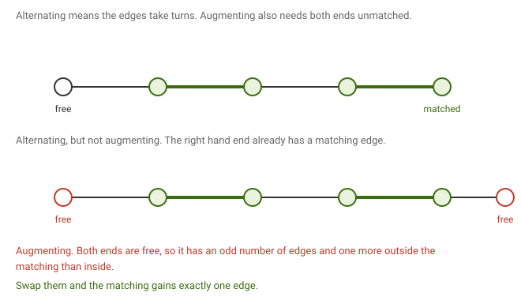
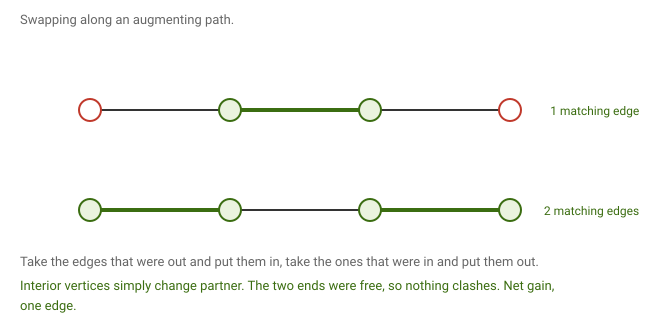
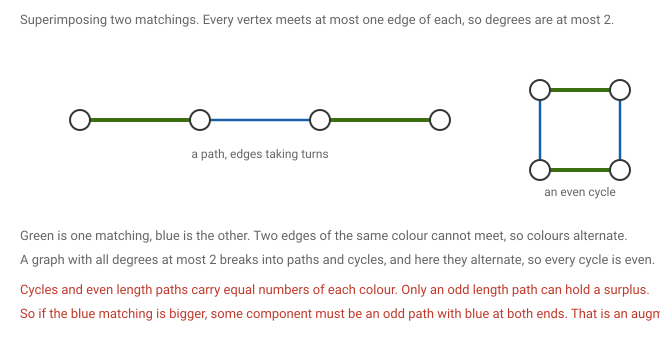
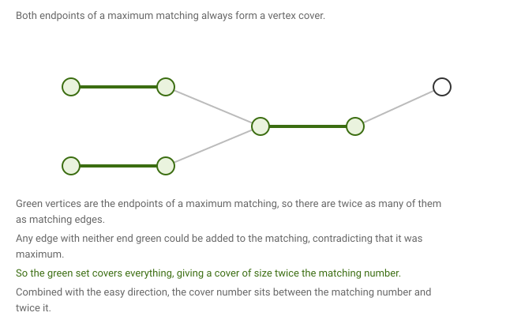

# 5 · 2026-07-29 — Matchings 2, Berge and König

Previous: [[2026-07-29 Euler by Extremal Argument, Matchings, MIS in Trees]] · Hub: [[Graph Theory]] · Next: [[Tutorial 1]]

Same afternoon as the morning class, going much further into matchings.

## How much this matters

Overall this note is core, and it is the heaviest in the course. If one question carries a lot of marks, it will most likely come from here.

Know cold: [[2026-07-29 Matchings 2 — Berge and König#The four parameters and how they pair up|the four parameters and both Gallai identities]], [[2026-07-29 Matchings 2 — Berge and König#Matching number never exceeds cover number|why matching is at most cover]], [[2026-07-29 Matchings 2 — Berge and König#Vertex covers, and the sandwich|the sandwich]], and [[2026-07-29 Matchings 2 — Berge and König#Berge's theorem|Berge]]. All four are short.

Know one proof properly: [[2026-07-29 Matchings 2 — Berge and König#König's theorem|König]]. Any of the three routes will do, so pick whichever sticks and ignore the others.

Know the statement: [[2026-07-29 Matchings 2 — Berge and König#Alternating and augmenting paths|alternating versus augmenting]], and which parity of swap gains an edge and which preserves size.

Read once: [[2026-07-29 Matchings 2 — Berge and König#Questions raised in class|the questions raised in class]] and [[2026-07-29 Matchings 2 — Berge and König#Other things from the page|Moon and Moser]]. Useful context, unlikely on their own.

## Notation

The course writes α(G) for the largest independent set, β(G) for the smallest vertex cover, α′(G) for the largest matching, and β′(G) for the smallest edge cover. The pattern is that α means packing and you maximise, β means covering and you minimise, unprimed refers to vertices and primed to edges.

My handwritten page uses MM, MVC and MIS for the same three things. Some textbooks write ν for α′ and τ for β. All the same objects.

V(M) means the set of vertices matched by M. A vertex is called matched, or covered, if some edge of M touches it, and free otherwise.

## The four parameters and how they pair up

A set S is independent exactly when everything outside it is a vertex cover. The reason is that both statements say the same thing about edges: no edge has both ends inside S is the same as every edge has at least one end outside S.

That single observation gives the first Gallai identity, α(G) + β(G) = n. Take a largest independent set, its complement is a cover, so β is at most n − α. Take a smallest cover, its complement is independent, so α is at least n − β. Both together force equality.

The second identity is α′(G) + β′(G) = n, valid when there are no isolated vertices. Going one way, take a maximum matching, which covers 2α′ vertices and leaves n − 2α′ uncovered; give each of those one edge of its own and you have an edge cover of size n − α′. Going the other way, take a minimum edge cover and note that each of its components must be a star, since a component containing a path on four vertices would have a droppable middle edge. Counting vertices across the stars gives n − β′ components, and picking one edge from each star gives a matching of that size.

This explains the third column of the table in my notes. It computes n minus the independent set size, which by the first identity is exactly the vertex cover number.

## Matching number never exceeds cover number

Take a maximum matching M and any vertex cover C. The cover must meet every edge of M, so it contains at least one endpoint of each. The edges of M are pairwise disjoint, so those chosen endpoints are α′ distinct vertices, all sitting inside C. Hence C has at least α′ vertices, and taking C smallest gives α′(G) at most β(G).

This holds in every graph. The triangle shows it can be strict: its matching number is 1 and its cover number is 2.

Worth noticing that the triangle is the smallest odd cycle. That is not a coincidence, and it is exactly why König needs bipartiteness.

## Alternating and augmenting paths

Fix a matching M.

An M alternating path is a path whose edges alternate between being in M and not being in M. That is the only requirement, and the endpoints can be anything.

An M augmenting path is an alternating path whose two endpoints are both free.

The difference matters because of what you can do with each. An augmenting path starts and ends with non matching edges, so it carries one more of those than matching edges, which means it has odd length.

Swap along it, taking the non matching edges in and throwing the matching edges out, and the result is still a matching. Interior vertices simply change partner, and the two endpoints were free so nothing clashes. The size goes up by exactly one.

Swapping along an alternating path of even length does something different. Such a path carries equal numbers of each type, so the swap leaves the size unchanged. Both behaviours get used later, so it is worth knowing which parity does which.

## Berge's theorem

Theorem. A matching M is not maximum if and only if G contains an M augmenting path.

Given an augmenting path, the swap above produces a strictly larger matching, so M was not maximum. That is the easy direction.

The other direction is the work. Suppose M is not maximum, so some matching N has more edges. Look at the graph formed by taking all edges of M together with all edges of N.

Every vertex meets at most one edge of M and at most one of N, since both are matchings, so every degree in this combined graph is at most 2. A graph with all degrees at most 2 is a disjoint union of paths and cycles.

Along any of those, the edges must alternate between M and N, because two consecutive edges from the same matching would share a vertex, which matchings forbid. So every cycle here is even.

Now count component by component. An isolated vertex contributes nothing to either side. An even cycle alternates, so it holds equally many of each. A path of even length starts and ends with different types, so again equal. Only a path of odd length can hold a surplus, and it holds one extra of whichever type sits at both of its ends.

Since N has more edges than M overall, at least one component must carry the surplus, and by the count above it can only be an odd length path whose two end edges belong to N. Both of its endpoints are then free with respect to M, because the end edge is not in M and any M edge at the endpoint would have continued the path. So that component is an M augmenting path.

One correction to my page. It says N is assumed to be maximum. The argument only needs N to be larger than M, and maximality is never used.

The algorithm falls straight out. Start with the empty matching, and while an augmenting path can be found, swap along it. Each pass adds exactly one edge, so it halts, and Berge guarantees that when no augmenting path exists the matching is maximum. That last point is the whole reason the algorithm is correct.

## Vertex covers, and the sandwich

A set of vertices is a vertex cover when every edge has at least one endpoint in it.

We already have α′ at most β. The other side is this.

Take a maximum matching M and let the candidate cover be all of its endpoints, which is 2α′ vertices. Is it a cover? Take any edge. If neither of its ends were among those endpoints, then adding that edge to M would give a larger matching, contradicting maximality. So at least one end is in the set.

That gives β at most 2α′, and together

α′(G) ≤ β(G) ≤ 2 α′(G).

Both ends are tight. The lower end is equality for any bipartite graph, by König below. The upper end is equality for the triangle, where α′ is 1 and β is 2.

The upper half is also the standard two approximation for the vertex cover problem, which is NP hard. Taking both endpoints of a maximum matching gives a cover at most twice the optimum.

## König's theorem

Theorem. If G is bipartite then α′(G) = β(G).

The easy direction is already done. For the other, it is enough to exhibit a single vertex cover of size α′, since β is a minimum and so is at most any particular cover.

Take a maximum matching M and build the following sets from it. Let A0 be the vertices of A left unmatched. Let B1 be the vertices of B reachable from A0 by alternating paths, let A1 be their matching partners, and let A2 be everything else in A. Let B0 be the unmatched vertices of B, and B2 the neighbours of A1 not already in B1.

The claim is that B1 together with A2 is a vertex cover of size exactly the matching number.

To see it covers, the only edges that could escape run from A0 or A1 into B0 or B2, and all three possibilities fail. An edge from A1 to B0 would extend an alternating path from A0 out to an unmatched vertex, giving an augmenting path and contradicting that M is maximum. An edge from A0 to B2 would put its target within one alternating step of A0, so by the definition of B1 the target would be in B1, not B2. An edge from A1 to B2 does the same thing one step later, since the path reaching A1 can be extended through the matching edge and out, again forcing the target into B1.

To see the size, every vertex of B1 is matched, because an unmatched one would have completed an augmenting path, and its partner lies in A1. Every vertex of A2 is matched too, since the unmatched vertices of A are exactly A0 which A2 excludes. No matching edge is counted twice, because the partner of a B1 vertex lands in A1 rather than A2. So each vertex of the cover sits on its own matching edge, and the cover has exactly as many vertices as M has edges.

Putting the two directions together, α′ = β.

A fuller walkthrough of this construction, with the same sets, is in [[Lec 02 — König's Theorem and Hall's Theorem]].

My page dates this 1936, and also 1736 in one place. 1936 is right. 1736 is Euler and the Konigsberg bridges.

## Questions raised in class

Is the cover number equal to the size of the smaller side for a bipartite graph? Only when the graph is complete bipartite. In general the smaller side is just an upper bound. Take five vertices on each side with edges from only two of the left hand vertices: those two form a cover of size 2, while the smaller side has size 5.

Is the smaller side always a minimum cover? No, same example. Both sides have five vertices and the minimum cover has two, and it is not a side at all.

Is the bipartition unique in a connected bipartite graph? Yes, up to swapping which side is called which. Fix a vertex r. In a bipartite graph every path from r to a given vertex v has the same parity of length, since walking a path alternates sides and v sits on only one side. Connectedness guarantees such a path exists. So once you decide where r goes, every other vertex is forced. Connectedness is needed: with two disjoint edges each component can be flipped independently, giving four different bipartitions.

## Other things from the page

Moon and Moser proved in 1965 that a graph on n vertices has at most 3 to the power n over 3 maximal independent sets, attained by n over 3 disjoint triangles where you pick one vertex from each. My page calls these maximum independent sets, but the result is about maximal ones, and it bounds how many there are rather than how large one is.

The claim that a leaf's edge belongs to some maximum matching is proved by the same exchange argument as the independent set version in [[2026-07-29 Euler by Extremal Argument, Matchings, MIS in Trees]]. If no matching edge touches the leaf, its neighbour must be matched to something else, and swapping that edge out for the leaf edge keeps the size.

## What to remember

The vertex cover number is n minus the independence number, so the two problems are one problem. Matching edges are disjoint, which is why a cover needs one vertex per matching edge, and taking both endpoints gives a cover of twice the size. An augmenting path is a certificate that a matching is not maximum, and Berge says it is the only obstruction. Superimposing two matchings gives degrees at most 2, so paths and even cycles, and only odd paths can carry a surplus. König turns the lower bound into equality for bipartite graphs, by constructing the cover from alternating reachability out of the unmatched side.

## Still unclear

- My page says N is assumed maximum in Berge's hard direction. Only larger than M is needed.
- Both 1936 and 1736 appear for König. It is 1936.
- Moon and Moser counts maximal independent sets, not maximum, and bounds the number of them.
