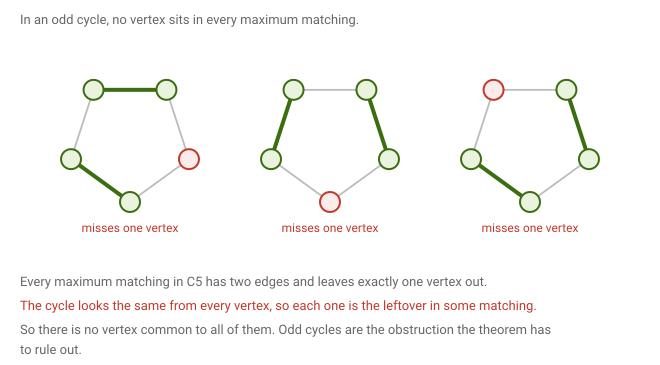
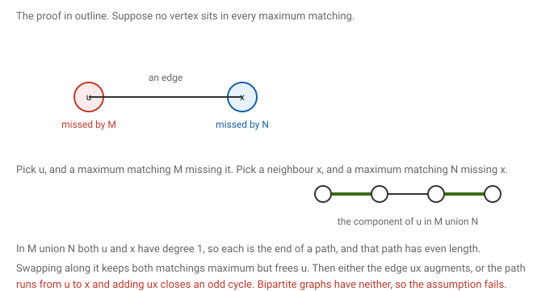

# 7 · 2026-08-10 — Matchings in bipartite graphs

Previous: [[Tutorial 1]] · Hub: [[Graph Theory]] · Next: [[2026-08-10 König by Induction, Hall, and Factors]]

## How much this matters

Overall this note is useful. One theorem with a fairly involved proof, so it costs more per mark than Euler or Berge.

Know cold: [[2026-08-10 Matchings in Bipartite Graphs#Why the question is interesting|why odd cycles have no such vertex]], and the tree case where a leaf's parent works. Both are a few lines and they frame the whole thing.

Know the idea: [[2026-08-10 Matchings in Bipartite Graphs#The proof|the proof]] in outline. Superimpose two maximum matchings, u and x sit at the ends of an even path, swap along it, and then either an edge augments or an odd cycle appears.

Full proof and the cover number exercise: only if the core notes are already solid.

The one line worth carrying regardless is that bipartiteness is used exactly once, at the end, to rule out an odd cycle.

## Notation

M and N are matchings, and V(M) is the set of vertices matched by M. A vertex is matched if some edge of M touches it, and free otherwise. As in [[2026-07-29 Matchings 2 — Berge and König]], α′(G) is the matching number and β(G) the vertex cover number.

A perfect matching is a matching of size n over 2, meaning every vertex is matched. It can only exist when n is even.

## What we are proving

Theorem. Let G be a bipartite graph with at least one edge. Then some vertex of G lies in every maximum matching.

Given: G is bipartite, and G has an edge.
To show: there is a single vertex that no maximum matching can avoid.

Note the two quantifiers, because swapping them changes the claim completely. We want one vertex that works for all maximum matchings, not merely that each matching has some vertex in it, which would be trivial.

## Why the question is interesting

For some graphs the answer is no.

Take an odd cycle. Every maximum matching has one fewer edge than would be needed to cover everything, so it leaves exactly one vertex out. An odd cycle looks identical from each of its vertices, so whichever vertex you name, you can rotate a maximum matching until that vertex is the leftover one. No vertex survives in all of them.

For trees the answer is yes, and easily. If u is a leaf with neighbour p, then p lies in every maximum matching. Suppose some maximum matching missed p. Then u would be unmatched too, since p is its only possible partner, and adding the edge up would give a larger matching, contradicting maximality.

Note the difference from the claim in the previous class. There we showed a leaf's edge lies in some maximum matching. Here we show a leaf's parent lies in every one. Different quantifier, different object, stronger statement.

## The proof

Suppose the conclusion fails, so for every vertex there is some maximum matching that misses it.

Pick any vertex u, and by that assumption pick a maximum matching M with u unmatched. Let x be any neighbour of u.

First, x must be matched by M. If it were not, then neither end of the edge ux would be used and M plus that edge would be a larger matching, contradicting maximality.

By the assumption again, pick a maximum matching N with x unmatched.

Now form the graph whose edges are those of M together with those of N. Every vertex meets at most one edge from each matching, so every degree is at most 2, and the graph breaks into paths and cycles whose edges alternate between M and N. Since M and N are both maximum they have the same size, so no component can carry a surplus of either, which forces every path component to have even length and every cycle to be even.

Look at u and x in that graph. The vertex u is missed by M but matched by N, so exactly one edge touches it. The vertex x is matched by M but missed by N, so again exactly one. Degree one means each is the endpoint of some path component.

Let P be the path component with u as an endpoint. It has even length, and the edge at u belongs to N.

Now swap along P, taking for each matching the edges of P it did not have. Since P has equal numbers of edges from each matching, both sizes are unchanged, so both results are still maximum. Call the new version of N by the name N prime. The single edge at u belonged to N and lay on P, so the swap removes it, and u is now unmatched by N prime.

Two cases.

If x is also unmatched by N prime, then both ends of the edge ux are free, so adding ux to N prime gives a larger matching. That contradicts N prime being maximum.

If x is matched by N prime, then something changed for x, since x was unmatched by N. The only edges whose status changed were those on P, so x lies on P. But x has degree one in the combined graph, so it is an endpoint of P, and P has only two endpoints, one of which is u. So P runs from u to x and has even length. Adding the edge ux closes it into a cycle of odd length. A bipartite graph has no odd cycle, so this is impossible.

Both cases are impossible, so the assumption was false and some vertex lies in every maximum matching.

Where bipartiteness was used: only in the very last step. Everything before it holds in any graph. The odd cycle is the sole obstruction, which is exactly why the odd cycle example above is the counterexample.

## At least as many such vertices as the cover number

Exercise from class. If G is bipartite and k is its vertex cover number, then at least k vertices lie in every maximum matching.

This came up on the 12 September exam, stated without the word bipartite. It is false without it: the five cycle has cover number 3 and not one vertex lies in every maximum matching. If it is set that way again, write the hypothesis in yourself and say where you use it.

By König from [[2026-07-29 Matchings 2 — Berge and König]], the matching number equals k too, so every maximum matching has k edges.

Induct on k. When k is zero there are no edges and nothing to prove.

For larger k, the theorem above gives a vertex v lying in every maximum matching. Delete it and call the result G prime.

The matching number of G prime is k−1. It cannot be k, because a matching of that size in G prime would be a maximum matching of G avoiding v, contradicting the choice of v. And it is at least k−1, because deleting v's edge from any maximum matching of G leaves k−1 edges that avoid v.

Since G prime is still bipartite, König gives its cover number as k−1 as well, so by induction it has at least k−1 vertices lying in every maximum matching of G prime.

Those same vertices work for G. Take any maximum matching M of G. It contains an edge at v, and removing that edge leaves a matching of G prime with k−1 edges, which is therefore maximum there. So each of the k−1 vertices lies in it, and hence in M.

None of them is v, since they live in G prime. Adding v gives at least k vertices.

Checking on a three vertex path: its cover number is 1, the maximum matchings are the two edges, and the middle vertex is in both. Exactly one, as promised. On a four vertex path the cover number is 2 and the only maximum matching uses all four vertices, comfortably more than 2.

## What to remember

A perfect matching covers everything and needs n even. Odd cycles have no vertex common to all maximum matchings, because they look the same from every vertex. In a tree a leaf's parent is in every maximum matching. Every bipartite graph has such a vertex, and the proof only needs bipartiteness at the final step, where it rules out an odd cycle. Superimposing two maximum matchings gives even paths and even cycles, and swapping along an even path preserves size, which is the opposite of what an augmenting path does.

## Still unclear

- The theorem needs G to have at least one edge. An edgeless graph has the empty matching as its unique maximum and no vertex lies in it. Worth checking the lecture stated this.
- Whether the bound of k vertices is tight in general. The three vertex path achieves it exactly.
