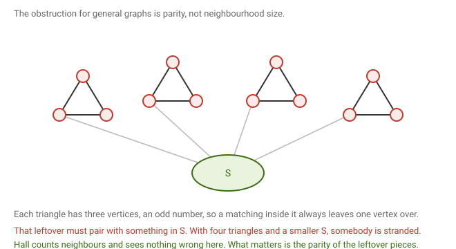
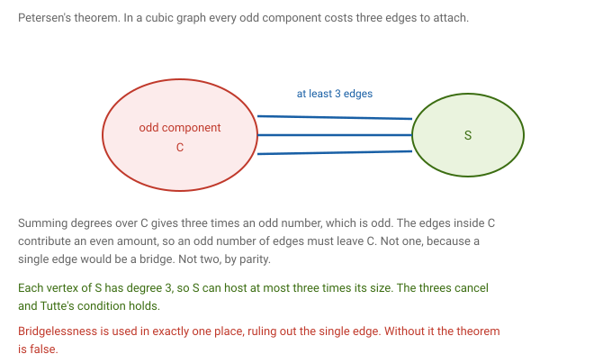

# 9 · 2026-08-19 — Matchings in non-bipartite graphs, Tutte's theorem

Previous: [[2026-08-10 König by Induction, Hall, and Factors]] · Hub: [[Graph Theory]] · Next: [[2026-08-31 Connectivity 1 — Minimum Degree and Whitney's Theorem]]

## How much this matters

Overall this note is core for its statement and useful for its proof. Tutte is a named theorem so the statement is very likely to be worth marks, but the hard direction is the longest argument in the course and the worst value per hour.

Know cold: [[2026-08-19 Tutte's 1-Factor Theorem#What we are proving|the statement]], [[2026-08-19 Tutte's 1-Factor Theorem#The easy direction|the easy direction]] which is only a few lines, and what a bad set is.

Know the example: [[2026-08-19 Tutte's 1-Factor Theorem#Why Hall is not enough here|triangles on a hub]]. It explains in one picture why Hall fails outside bipartite graphs, and it is the kind of thing that gets asked directly.

Know the idea: [[2026-08-19 Tutte's 1-Factor Theorem#The hard direction|the three moves]] of the hard direction. Add edges to a maximal counterexample, take the universal vertices, split on whether the rest is a union of cliques.

Know the counting: [[2026-08-19 Tutte's 1-Factor Theorem#Petersen's theorem|Petersen]]. The proof is short and the point is memorable, that the two threes cancel and bridgelessness is used exactly once.

Full hard direction: last thing to attempt, and only with time to spare.

## Notation

An odd component is a connected component with an odd number of vertices, and odd(H) counts how many odd components H has. Writing G − S means deleting the vertex set S together with every edge touching it.

A 1-factor is another name for a perfect matching. A set S is called bad when the number of odd components of G − S exceeds the size of S.

A universal vertex is one adjacent to every other vertex. An induced path on three vertices means vertices a, b, c with edges ab and bc but no edge ac.

## What we are proving

Theorem (Tutte, 1947). A graph G has a perfect matching if and only if for every set S of vertices, the size of S is at least the number of odd components of G − S.

Two directions again. Assuming a perfect matching exists, show the counting condition holds. Assuming the condition holds, produce a perfect matching. The first is short, the second takes the rest of the note.

## Why Hall is not enough here

In bipartite graphs Hall's condition decides everything. Outside bipartite graphs it simply measures the wrong thing.

The trivial case first. In a complete graph every set has plenty of neighbours, yet a complete graph on an odd number of vertices has no perfect matching, since a perfect matching pairs vertices up and an odd count always leaves one over. So assume n is even from here.

The real counterexample is this.

Attach several triangles to a small set S. Each triangle has three vertices, which is odd, so a matching inside a triangle covers at most two of them and one vertex must find its partner outside, in S. With more triangles than S has vertices, somebody is stranded.

Hall's condition looks at how many neighbours a set has and sees nothing wrong. What actually matters is the parity of the leftover pieces.

## The easy direction

Claim. If some S has more odd components in G − S than S has vertices, then G has no perfect matching.

Suppose M were a perfect matching and delete S. Each odd component of G − S has an odd number of vertices, so M cannot pair them all up inside that component and at least one vertex must be matched outside it. The only vertices available outside are those of S, since the other components have no edges to it. Different odd components send their leftover to different vertices of S, because M is a matching. So S needs at least as many vertices as there are odd components, contradicting the assumption.

Two quick checks. If n is odd then S can be the empty set, which has no vertices while G has at least one odd component, so the empty set is bad. That recovers the observation that odd order rules out a perfect matching. And in the triangles picture, taking S to be the hub makes every triangle an odd component.

## The hard direction

Claim. If every set S satisfies the condition, then G has a perfect matching.

Suppose not, so G satisfies the condition but has no perfect matching.

### Step one, pass to a maximal counterexample

Keep adding edges to G for as long as the graph still fails to have a perfect matching, and stop at a graph H that is maximal with this property. So H has no perfect matching, but adding any missing edge to H creates one. This is possible because the complete graph on an even number of vertices does have a perfect matching, so the process must halt before then.

H still satisfies the condition. To see it, suppose some S had more odd components in H − S than S has vertices. Now G is a subgraph of H on the same vertices, so G − S comes from H − S by deleting edges, and deleting edges only splits components apart. Take any odd component of H − S. When it splits, the sizes of its pieces add up to an odd number, and a sum of even numbers is even, so at least one piece must be odd. So every odd component of H − S produces at least one odd component of G − S, meaning S would be bad in G too, contradicting our hypothesis about G.

### Step two, look at the universal vertices

Let S be the set of vertices of H adjacent to everything else. Two cases follow, depending on what the rest looks like.

### Case one, H − S is a disjoint union of cliques

First, the size of S and the number of odd components of H − S have the same parity. Counting all vertices, n equals the size of S plus the sizes of all components. Even components contribute even numbers and odd ones contribute odd numbers, so modulo 2 the total is the size of S plus the number of odd components. Since n is even, those two quantities have the same parity.

Now build a perfect matching directly. Send one vertex of each odd clique into S, which is allowed because every vertex of S is adjacent to everything, and there are enough vertices in S by the condition. What remains of each odd clique is even and is a clique, so it pairs up internally. Each even clique pairs up internally too. The vertices of S left over number the size of S minus the number of odd components, which is even by the parity observation, and S is itself a clique since its vertices are adjacent to everything, so they pair among themselves.

Everything is matched, so H has a perfect matching, contradicting how H was chosen. The parity observation is exactly what makes the last step work; without it you would be left with one unmatched vertex in S and nobody to pair it with.

### Case two, H − S is not a disjoint union of cliques

Then some component of H − S fails to be a clique, so it contains two non adjacent vertices. Take a shortest path between them inside that component. Shortest paths are induced, as shown in [[Tutorial 1]], so its first three vertices give an induced path a, b, c with ab and bc edges and ac absent.

The middle vertex b lies outside S, so b is not universal, and there is some vertex x not adjacent to b.

By maximality of H, adding the missing edge ac creates a perfect matching, call it M, and that matching must use ac, since otherwise it would already be a perfect matching of H. Likewise adding bx creates a perfect matching N that must use bx.

Consider the graph whose edges are those of M together with those of N. As before every degree is at most two, and since both matchings are perfect every vertex has degree exactly two except where they agree, so the components are alternating even cycles.

The edges ac and bx each lie on some cycle. If they lie on different cycles, take the cycle containing bx and swap along it, replacing its M edges by its N edges. That produces a perfect matching that no longer needs ac, and every edge it uses belongs to H. If they lie on the same cycle, walk around it and re-pair the vertices so that the stretch through a, b and c uses ab or bc in place of ac, both of which are edges of H.

Either way H ends up with a perfect matching, contradicting how H was chosen.

Every case is impossible, so the assumption that G has no perfect matching fails, and the theorem is proved.

## Petersen's theorem

Definitions first. A graph is cubic when it is 3 regular. A bridge is an edge whose removal increases the number of components, and a graph is bridgeless when it has none.

Theorem (Petersen, 1891). Every bridgeless cubic graph has a perfect matching.

This is the classic application, and it works by checking Tutte's condition directly.

Start with S empty. In a cubic graph every component has even order, because summing degrees inside a component gives three times its vertex count and also twice its edge count, so three times the vertex count is even and therefore the vertex count is even. So there are no odd components at all and the condition holds trivially.

Now take S non empty.

Let C be an odd component of G − S. Summing degrees over C, counting in G, gives three times the size of C, which is odd since the size is odd. That total also equals twice the number of edges inside C plus the number of edges leaving C. The first term is even, so the number of edges leaving C is odd.

That count cannot be one, because a single edge joining C to the rest would be a bridge and G is bridgeless. It cannot be two either, by the parity we just established. So at least three edges leave every odd component.

Counting the edges out of S from below, they number at least three times the number of odd components. Counting from above, each vertex of S has degree exactly three so it hosts at most three departing edges, giving at most three times the size of S. Comparing the two, the size of S is at least the number of odd components.

The condition holds for every S, so by Tutte the graph has a perfect matching.

Bridgelessness is used in exactly one place, ruling out a single edge. Drop it and the theorem is false. Take a hub vertex joined by three bridges to three copies of a five vertex piece; every degree is three and the order is even, but deleting the hub leaves three odd components against one vertex, so the hub is a bad set and no perfect matching exists.

## What to remember

Off bipartite graphs, neighbourhood size is the wrong invariant and parity is the right one. A bad set certifies that no perfect matching exists, and Tutte says it is the only obstruction. The hard direction works by adding edges until one more would create a perfect matching, which is the extremal method again. Deleting edges only splits components, and an odd component always splits into at least one odd piece, which is what lets the condition survive that move. Superimposing two perfect matchings gives even cycles, and re-pairing along them lets you dodge an unwanted edge. In Petersen's proof the two threes cancel, and bridgelessness carries the whole hypothesis.

## Still unclear

- My page dates the theorem to the 1940s. It is 1947.
- Case two is the fiddliest step. Worth checking against the lecture that the substitute edge is ab or bc.
- Why universal vertices are the right choice for S. They make the first step of case one free, since they are adjacent to everything. Worth asking whether another choice would work.
- Tutte gives a criterion, not an algorithm. Edmonds' blossom algorithm is the algorithmic counterpart, in NPTEL lectures 4 to 6.
