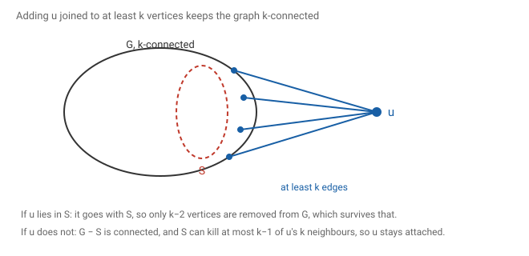
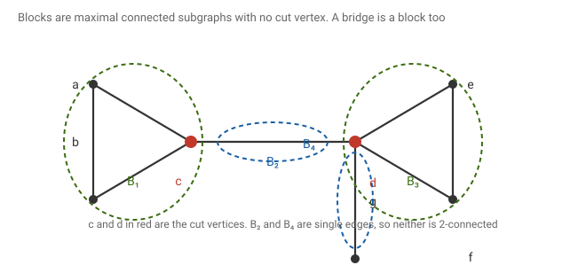
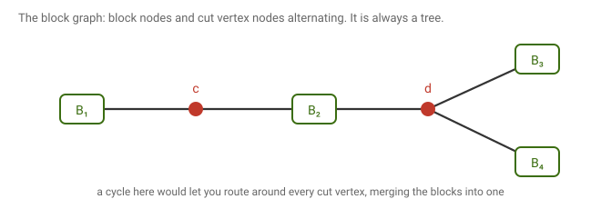
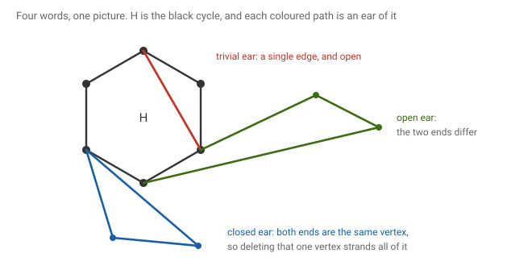
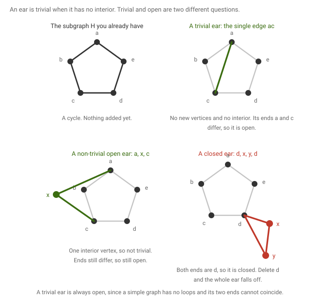
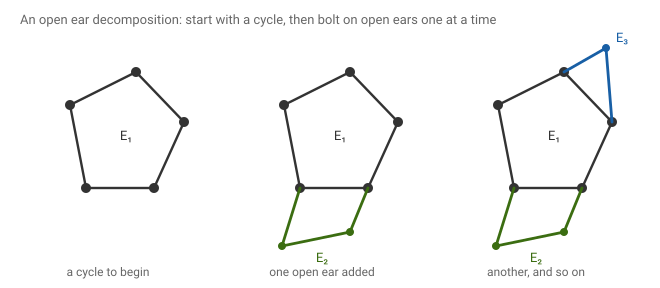

# 11 · 2026-08-31 — Blocks, ear decomposition, and k-connectivity

Previous: [[2026-08-31 Connectivity 1 — Minimum Degree and Whitney's Theorem]] · Hub: [[Graph Theory]] · Next: [[2026-08-31 Menger's Theorem and Dirac's Fan Lemma]]

Same session as the previous note, continued. Split into its own file because the material is long. Everything here rests on Whitney's theorem from that note.

## How much this matters

Overall this note is core. Ear decomposition is a named syllabus topic and blocks come back with every later structural result.

Know cold: [[2026-08-31 Blocks, Ear Decomposition, and k-Connectivity#Blocks|what a block is]], including the part my page got wrong, and [[2026-08-31 Blocks, Ear Decomposition, and k-Connectivity#Ears and ear decomposition|what an open ear decomposition is]]. Definitions here are worth more marks than usual because there are four of them and they are easy to confuse.

Know the argument: [[2026-08-31 Blocks, Ear Decomposition, and k-Connectivity#An open ear decomposition characterises 2-connectedness|the ear decomposition theorem]], both directions. Each is about ten lines and this is the most likely theorem in the note to be set.

Know the statement and one proof: [[2026-08-31 Blocks, Ear Decomposition, and k-Connectivity#Four things 2-connectedness buys you|the four consequences]]. They are all the same trick, subdivide and apply Whitney, so learn the trick rather than four proofs.

Know the idea: [[2026-08-31 Blocks, Ear Decomposition, and k-Connectivity#The block tree|the block tree]]. The fact that it is a tree is quotable and the proof is short.

Read once: [[2026-08-31 Blocks, Ear Decomposition, and k-Connectivity#The k-connected generalisation|the k-connected generalisation]]. The attempt in my notes does not close, and the honest answer is Menger's theorem, which is proved in [[2026-08-31 Menger's Theorem and Dirac's Fan Lemma#The global form of Menger's theorem|the next note]]. Do not spend time trying to finish it.

## Notation

As in the previous note, G is a finite simple graph on n vertices, κ(G) is the vertex connectivity, and δ(G) the minimum degree. A cut vertex is a vertex whose deletion increases the number of components.

H is used throughout for a subgraph of G, and Gᵢ for the subgraph built after i steps of a decomposition. When two graphs are joined, V(H₁ ∪ H₂) means the union of the vertex sets and E(H₁ ∪ H₂) the union of the edge sets.

Subdividing an edge ab means deleting it and adding a new vertex w together with the two edges aw and wb. The reverse operation, replacing a degree two vertex and its two edges by a single edge, is called suppressing it.

## Adding a vertex keeps a graph k-connected

Lemma. Let G be k-connected and let H be obtained by adding one new vertex u and joining it to at least k vertices of G. Then H is k-connected.

Given: G is k-connected, and u has at least k neighbours in G.
To show: no set of fewer than k vertices separates H.

My page sets up the strategy, which is to show no vertex separator S of size at most k−1 exists, and defines a vertex separator as a subset of vertices whose deletion disconnects the graph. The two cases are then straightforward, and my page draws both but writes out neither.

First the size condition. H has n+1 vertices and G already had more than k, so H has more than k. Good.

Now take any S with at most k−1 vertices and split on whether u is in it.

If u lies in S, then deleting S from H deletes u along with the rest, so H − S is exactly G − (S without u). That is a set of at most k−2 vertices removed from a k-connected graph, so what remains is connected.

If u does not lie in S, then S is a set of at most k−1 vertices of G, so G − S is connected. The new vertex u has at least k neighbours in G, and at most k−1 of them can lie in S, so at least one survives. Therefore u is attached to the connected graph G − S by at least one edge, and H − S is connected.

Either way H − S is connected, so H is k-connected.

The hypothesis is used in exactly one place, the counting in the second case. Joining u to only k−1 vertices would let S be precisely those k−1 neighbours, stranding u.

## Four things 2-connectedness buys you

Lemma. Let G be 2-connected. Then

1. any two vertices lie on a common cycle,
2. any vertex and any edge lie on a common cycle,
3. any two edges lie on a common cycle,
4. for any three vertices w, x, y there are two paths from w, one ending at x and one ending at y, which share no vertex except w.

My page states all four and draws each, with no proofs. They are worth doing because they are the same trick four times, and seeing that is the point.

The trick is to turn whatever you were given into vertices, so that part one applies. Subdividing an edge converts it into a vertex, and adding a new vertex joined to two old ones converts a pair into a single target. Both operations preserve 2-connectedness, the first by the subdivision lemma below and the second by the vertex addition lemma above with k = 2.

Part one is Whitney read backwards. Take x and y. By Whitney there are two internally disjoint x to y paths, and gluing two internally disjoint paths with the same endpoints gives a cycle, which passes through both.

Part two. Let the edge be e = ab. Subdivide it with a new vertex w, giving G′, which is still 2-connected. Apply part one to x and w in G′, giving a cycle through both. Now w has degree exactly two in G′, so any cycle through w must use both of its edges, namely aw and wb. Suppress w again, and that stretch becomes the single edge ab. The result is a cycle of G through x and through e.

Part three is the same move twice. Subdivide e with a vertex w and f with a vertex w′, apply part one to w and w′, then suppress both.

Part four. Add a brand new vertex α and join it to x and to y. By the vertex addition lemma with k = 2, the result G′ is 2-connected. By Whitney there are two internally disjoint paths from w to α in G′. The only neighbours α has are x and y, so one path arrives at α through x and the other through y. Delete α from both. What is left is a path from w to x and a path from w to y, and they share no vertex except w, because the originals were internally disjoint and α was the only shared endpoint besides w.

Part four is the two path case of what is called the fan lemma. The general version, with a set of any size, comes with Menger.

## Blocks

My page defines a block as a vertex maximal 2-connected induced subgraph. That is not quite the standard definition, and the gap matters.

The standard definition is that a block of G is a maximal connected subgraph with no cut vertex. The difference shows up on small pieces. A bridge, together with its two endpoints, is a block, and it is a copy of K₂, which is not 2-connected. An isolated vertex is a block too, a copy of K₁. So "maximal 2-connected subgraph" finds every block on three or more vertices and misses all the rest.

Verified: the path on three vertices a, b, c has blocks {a,b} and {b,c}, each a single edge, and the connectivity of K₂ is 1, not 2. Under my page's definition that graph would have no blocks at all.

The word induced is harmless but unnecessary, since maximality already forces a block to be induced. If a block missed an edge between two of its own vertices, adding that edge back would keep it connected and cut vertex free, contradicting maximality.

Two blocks meet in at most one vertex, and any vertex in two blocks is a cut vertex. The first part holds because if two blocks shared two vertices, their union would still have no cut vertex, contradicting that each was maximal. The second is the reason the next construction works.

## The block tree

Build a new graph from G as follows. Put one node for each block and one node for each cut vertex of G, and join a cut vertex node to a block node when that cut vertex lies in that block. My page writes this as V = {blocks} ∪ {cut vertices}, and calls the result the block graph.

Claim. If G is connected, its block graph is a tree.

It is connected, because G is: any two blocks are joined in G by a path, and that path passes through the cut vertices separating them, which supplies a route in the block graph.

For acyclicity, suppose the block graph contained a cycle. Such a cycle alternates between block nodes and cut vertex nodes, say B₁, c₁, B₂, c₂, …, Bᵣ, cᵣ and back to B₁. Consider the union of those blocks inside G. Each cᵢ now has the cycle running through it in two directions, so deleting cᵢ from that union leaves everything still joined by going the other way round. The same holds for every other vertex, since each individual block has no cut vertex. So the union is a connected subgraph with no cut vertex, and it properly contains B₁, contradicting the maximality of B₁.

Hence the block graph is connected and acyclic, which is a tree. My page calls this the block tree representation.

Checked on 585 random connected graphs, the block graph was a tree every time.

One corollary is worth stating, because the last section needs it. Two vertices of a connected graph lie in a common block exactly when no single cut vertex separates them. If they lay in different blocks, the block tree path between them would pass through at least one cut vertex node, and that cut vertex separates them in G.

## Subdividing an edge

Lemma. G is 2-connected if and only if the graph obtained by subdividing one edge of G is 2-connected.

My page records this with a tick and no argument, so here it is. Let e = ab be subdivided by the new vertex w, giving H.

Suppose G is 2-connected, and delete any one vertex of H. If the deleted vertex is w, what remains is G − e, which is connected because a 2-connected graph has no bridge. If the deleted vertex is a, then in H the vertex w keeps only the edge wb, so what remains is G − a with a pendant vertex hanging off b, and G − a is connected. The case of b is symmetric. For any other vertex u, what remains is G − u with e still subdivided, connected because G − u is. So H is 2-connected.

Conversely, suppose H is 2-connected and delete any vertex u of G. Then H − u is connected, and suppressing w turns it into G − u without breaking anything, since suppressing replaces a path by an edge with the same endpoints. So G − u is connected and G is 2-connected.

Verified on 1445 random graphs: subdividing an edge never changed whether the graph was 2-connected, in either direction.

Since subdividing repeatedly is just doing this several times, the whole family of subdivisions of G is 2-connected exactly when G is. My page notes the cost of building one, at most three times the original edge count, which keeps it linear.

## Ears and ear decomposition

Let H be a subgraph of G. An ear of H is a path in G whose two endpoints lie in H and whose internal vertices do not.

Four words go with this, and my page labels all four on one picture.

An ear is trivial when it has no internal vertices at all, so it is a single edge joining two vertices of H. It is non trivial otherwise.

An ear is open when its two endpoints are different, and closed when they coincide, in which case it is a cycle touching H at exactly one vertex.

Trivial or not asks whether the ear has an interior. Open or closed asks whether its two ends are different vertices. They are independent questions, and only the second one appears in the theorem.

Ear decomposition. It is a partition of the edges of a graph into ears E₁, E₂, …, Eₖ such that E₁ is a cycle and each later Eᵢ is an ear of the graph formed by E₁ ∪ E₂ ∪ … ∪ Eᵢ₋₁. It is an open ear decomposition when every ear after the first is open.

One notational warning, because it is easy to lose. Each Eᵢ is a set of edges, one ear. Each Gᵢ, used in the proof below, is a whole graph, namely E₁ ∪ … ∪ Eᵢ. So Gᵢ is a running total and Gᵢ₋₁ simply means whatever had been built before the i-th ear went on. A worked example with named vertices is in [[15 High-Yield Proofs]], question 22.

## An open ear decomposition characterises 2-connectedness

Theorem (Whitney, 1932). A graph on at least three vertices is 2-connected if and only if it has an open ear decomposition.

Given: G is a graph on at least three vertices.
To show: the two conditions are the same condition.

### If it has one, it is 2-connected

Induct on the number of ears. Write Gᵢ for E₁ ∪ … ∪ Eᵢ.

The base is G₁, a cycle, which is 2-connected.

For the step, suppose Gᵢ₋₁ is 2-connected and Eᵢ is an open ear with distinct endpoints a and b. Take any vertex u of Gᵢ and check that Gᵢ − u is still connected.

If u is an internal vertex of the ear, then deleting it leaves Gᵢ₋₁ untouched, with two paths hanging off a and off b. Those stubs are attached to a connected graph, so the whole thing is connected.

If u belongs to Gᵢ₋₁, then Gᵢ₋₁ − u is connected because Gᵢ₋₁ is 2-connected. The interior of the ear is still attached, because its two ends are a and b, they are different, and u can only be one of them. So at least one end survives to hold the ear on.

Either way Gᵢ − u is connected, so Gᵢ is 2-connected, and by induction so is G.

Notice exactly where openness was used: in the second case, to guarantee that deleting u cannot detach the ear at both ends at once. A closed ear has a = b, and deleting that single vertex would strand the whole ear. That is the entire reason the theorem says open.

### If it is 2-connected, it has one

Since G is 2-connected we have δ(G) ≥ 2, so G contains a cycle by Lemma B of [[2026-07-24 Preliminaries#What high minimum degree buys you|the preliminaries note]]. Take any cycle and call it E₁.

Now suppose Gᵢ has been built and is not yet all of G. Two things can be missing.

If some edge of G has both endpoints in Gᵢ but is not itself in Gᵢ, take it. It is a trivial ear, and it is open because a simple graph has no loops, so its two endpoints differ.

Otherwise some vertex v lies outside Gᵢ. Since G is connected there is an edge from Gᵢ out towards it, so pick a vertex a in Gᵢ with a neighbour v outside. Now delete a. Since G is 2-connected, G − a is connected, so inside G − a there is a path from v back to Gᵢ. Follow it from v and stop at the first vertex of Gᵢ it reaches, calling that vertex b. Then a, v, then along to b is an ear, its interior lies outside Gᵢ, and b is not a because the path avoided a. So it is an open ear.

Add it and repeat. Each step uses at least one new edge and G is finite, so the process stops, and it can only stop when Gᵢ is all of G.

Bipartiteness plays no role anywhere here. What does the work is 2-connectedness, used once to get the starting cycle and once more, crucially, to guarantee b ≠ a. Drop it and you still get an ear decomposition, but the ears can be closed.

## The k-connected generalisation

My page then asks the natural question. Whitney says 2-connected is the same as two internally disjoint paths between every pair. Is k-connected the same as k internally disjoint paths between every pair?

The answer is yes, and it is worth knowing that the statement is true. But the argument on my page does not get there, and it is more useful to say so plainly than to pretend otherwise.

The attempt runs an induction on k. The base k = 1 is fine, since a connected graph has one path between any two vertices by definition. The step assumes the result for k = l and tries to reach l+1, and my page collects several supporting facts along the way. Three of them are correct and worth keeping.

If G is (l+1)-connected then δ(G) ≥ l+1. This is the standard chain κ ≤ λ ≤ δ from [[Assignment 1]].

If G is k-connected then G − e is (k−1)-connected, for any edge e. Verified over 14111 edge deletions with no failures.

If G is (l+1)-connected then G − x is l-connected for any vertex x, which is immediate from the definition.

One of them, however, is stated in a form that is false.

### The union lemma needs a hypothesis my page omits

My page records: if H₁ is l-connected and H₂ is l-connected, then H₁ ∪ H₂ is l-connected, where the union takes the union of the vertex sets and of the edge sets.

That is false as written. Take two triangles sharing exactly one vertex. Each triangle is 2-connected. Their union has a cut vertex, the shared one, so its connectivity is 1, not 2. This is the same bowtie that appeared in [[2026-08-31 Connectivity 1 — Minimum Degree and Whitney's Theorem#Vertex connectivity is not edge connectivity|the previous note]] for a different purpose.

The missing hypothesis is that the two graphs must overlap in at least l vertices. With it the statement is true, and the proof is three lines. Take any S with at most l−1 vertices. Then H₁ − S is connected and H₂ − S is connected, since each is l-connected. The two share at least l vertices, and S can kill at most l−1 of them, so at least one shared vertex survives in both. That shared survivor glues the two connected pieces together, so the union minus S is connected.

Verified: across 2762 pairs satisfying the overlap condition there were no failures, while the bare statement fails on the two triangles.

Where my page applies it, the hypothesis happens to hold. The application is that if G − x and G − y are both l-connected and xy is an edge, then G minus that edge is l-connected. Here the two graphs share every vertex except x and y, which is n−2 of them, comfortably more than l. So the conclusion is fine even though the lemma it was quoted from is not.

### What actually proves it

The induction does not close because knowing l disjoint paths exist gives you no grip on where an (l+1)-th could come from. The theorem is the global form of Menger's theorem, and the proof needs Menger's machinery rather than an induction on k. My page ends on exactly the right note for this, stating the local version for two paths.

Let x and y be two non adjacent vertices of G. If every x,y-cut has at least two vertices, then there are two internally vertex disjoint paths between x and y.

For k = 2 this one is provable with what we already have. Suppose every x,y-cut has at least two vertices, which is to say no single vertex separates x from y. By the corollary to the block tree above, x and y then lie in a common block B. That block is not a single edge, because x and y are not adjacent, and a block that is not a single edge or a single vertex has at least three vertices and no cut vertex, so it is 2-connected. Apply Whitney inside B and you get two internally disjoint x to y paths.

The general k version of that statement is Menger's theorem, written up in [[2026-08-31 Menger's Theorem and Dirac's Fan Lemma]], and once it is available the k-connected characterisation follows from it in a few lines.

## What to remember

Adding a vertex joined to at least k old ones preserves k-connectedness, and the proof is two cases split on whether the new vertex is in the separator. Everything 2-connectedness buys you comes from one trick: turn edges into vertices by subdividing, turn a pair of targets into one by adding a vertex joined to both, then apply Whitney and undo. A block is a maximal connected subgraph with no cut vertex, which is not the same as a maximal 2-connected subgraph, because bridges are blocks too. The block graph of a connected graph is a tree, because a cycle in it would let you route around every cut vertex and merge the blocks. Subdividing an edge never changes whether a graph is 2-connected. An open ear decomposition exists exactly for 2-connected graphs, and openness is what stops a single deleted vertex from stranding a whole ear. The k-connected characterisation is true but needs Menger, and two l-connected graphs only union to an l-connected graph when they share at least l vertices.

## Still unclear

- My page defines a block as a vertex maximal 2-connected induced subgraph. That misses bridges and isolated vertices. The correct definition is a maximal connected subgraph with no cut vertex.
- My page states the union lemma without the requirement that the two graphs share at least l vertices. Two triangles glued at a vertex are a counterexample.
- The induction on k does not close, and no attempt on my page finishes it. The result needs Menger's theorem.
- My page draws a fifth item in the four part lemma, two crossing paths with ends x, w and y, z, but never states it. It looks like the two path case of the fan lemma or an early sketch of Menger. Worth asking in class what statement that picture belongs to.
- The complexity remark on my page, that a subdivision costs at most three times the edges, was not explained. It looks like a bound for an algorithm that subdivides every edge, which would be worth confirming.
