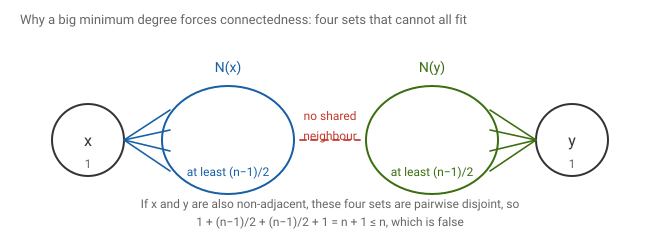
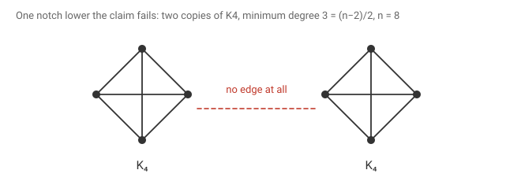
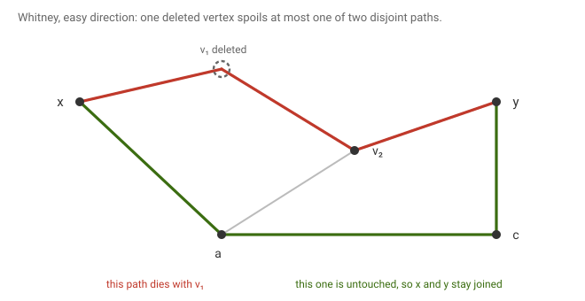
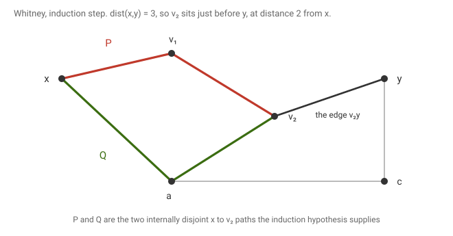
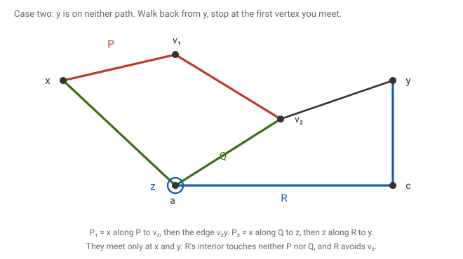
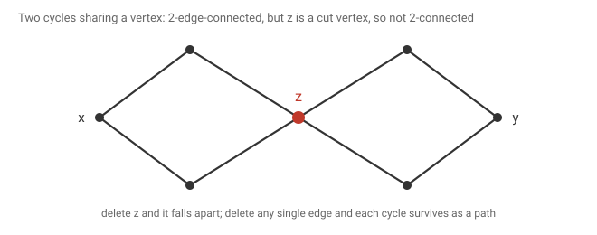

# 10 · 2026-08-31 — Connectivity 1, minimum degree and Whitney's theorem

Previous: [[2026-08-19 Tutte's 1-Factor Theorem]] · Hub: [[Graph Theory]] · Next: [[2026-08-31 Blocks, Ear Decomposition, and k-Connectivity]]

First class on connectivity. Split into two files because the session was long. This one covers what k-connected means, how a large minimum degree forces connectedness, Dirac's theorem, and Whitney's characterisation of 2-connected graphs.

## How much this matters

Overall this note is core. Connectivity is a named syllabus topic and Whitney is the theorem the whole unit is built on.

Know cold: [[2026-08-31 Connectivity 1 — Minimum Degree and Whitney's Theorem#What k-connected means|the definition]], and [[2026-08-31 Connectivity 1 — Minimum Degree and Whitney's Theorem#Whitney's theorem, the easy direction|the easy direction of Whitney]], which is four lines. Also the [[2026-08-31 Connectivity 1 — Minimum Degree and Whitney's Theorem#Vertex connectivity is not edge connectivity|bowtie]], because it is the standard exam question on why the two connectivities differ.

Know the argument: [[2026-08-31 Connectivity 1 — Minimum Degree and Whitney's Theorem#Whitney's theorem, the hard direction|the hard direction of Whitney]]. It is an induction on distance with two cases, and the whole course refers back to it.

Know the counting: [[2026-08-31 Connectivity 1 — Minimum Degree and Whitney's Theorem#A large minimum degree forces connectedness|the minimum degree bound]]. Three lines, and the same count answers several exam questions.

Know the route: [[2026-08-31 Connectivity 1 — Minimum Degree and Whitney's Theorem#Dirac's theorem|Dirac]]. The proof is the long path theorem you already know plus one extra step, so learn it as a variation rather than as a new proof.

## Notation

G is a finite simple graph with n vertices, and δ(G) is its minimum degree. N(v) is the set of vertices adjacent to v, and deg(v) is how many there are. Writing G − S means deleting the vertex set S together with every edge touching it, and G − e means deleting only the edge e.

Two x to y paths are internally vertex disjoint when the only vertices they share are x and y themselves. They may, and must, share those two.

A vertex separator, also called a cut, is a set S of vertices such that G − S is disconnected. A cut vertex is a separator of size one. For two specific non adjacent vertices x and y, an x,y-cut is a set S not containing x or y such that x and y lie in different components of G − S.

κ(G) is the vertex connectivity and λ(G) the edge connectivity. As established in [[Assignment 1]], κ(G) ≤ λ(G) ≤ δ(G) always.

## What we are proving

Theorem (Whitney, 1932). A graph G with at least three vertices is 2-connected if and only if every pair of vertices x, y has two internally vertex disjoint paths between them.

Given: G is a graph on at least three vertices.
To show: the two conditions are the same condition.

Watch the quantifier. The condition is about every pair, not some pair. One pair with two disjoint paths proves nothing.

## What k-connected means

My page defines it this way. G is k-vertex connected, or k-edge connected, when removing any arbitrary subset of at most k−1 vertices, or edges, does not disconnect the graph.

One thing that definition leaves out. The usual convention also demands that G has more than k vertices. Without that clause the complete graph K₃ would count as 3-connected, since you cannot disconnect it by deleting two vertices, only reduce it to a single vertex. With the clause, K₃ is 2-connected and no more, and in general Kₙ is exactly (n−1)-connected. Keep the clause, because several later results would be false otherwise.

The two notions come apart. Edges are weaker than vertices, so κ(G) ≤ λ(G), and the gap can be real. That is the point of the last section.

## A large minimum degree forces connectedness

Claim. If δ(G) ≥ (n−1)/2 then G is connected.

Given: every vertex has at least (n−1)/2 neighbours.
To show: any two vertices are joined by a path.

Take any two vertices x and y. If they are adjacent, they are joined and there is nothing to do, so suppose they are not. It is enough to find a common neighbour, because that gives a path of length two.

Suppose they had no common neighbour. Then the four sets {x}, N(x), {y} and N(y) are pairwise disjoint. They are disjoint for three separate reasons, and it is worth seeing all three. First, x is not in N(x), because the graph is simple and a vertex is never its own neighbour. Second, x is not in N(y) and y is not in N(x), because x and y are not adjacent. Third, N(x) and N(y) do not meet, because that is exactly the assumption we are trying to contradict.

Four disjoint sets cannot hold more vertices than the graph has, so

1 + |N(x)| + 1 + |N(y)| ≤ n.

Each neighbourhood has at least (n−1)/2 members, so the left hand side is at least 2 + (n−1) = n + 1. That gives n + 1 ≤ n, which is false. So x and y do have a common neighbour, and G is connected.

The bound cannot be lowered. Take two disjoint copies of the complete graph on n/2 vertices. Every vertex has degree n/2 − 1, which is (n−2)/2, one notch below the bound, and the graph is plainly disconnected.

Verified: for n = 4, 6, 8 and 10, two disjoint complete graphs on n/2 vertices have minimum degree exactly (n−2)/2 and are disconnected, while across 1273 random graphs meeting δ ≥ (n−1)/2, not one was disconnected.

## The version with n over 2

My page also records the weaker hypothesis δ ≥ n/2, alongside the observation that follows from it.

Claim. If δ(G) ≥ n/2 then every pair of vertices is either adjacent or has a common neighbour.

This is the same count as before, only now it is the conclusion rather than a step. If x and y were non adjacent with no common neighbour, the four disjoint sets give 2 + |N(x)| + |N(y)| ≤ n, so 2 + n ≤ n, which is false.

So why keep both versions? Because (n−1)/2 is the sharp threshold for connectedness, while n/2 is what Dirac's theorem needs. The stronger hypothesis buys a much stronger conclusion, as the next section shows.

## Dirac's theorem

Theorem (Dirac, 1952). If n ≥ 3 and δ(G) ≥ n/2, then G has a Hamiltonian cycle.

Given: at least three vertices, and every vertex adjacent to at least half of the graph.
To show: a cycle passing through every vertex exactly once.

My page states this and stars it but does not prove it. The proof is worth doing, because it is the [[2026-07-24 Long Path Theorem]] machinery reused almost verbatim, with one new step at the end. If you know that theorem you are most of the way here.

First, G is connected, since n/2 is at least (n−1)/2 and the previous section applies.

Take a longest path P = v₀v₁…vₖ. Both endpoints are trapped, meaning every neighbour of v₀ and every neighbour of vₖ already lies on P, because an outside neighbour could be attached to make a longer path.

Now define the two index sets exactly as in the long path theorem. Let A be the set of positions i in {1, …, k} with v₀ adjacent to vᵢ, and let B be the set of positions i in {1, …, k} with vₖ adjacent to vᵢ₋₁. Every neighbour of v₀ is some vᵢ with i in {1, …, k}, so A has at least deg(v₀) ≥ n/2 members. Every neighbour of vₖ is some vᵢ₋₁ with i in {1, …, k}, so B likewise has at least n/2 members.

Both sets sit inside a box of k positions, and a path uses no vertex twice so k ≤ n−1. Their sizes add to at least n, which exceeds n−1 and therefore exceeds k, so by pigeonhole they overlap. Take i in both.

That gives the two crossing edges v₀vᵢ and vₖvᵢ₋₁, which fold P into the cycle

v₀, v₁, …, vᵢ₋₁, vₖ, vₖ₋₁, …, vᵢ, v₀

passing through all k+1 vertices of P. So far this is the long path theorem verbatim.

Here is the new step. The claim is that this cycle already contains every vertex of G. Suppose some vertex w lies outside it. Count how many vertices w could possibly be adjacent to. The cycle has k+1 vertices, and since A sits inside a box of size k we have k ≥ n/2, so the cycle has at least n/2 + 1 vertices. Outside the cycle there are n − (k+1) vertices, and excluding w itself that leaves at most n − (n/2 + 1) − 1 = n/2 − 2 possible neighbours off the cycle. But w has at least n/2 neighbours, which is more than that, so w must be adjacent to some vertex u on the cycle.

Now snip the cycle open at u, by deleting one of the two cycle edges at u. What remains is a path through all k+1 cycle vertices, ending at u. Attach w by the edge wu. That is a path of length k+1, longer than P, contradicting the choice of P.

So no vertex lies outside, the cycle passes through all n vertices, and it is a Hamiltonian cycle.

Verified on 151 random graphs satisfying the hypothesis, every one had a Hamiltonian cycle, found by exhaustive search.

Where each hypothesis was used. The bound n/2 is used twice, once to make the two index sets overlap and once to force w onto the cycle. Halving it to (n−1)/2 breaks the second use, and the theorem genuinely fails there: two complete graphs sharing a single vertex have minimum degree about n/2 − 1 and no Hamiltonian cycle, since the shared vertex would have to be visited twice.

## Whitney's theorem, the easy direction

Claim. If every pair of vertices has two internally vertex disjoint paths between them, then G is 2-connected.

Delete any single vertex u and take any two remaining vertices x and y. By hypothesis there are two internally disjoint x to y paths. The vertex u can lie on at most one of them, because if it lay on both it would be an internal vertex shared by two paths that share no internal vertex. So at least one path survives intact, and x and y are still joined.

Since x and y were arbitrary, G − u is connected. Since u was arbitrary, no single vertex separates G, which is what 2-connected means.

The whole argument is the sentence "one vertex can spoil at most one of two disjoint paths". That is worth remembering on its own, because the same sentence generalises to k paths and k−1 deleted vertices.

## Whitney's theorem, the hard direction

Claim. If G is 2-connected, then every pair of vertices x, y has two internally vertex disjoint paths between them.

This is the real work. My page runs it as an induction on the distance between x and y, labelled "first attempt", and the argument does close, so it is not merely an attempt.

Induct on d = dist(x, y).

For the base case d = 1, the vertices are adjacent. One path is the edge xy itself. For the second, delete the edge xy and observe that G − xy is still connected: G is 2-connected, so it has no cut vertex, and a 2-connected graph on at least three vertices has no bridge either, since a bridge in a graph with no cut vertex could only join two vertices of degree one. So a second x to y path exists in G − xy, and it is internally disjoint from the single edge xy because the edge has no internal vertices at all.

Now assume the statement holds for every pair at distance at most k, and take x and y at distance k+1.

Take a shortest x to y path and let v be the vertex just before y on it, so v is adjacent to y and dist(x, v) = k. By the induction hypothesis there are two internally disjoint paths P and Q from x to v.

Two cases, depending on whether y is already caught by those paths.

Case one, y lies on P or on Q. Then P together with Q forms a cycle through x and through v, and y sits on that cycle. Any two vertices of a cycle are joined by two internally disjoint paths, namely the two arcs, so x and y are joined by two such paths and we are done.

Case two, y lies on neither. This is the case the figure shows.

Delete v. Because G is 2-connected, G − v is still connected, so there is a path from y to some vertex of P ∪ Q inside G − v. Follow that path from y and stop the instant it first touches P ∪ Q. Call the stopping vertex z and call the piece travelled so far R.

Two properties of R are worth stating separately, because the proof needs both. First, R avoids v, because we deleted v before looking for it. Second, no vertex of R except z lies on P or on Q, because we stopped at the first touch. That second property is exactly why z was defined as the first touch rather than any old common vertex.

Without loss of generality z lies on Q, since P and Q play symmetric roles.

Now assemble the two paths.

The first is x along P to v, then the edge vy. Call it P₁.

The second is x along Q as far as z, then z along R to y. Call it P₂.

Check that they are internally disjoint. The interior of P₁ consists of the internal vertices of P together with v. The interior of P₂ consists of the part of Q strictly between x and z, together with the internal vertices of R. Now P and Q share no internal vertex, so the P part and the Q part do not meet. The interior of R meets neither P nor Q, by the second property above. And v is not on P₂, because v is not on R by the first property, and the stretch of Q used stops at z, which is not v, again because R avoids v. So the two paths meet only at x and y.

Since x and y were arbitrary, the statement holds for every pair, and with the easy direction this proves Whitney's theorem.

Checked on 805 random connected graphs: being 2-connected and having two internally disjoint paths between every pair agreed in every case.

## Vertex connectivity is not edge connectivity

My page closes with a small graph that separates the two notions, and it is worth keeping.

Take two cycles sharing exactly one vertex z. Deleting z disconnects the graph, so z is a cut vertex and κ = 1, meaning the graph is not 2-connected. But deleting any single edge leaves everything joined, because each cycle survives the loss of one of its edges as a path. So λ = 2 and the graph is 2-edge-connected.

Verified: for two triangles sharing a vertex, κ = 1 and λ = 2, with z the only cut vertex.

The lesson is that edges are the weaker currency. A single vertex can carry the whole graph's connectedness in a way that no single edge can, which is why κ ≤ λ and not the other way round.

## What to remember

Being k-connected means no set of fewer than k vertices separates the graph, and the definition also quietly requires more than k vertices, which is what stops Kₙ from being n-connected. A minimum degree of (n−1)/2 forces connectedness, by the count that {x}, N(x), {y} and N(y) would otherwise be four disjoint sets adding past n, and two disjoint cliques show the bound is sharp. Raising the hypothesis to n/2 buys a Hamiltonian cycle, and Dirac's proof is the long path theorem plus one step that drags every stray vertex onto the cycle. Whitney's easy direction is the single sentence that one deleted vertex can spoil at most one of two disjoint paths. The hard direction inducts on distance, takes the neighbour v of y on a shortest path, and in the awkward case runs a path R back from y and stops at the first vertex it meets, which is what makes the pieces disjoint. Vertex connectivity and edge connectivity are different numbers, and two cycles glued at a vertex is the smallest example worth carrying.

## Still unclear

- My definition of k-connected omits the requirement that G has more than k vertices. Without it, Kₙ would count as n-connected.
- My page labels the induction on distance a "first attempt". It closes as written, so the label understates it. The attempt that does not close is the generalisation to k paths, in [[2026-08-31 Blocks, Ear Decomposition, and k-Connectivity#The k-connected generalisation|the next note]].
- Dirac's theorem is starred on my page but never proved. Proved here, by reusing the long path theorem.
- Worth confirming with the lecture whether the base case of Whitney's induction was done as I have it, using the absence of a bridge, or some other way.
