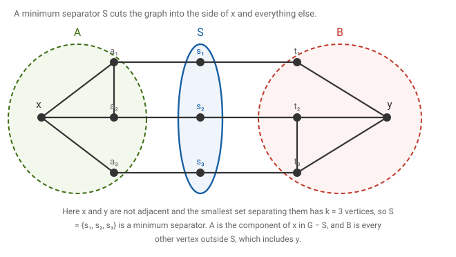
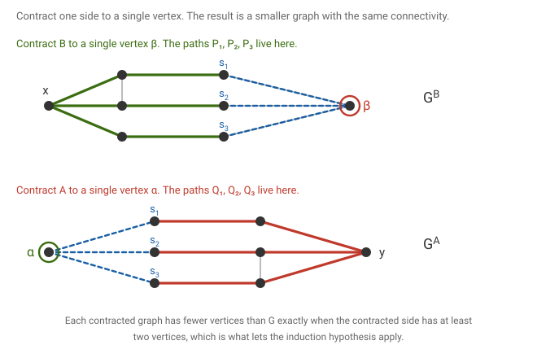
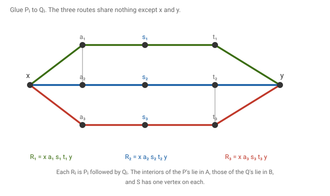
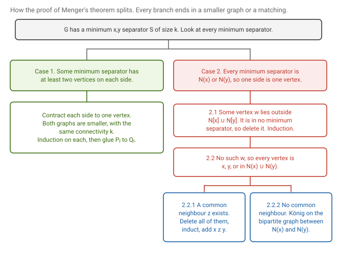
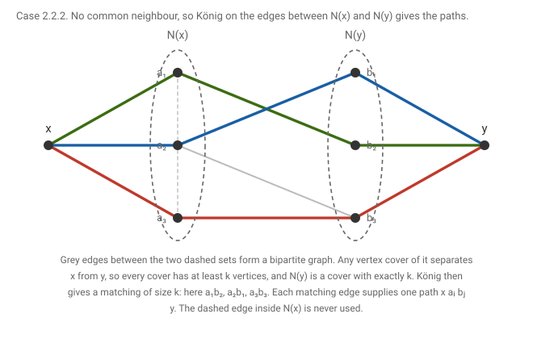
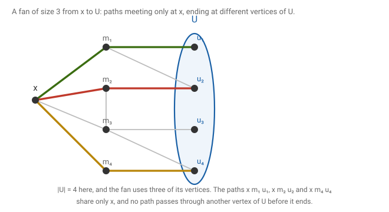
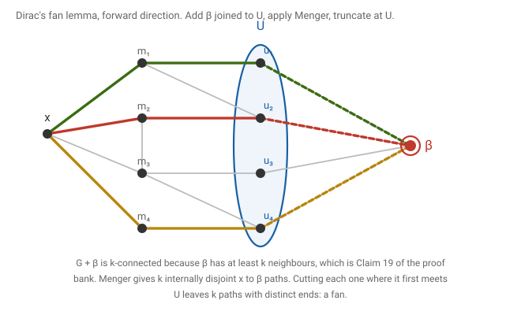
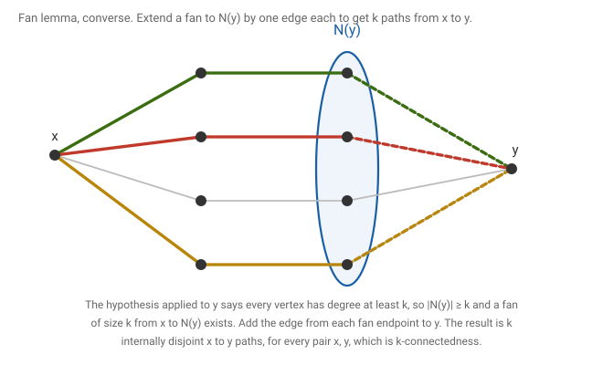
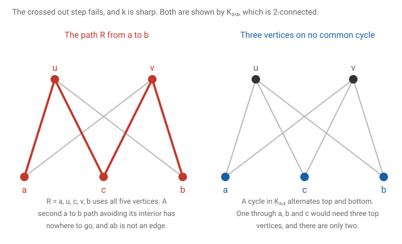
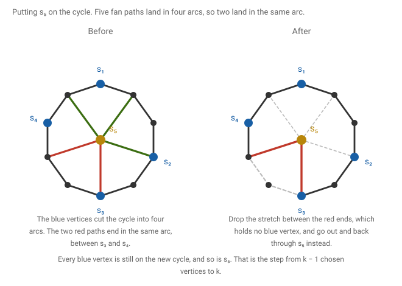

# 12 · 2026-08-31 — Menger's theorem, Dirac's fan lemma, and cycles through k vertices

Previous: [[2026-08-31 Blocks, Ear Decomposition, and k-Connectivity]] · Hub: [[Graph Theory]] · Next: [[2026-10-05 Coloring 1 — Greedy Colouring, Degeneracy, and Lower Bounds]]

This is the continuation of the connectivity unit. The page I uploaded as Connectivity 2 is the same long OneNote page as Connectivity 1, extended to the right, and still headed Monday 31 August. The left half repeats what notes 10 and 11 already cover. Everything on the right of that is new and is written up here: Menger's theorem with a full induction, its global corollary, fans, Dirac's fan lemma in both directions, and the question about a cycle through any k vertices.

## How much this matters

Overall this note is core. Menger is the main theorem of the connectivity unit and everything else in it is a corollary.

Know cold: [[2026-08-31 Menger's Theorem and Dirac's Fan Lemma#The global form of Menger's theorem|the global form of Menger]] and [[2026-08-31 Menger's Theorem and Dirac's Fan Lemma#Fans and Dirac's fan lemma|the fan lemma statement and its easy direction]]. They are short, they are what a question will actually ask you to use, and each one reduces to Menger by adding a single vertex.

Know the idea: [[2026-08-31 Menger's Theorem and Dirac's Fan Lemma#Menger's theorem, the induction|Menger's theorem]]. The idea is to take a minimum separator, cut the graph into the side of x and the side of y, contract each side to one vertex, apply the induction to each smaller graph, and glue. If no separator cuts both sides properly, the graph is so tight that König finishes it. Learn the shape and the two cases, not every sub-case.

Know the argument: [[2026-08-31 Menger's Theorem and Dirac's Fan Lemma#A cycle through any k vertices|a cycle through any k vertices]]. It is a pigeonhole on a fan and it is a good exam question because the first thing everyone tries is false.

Know the statement: [[2026-08-31 Menger's Theorem and Dirac's Fan Lemma#The converse of the fan lemma|the converse of the fan lemma]]. The proof is five lines once you have the corollary, but the page omits a hypothesis it needs.

Read once and move on: the sub-cases 2.1, 2.2.1 and 2.2.2 of Menger. They are bookkeeping around a finish by König, and they are the first thing to drop if time is short.

## Notation

G is a finite simple graph with n vertices. N(v) is the set of neighbours of v. G − S means deleting a vertex set S with its edges, and G − e deletes one edge.

Let x and y be two distinct vertices that are not adjacent. An x,y-separator is a set S of vertices, not containing x or y, such that x and y lie in different components of G − S. I write κ(x,y) for the smallest size of an x,y-separator. My page writes K with subscripts x, y and a G, but I avoid that because K already means a complete graph. If x and y are adjacent no separator exists, so κ(x,y) is only defined for non-adjacent pairs.

Two x to y paths are internally vertex disjoint when they share no vertex other than x and y. Both ends are shared, and that is allowed. I will say disjoint paths for short, and I always mean this.

For a vertex x and a set U of vertices, an (x,U)-fan of size k is a family of k paths, each starting at x and ending in U, which share only the vertex x and whose end vertices are all different. Paths may be a single vertex if x is itself in U.

## What we are proving

Theorem (Menger, 1927, vertex form). Let x and y be non-adjacent vertices of a graph G. Then the smallest size of an x,y-separator equals the largest number of disjoint x to y paths.

Given: G is a graph and x, y are distinct and non-adjacent.
To show: κ(x,y) equals the maximum number of disjoint x to y paths.

The direction that is at most is easy. Any family of disjoint paths needs a separator vertex on each, and the paths share no interior vertex, so a separator has at least as many vertices as there are paths. The content is the other direction: a separator of size k forces k disjoint paths.

## Menger's theorem, the induction

Let k = κ(x,y) and fix a separator S with |S| = k. If k = 0 there is nothing to prove, so assume k ≥ 1. I prove that there are k disjoint x to y paths by strong induction on n, for all graphs and all non-adjacent pairs at once. The smallest instance is a path x z y with one internal vertex, where k = 1 and the single path works, and it is covered by the argument below.

Let A be the vertex set of the component of G − S containing x, and let B be all the other vertices of G − S. So V is the disjoint union of A, S and B, with y in B, and no edge joins A to B because S separates them.

The figure shows the running example for this proof. Here x, a₁, a₂, a₃ lie in A, the three vertices s₁, s₂, s₃ form S, and t₁, t₂, t₃, y lie in B. I keep this graph through all the figures below.

First observation. Every s in S has a neighbour in A and a neighbour in B. Suppose some s had no neighbour in A. Then A is still cut off from the rest in G − (S − s), because the only way out of A was through S and s sends no edge into A. So S − s separates x from y and is smaller than S, contradicting that S is minimum. The same argument works for B.

Now split on whether some minimum separator has both sides of size at least two. The case division on my page is stated differently, in terms of components of x and y, but this version is cleaner and makes the sub-cases shorter.

Case 1. Some minimum separator S has |A| ≥ 2 and |B| ≥ 2. Build two smaller graphs. Gᴮ is obtained from G by contracting all of B to a single new vertex β, so its vertices are A, S and β. By the first observation β is adjacent to every vertex of S, and to nothing in A. Gᴬ is obtained by contracting A to a single vertex α, with vertices α, S and B, and α is adjacent to all of S. Both have fewer vertices than G because |A| ≥ 2 and |B| ≥ 2.

Claim: κ(x,β) in Gᴮ is at least k. Let T be an x,β-separator in Gᴮ, so T is a set of vertices of A and S, not containing x. I claim T is also an x,y-separator in G. Suppose not, and take an x to y path in G − T. Replace every vertex of B on it by β. Consecutive copies of β merge, and we get a walk from x to β in Gᴮ − T, hence a path, contradicting that T separates. So |T| ≥ k. The page makes the same point in purple, saying that a smaller T would be an x,y-separator in G. Since S itself separates x from β in Gᴮ, equality holds and κ(x,β) = k.

By induction Gᴮ has k disjoint x to β paths. The last vertex before β on each path is a neighbour of β, so it lies in S, and since the paths are disjoint and |S| = k, each vertex of S is the last vertex on exactly one path. Name them so that path Pᵢ ends sᵢ, then β. Then no path passes through a vertex of S before its end, because that vertex is already the final vertex of another path. So after cutting off β, each Pᵢ is a path from x to sᵢ whose vertices other than sᵢ all lie in A.

Do the same in Gᴬ to get k disjoint paths from α to the vertices of S, and cut off α. The result is k paths Qᵢ from sᵢ to y whose vertices other than sᵢ all lie in B.

Now glue. Rᵢ is Pᵢ followed by Qᵢ, a path from x to y through sᵢ. The Rᵢ are disjoint because the Pᵢ use only A and S, the Qᵢ only S and B, and each vertex sᵢ belongs to exactly one pair.

Case 2. Every minimum separator has |A| = 1 or |B| = 1. If |A| = 1 then A = {x}, so S is exactly N(x), because each s in S is adjacent to x by the first observation and every neighbour of x lies in S. Likewise |B| = 1 gives S = N(y). So in this case every minimum separator is either N(x) or N(y).

Case 2.1. There is a vertex w, different from x and y, outside N(x) and outside N(y). Then w lies in no minimum separator, since the only minimum separators are N(x) and N(y). I claim κ(x,y) in G − w is still at least k. Suppose T separates x from y in G − w with |T| < k. Then T ∪ {w} separates them in G and has size at most k. It cannot have size less than k, so |T| = k − 1 and T ∪ {w} is a minimum separator containing w, a contradiction. By induction G − w has k disjoint paths, and they are paths of G. My page writes that w is outside N(x) and N(y), and then says that if w lies in a minimum separator R one can apply Case 1 with respect to R. The remark above shows that situation never arises, so no extra step is needed.

Case 2.2. No such w exists, so every vertex of G is x, y, or lies in N(x) ∪ N(y).

Case 2.2.1. N(x) and N(y) share some vertex. Let c be the number of common neighbours, c ≥ 1. Each common neighbour z gives the path x z y, and these c paths are disjoint. Delete the common neighbours to get G′. A separator T′ of x from y in G′ together with the c common neighbours separates them in G, so |T′| ≥ k − c. By induction G′, which has fewer vertices, contains k − c disjoint paths, and they avoid the common neighbours. Together with the c paths x z y this is k paths.

Case 2.2.2. N(x) and N(y) are disjoint. Then every vertex other than x and y is in exactly one of them. Let H be the bipartite graph whose sides are N(x) and N(y) and whose edges are the edges of G between them.

Any vertex cover C of H is an x,y-separator in G. Take an x to y path. Its first vertex after x lies in N(x), and its last vertex before y lies in N(y), and every vertex in between lies in one of the two sets. So somewhere along the path there is a consecutive pair a in N(x), b in N(y). That is an edge of H, and C contains a or b. So every vertex cover of H has at least k vertices, i.e. β(H) ≥ k. On the other side N(x) and N(y) are both separators, so both have at least k vertices, and by the case assumption one of them has exactly k. Either set is a vertex cover of H, since every edge of H touches both sides. So β(H) = k.

By König's theorem, which is in [[2026-07-29 Matchings 2 — Berge and König]], H has a matching of size k, say a₁b₁, …, aₖbₖ. Then x aᵢ bᵢ y for i from 1 to k are k disjoint paths. This is where bipartite matching reappears inside connectivity, and it is the reason König belongs to this course.

Hypotheses used. Induction on n is used in Case 1 on Gᴮ and Gᴬ, in Case 2.1 on G − w, and in Case 2.2.1 on G′. Minimality of S is used in the first observation and in Case 2.1. Non-adjacency of x and y is used to define separators and to make N(x) and N(y) separators.

## The global form of Menger's theorem

Corollary (global Menger). Let G be a graph with at least two vertices and k ≥ 1. Then G is k-connected if and only if every two distinct vertices are joined by k disjoint paths.

Given: G has at least two vertices.
To show: the two conditions are equivalent.

My page labels this statement with Menger's name. It is a corollary, because it needs Menger exactly once, and I give the easy direction first since it needs nothing.

Suppose every pair has k disjoint paths. First n > k. Between two vertices x, y there is at most one path of length one and, apart from that, each path uses a different interior vertex, so there are at most 1 + (n − 2) = n − 1 paths. So n − 1 ≥ k. Next suppose T has fewer than k vertices and G − T is disconnected, and pick x and y in different components. They are not adjacent and not in T. Every one of the k disjoint paths between x and y has an interior vertex in T, since otherwise x and y would be connected in G − T. The interiors are disjoint, so |T| ≥ k, a contradiction. So G is k-connected.

Conversely suppose G is k-connected, so n > k, and take x, y distinct. If they are not adjacent, every x,y-separator is a set whose removal disconnects G, so it has at least k vertices, and Menger gives k disjoint paths. If they are adjacent, let G′ be G − xy. I claim G′ is (k − 1)-connected. Take T with at most k − 2 vertices. Then G − T is 2-connected: it has at least n − k + 2 ≥ 3 vertices, and deleting one more vertex deletes at most k − 1 vertices from G, which leaves it connected. By Whitney, in [[2026-08-31 Connectivity 1 — Minimum Degree and Whitney's Theorem]], every edge of a 2-connected graph lies on a cycle, so xy does, and G − T − xy is still connected. That proves the claim. Now x and y are non-adjacent in G′, and every separator in G′ has at least k − 1 vertices, so Menger gives k − 1 disjoint paths in G′. Add the edge xy as a path with no interior vertex, and this gives k disjoint paths in G.

The page's text skips the adjacent case, which needs this extra step because Menger as stated only covers non-adjacent pairs.

## Fans and Dirac's fan lemma

Theorem (Dirac's fan lemma). Let G be a graph with more than k vertices. Then G is k-connected if and only if for every vertex x and every set U of at least k vertices there is an (x,U)-fan of size k.

Given: G has more than k vertices.
To show: k-connected is equivalent to the fan condition for every x and every U with |U| ≥ k.

The figure shows a fan of size three from x to a set U of four vertices. Three of the four vertices of U are reached, each by its own path, and only x is shared.

For the forward direction suppose G is k-connected. Fix x and U with |U| ≥ k. Add a new vertex β joined to every vertex of U, and call the result G′. By [[2026-08-31 Blocks, Ear Decomposition, and k-Connectivity#Adding a vertex keeps a graph k-connected|adding a vertex joined to at least k old vertices]], G′ is again k-connected. By the global form of Menger there are k disjoint x to β paths in G′. Each one reaches β from a vertex of U. Cut each path at the first vertex that lies in U, and delete the rest. If x lies in U the path that was the single edge xβ becomes the one-vertex path x. The resulting paths share only x, and their end vertices are distinct because the original paths were disjoint. That is an (x,U)-fan of size k.

## The converse of the fan lemma

For the converse suppose that every x and every U with |U| ≥ k has a fan of size k.

First every vertex y has degree at least k. Since n > k, choose a set U of k vertices not containing y, and use the fan from y to U. Its k paths start at y and share only y, so their second vertices are k different neighbours of y.

Now take any two distinct vertices x and y. Let U = N(y), which has at least k vertices. Take an (x,U)-fan of size k. Cut each path at its first vertex in U. A path that went through y would have had to arrive at y from a neighbour of y, so it would already have hit U, which means no path reaches y after the cut. Now add the edge from each endpoint to y. These are k paths from x to y that share only x and y. If x is itself in U, the path consisting of x alone becomes the edge xy, and the argument still holds. By the easy direction of the global form of Menger, G is k-connected.

The page does not state the hypothesis n > k, and the lemma is false without it. The complete graph Kₖ has only k vertices. A set U of at least k vertices must be all of V, and for any x there is a fan from x to all of V by the star of edges plus the trivial path, so the fan condition holds. But Kₖ is not k-connected, because by definition k-connected needs more than k vertices. This is the same size clause as in [[2026-08-31 Connectivity 1 — Minimum Degree and Whitney's Theorem#What k-connected means|the definition]].

## A cycle through any k vertices

The question on my page is the following.

Theorem. Let G be a k-connected graph with k ≥ 2, and let S be a set of at most k vertices. Then G has a cycle containing every vertex of S.

Given: G is k-connected, k ≥ 2, and |S| ≤ k.
To show: some cycle of G passes through all vertices of S.

My page has two attempts. The first, which is crossed out, takes a cycle built from a path R that joins two of the chosen vertices a and b and says that since G is k-connected there is another a to b path T internally disjoint from R. I wrote Not true next to it, and I agree, for a reason worth keeping in mind. In K₂,₃, which is 2-connected, take two vertices a and b from the three on the larger side. Then R = a, u, c, v, b uses every vertex except the two ends, so no second a to b path can avoid R, and ab is not an edge. A computer check shows the same failure in the Petersen graph, which is 3-connected: for every non-adjacent pair of vertices there is an a to b path with no second path disjoint from it. So connectivity guarantees that some good pair of paths exists but never that an arbitrary path can be completed.

The correct attempt is the induction I now describe, and the key tool is the fan lemma.

Induction on m = |S|. If m ≤ 2 the result is Whitney, since G is 2-connected: any two vertices lie on a common cycle, namely two disjoint paths between them, and a single vertex lies on a cycle too. For the empty set any cycle will do.

Now let 3 ≤ m ≤ k, write S = S′ ∪ {s} with |S′| = m − 1, and suppose there is a cycle C through all of S′. If s lies on C, we are finished. Otherwise s is not on C. Note that G is also m-connected, because m ≤ k, so the fan lemma applies with m in place of k.

Case 1. C has at least m vertices. By the fan lemma there is a fan of size m from s to V(C). Cut each path at its first vertex of C, so that the paths meet C only at their ends. Their m endpoints u₁, …, uₘ are distinct vertices of C. The m − 1 vertices of S′ cut C into m − 1 arcs. Orient C and let the arc of sⱼ consist of sⱼ itself and the vertices after it, up to but not including the next vertex of S′. The arcs partition V(C). Since m endpoints are placed in m − 1 arcs, two endpoints u and w lie in the same arc, say u comes first. The stretch of C strictly between u and w contains no vertex of S′, because the only vertex of S′ in the arc is its first one, and that is u or lies before it. Delete that stretch and replace it by u, the fan path to s, then s, then the fan path from s to w, then w. Since the fan paths meet C only at their ends and meet each other only at s, the result is a cycle. It still contains u and w and every vertex of S′, and it contains s.

Case 2. C has fewer than m vertices. Then C has exactly m − 1 vertices, because it contains all of S′, so V(C) = S′. Take a fan of size m − 1 from s to V(C), using the fan lemma with m − 1. Its paths end at all the vertices of C. Take two endpoints u and w that are consecutive on C. Replace the edge uw by u, the fan path to s, s, the fan path to w, w. This is a cycle containing all of S′ and s.

In both cases the new cycle contains S′ and s, so it contains S, and the induction is complete. The page draws the fan as one of size k − 1 in one picture and size k in the ticked one. The argument needs size m, the number of vertices of S′ plus one, because the pigeonhole needs one more path than arcs, and that is the reason the first picture could not close.

The bound k is sharp. Take the complete bipartite graph Kₖ,ₖ₊₁ with k ≥ 2. It is k-connected, since deleting fewer than k vertices leaves both sides nonempty and every vertex on one side is adjacent to every vertex on the other. A cycle alternates between the two sides, so a cycle through all k + 1 vertices of the larger side would need at least k + 1 vertices from the smaller side, and there are only k. So these k + 1 vertices lie on no common cycle.

## What to remember

Menger says that the size of a smallest x,y-separator equals the number of disjoint x to y paths, for non-adjacent x and y. The easy half is that each path needs its own separator vertex. The hard half is an induction on n: take a minimum separator S, let A be the side of x and B the rest, check that every s in S has neighbours on both sides, contract B to β and A to α, and the induction gives k paths from x to S through A and k paths from S to y through B, which glue. If no minimum separator has two proper sides, every minimum separator is N(x) or N(y), and either some vertex lies outside the two neighbourhoods and can be deleted, or the whole graph is x, y and their neighbours and König finishes it. The global form says k-connected is the same as k disjoint paths between every pair, and the adjacent pair needs the trick of deleting the edge and using (k − 1)-connectivity. Fans are one vertex to a set, and the fan lemma is Menger after adding a vertex joined to the set. The converse needs more than k vertices. The cycle through k vertices is an induction using a fan of the right size and a pigeonhole on arcs, and it is sharp for Kₖ,ₖ₊₁.

## Still unclear

- The page is headed Monday 31 August, like Connectivity 1, but the Menger material is certainly a later class, and I do not know its true date. I have kept 2026-08-31 as the page date and assigned class 8. Please confirm the real date.
- The base case on my page says x z y with a separator of size one, and then states the induction hypothesis for n at most l. That is fine but the induction is cleaner if the hypothesis covers all graphs with fewer vertices, which is what I have used.
- In Case 2.1 the page says w is not in N(x) and not in N(y) and then handles the case that w is in a minimum separator R. That case cannot occur, as shown above, and the extra step is harmless but unnecessary.
- The corollary on the page is labelled Menger's theorem and says for all x, y there exist k disjoint paths. For adjacent x and y the theorem as stated does not apply, and the step that deletes the edge xy is needed.
- The fan lemma converse needs more than k vertices. Kₖ is a counterexample otherwise.
- The crossed out claim that there is another path T disjoint from R is false. K₂,₃ is a counterexample.
- The fan in my picture for the cycle question is drawn with size k − 1 in one version and k in the other. The induction needs size m, the size of S′ plus one.
