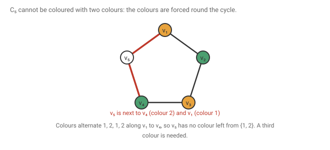
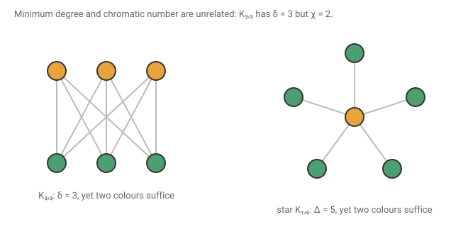
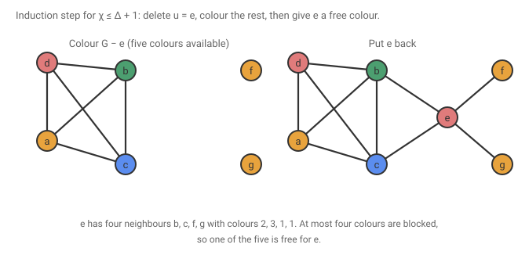
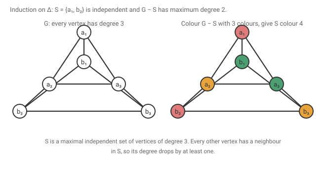
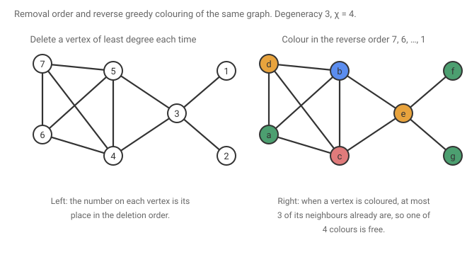
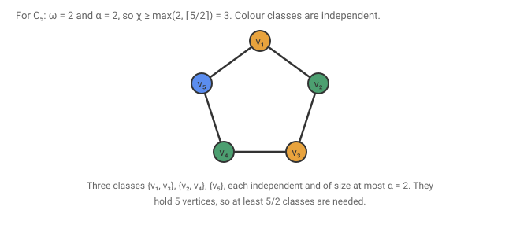

# 13 · 2026-10-05 — Coloring 1, greedy colouring, degeneracy, and lower bounds

Previous: [[2026-08-31 Menger's Theorem and Dirac's Fan Lemma]] · Hub: [[Graph Theory]] · Next: none yet, this is the latest note

First class on vertex colouring. The page is headed Monday 5 October. It defines proper colourings and the chromatic number, computes χ for the standard families, proves χ ≤ Δ + 1 twice, introduces degenerate graphs and proves χ ≤ k + 1 for k-degenerate graphs, and ends with the two lower bounds from cliques and independent sets.

## How much this matters

Overall this note is core. Colouring is a named syllabus unit, and this class is the toolkit that planar colouring and Brooks will use.

Know cold: [[2026-10-05 Coloring 1 — Greedy Colouring, Degeneracy, and Lower Bounds#Degenerate graphs and the bound k + 1|the bound χ ≤ k + 1 for k-degenerate graphs]], and [[2026-10-05 Coloring 1 — Greedy Colouring, Degeneracy, and Lower Bounds#The first proof of Δ + 1|the first proof of χ ≤ Δ + 1]]. Both are the same three line argument, delete a vertex, colour the rest, take a free colour, and this one move is the answer to most colouring questions. Also [[2026-10-05 Coloring 1 — Greedy Colouring, Degeneracy, and Lower Bounds#The odd cycle|the odd cycle]], which is the standard example of a graph that needs one more colour than its structure suggests.

Know the idea: [[2026-10-05 Coloring 1 — Greedy Colouring, Degeneracy, and Lower Bounds#The second proof of Δ + 1|the second proof by induction on Δ]]. The idea is to remove a maximal independent set of maximum degree vertices, which lowers the maximum degree, and spend one new colour on it. It is the seed of Brooks, so learn the idea rather than the wording.

Know the statement: [[2026-10-05 Coloring 1 — Greedy Colouring, Degeneracy, and Lower Bounds#Two lower bounds|the lower bounds ω and n over α]], together with the fact that χ can be far above both. Also that Kᵣ,ᵣ has degeneracy r but χ = 2.

Read once and move on: [[2026-10-05 Coloring 1 — Greedy Colouring, Degeneracy, and Lower Bounds#Which graphs are 2-degenerate|the 2-degenerate examples]] and [[2026-10-05 Coloring 1 — Greedy Colouring, Degeneracy, and Lower Bounds#Wheels|the wheels]]. They are practice with the definitions and not a theorem you will be asked to reproduce.

## Notation

G is a finite simple graph with n vertices. Δ(G) is its maximum degree and δ(G) its minimum degree. N(v) is the set of neighbours of v, and deg(v) their number. G − S deletes a vertex set S and every edge touching it.

A colouring of G with k colours is a function c from V(G) to {1, …, k}. It is proper if c(u) ≠ c(v) whenever uv is an edge. Colourings in this note are always proper. The chromatic number χ(G) is the smallest k for which a proper colouring with k colours exists.

An independent set is a set of vertices no two of which are adjacent. α(G) is the size of the largest independent set, following West. A clique is a set of vertices any two of which are adjacent, and ω(G) is the size of the largest clique. Pₙ is the path on n vertices, Cₙ the cycle on n vertices, Kₙ the complete graph, and Kᵣ,ᵣ the complete bipartite graph with r vertices on each side. Wₘ is the wheel on m vertices in all: a hub adjacent to every vertex of a cycle on m − 1 vertices.

To prove χ(G) ≤ k you give one proper colouring with k colours. To prove χ(G) ≥ k you must show that no proper colouring with k − 1 colours exists, and that is usually the harder half. Everything below is organised by which half it is.

## What we are proving

Theorem. For every graph G, χ(G) ≤ Δ(G) + 1. More generally, if every subgraph of G has a vertex of degree at most k, then χ(G) ≤ k + 1.

Given: the degree condition.
To show: a proper colouring with one more colour than the degree bound.

Alongside, two lower bounds: χ(G) ≥ ω(G) and χ(G) ≥ n divided by α(G).

## First examples

The path Pₙ has χ = 2 for n ≥ 2. Colour the vertices alternately 1, 2, 1, 2, and two colours are needed because the graph has an edge.

The even cycle C₂ₙ has χ = 2 by the same alternating colouring, which closes up because the cycle has an even number of vertices.

The complete graph Kₙ has χ = n, because every two vertices are adjacent, so all n colours must be different.

A tree T with at least one edge has χ = 2. Pick a root r and colour each vertex by the parity of its distance from r. Adjacent vertices are at distances differing by exactly one, since a tree has no cycles that could give a shortcut, so their colours differ.

The general bounds are 1 ≤ χ(G) ≤ n. The lower bound is attained by a graph with no edges, the upper by Kₙ, so neither can be improved without more information.

A colouring only looks at edges, so if G has components G₁, …, Gᵣ then χ(G) is the largest of the χ(Gᵢ). The page uses this to say we may assume G is connected.

## The odd cycle

Claim. χ(C₂ₙ₊₁) = 3.

Given: a cycle on 2n + 1 vertices v₁, …, v₂ₙ₊₁ in order, with n ≥ 1.
To show: three colours suffice and two do not.

Suppose a proper colouring uses only the colours 1 and 2. Say c(v₁) = 1. Then c(v₂) = 2 since v₂ is adjacent to v₁. Then c(v₃) = 1 since it is adjacent to v₂ and only two colours are allowed. Continuing, the colours are forced to alternate, and c(vⱼ) = 1 exactly when j is odd. In particular c(v₂ₙ₊₁) = 1, because 2n + 1 is odd. But v₂ₙ₊₁ is adjacent to v₁, which also has colour 1, a contradiction. So χ ≥ 3. For three colours, colour v₁, …, v₂ₙ alternately 1, 2 and give v₂ₙ₊₁ the colour 3.

The parity of the cycle is used exactly once, to conclude that the forced alternation puts the same colour on the two ends.

## Wheels

Claim. Wₘ has χ = 4 when m is even and χ = 3 when m is odd.

The page writes W₂ₙ and W₂ₙ₊₁. Its figure shows a hub and six rim vertices, seven vertices in all, which fits the convention that the subscript counts all vertices, and that is the convention I use. Let h be the hub and R the rim cycle, which has m − 1 vertices. The hub is adjacent to every rim vertex, so its colour appears nowhere on the rim. So any proper colouring of Wₘ is a proper colouring of R with the hub's colour left out, plus the hub, and χ(Wₘ) = 1 + χ(R). If m is odd then R is an even cycle with χ = 2, so χ = 3. If m is even then R is an odd cycle with χ = 3, so χ = 4.

## Minimum degree does not bound χ from below

My page asks whether χ(G) ≥ δ(G). The answer is no. Take Kᵣ,ᵣ, which has δ = r. Colour one side 1 and the other side 2, which is proper because there are no edges inside a side. So χ = 2 while δ = r can be as large as we like.

The star K₁,ₙ shows the upper bound is also far from tight in places. It has Δ = n but χ = 2.

## The first proof of Δ + 1

Theorem. χ(G) ≤ Δ(G) + 1.

Given: a graph G with maximum degree Δ.
To show: a proper colouring with Δ + 1 colours.

By induction on the number n of vertices. For n = 1 there is a single vertex and one colour is enough, and Δ + 1 ≥ 1.

Let n ≥ 2 and choose any vertex u. Let H = G − u. The maximum degree of H is at most Δ, because deleting a vertex never raises a degree, so by induction H has a proper colouring with Δ + 1 colours, even if the maximum degree of H is lower. Now put u back. It has at most Δ neighbours in G, so the neighbours of u use at most Δ of the Δ + 1 colours. Pick a colour not used on any neighbour and give it to u. No edge at u is monochromatic, so this is a proper colouring of G.

The figure is the running example for the rest of the note: a complete graph K₄ on a, b, c, d, a vertex e joined to b and c, and two pendant vertices f and g joined to e. Its maximum degree is 4, reached at b, c and e. After deleting e the rest is coloured, and e sees only the colours 2, 3 and 1.

Are there graphs that need all Δ + 1 colours? Yes. Kₙ has Δ = n − 1 and χ = n, and odd cycles have Δ = 2 and χ = 3. Brooks' theorem, which is on the syllabus and not yet in these notes, says these are the only connected examples. I do not prove it here.

## The second proof of Δ + 1

The page gives a second proof, by induction on Δ. It matters because the idea, remove a large set that is cheap to colour and lower the maximum degree, is the start of Brooks' theorem.

Theorem. χ(G) ≤ Δ(G) + 1, by induction on Δ.

Given: a graph G with maximum degree Δ.
To show: a proper colouring with Δ + 1 colours.

If Δ = 0 there are no edges and one colour is enough. Let Δ ≥ 1 and assume the result for all graphs of maximum degree less than Δ.

Let R be the set of vertices of degree exactly Δ. Let S be a maximal independent subset of R, meaning an independent set of vertices of R to which no further vertex of R can be added. Such a set exists, for instance by adding vertices of R one at a time while keeping the set independent.

Claim. Every vertex of G − S has degree at most Δ − 1 in G − S.

A vertex x outside S has degree at most Δ in G. If x is not in R its degree is already at most Δ − 1. If x is in R but not in S, then S ∪ {x} is not independent, since S is maximal, so x has a neighbour in S. Deleting S therefore takes at least one neighbour of x away, and its degree drops to at most Δ − 1.

By the induction hypothesis G − S has a proper colouring with Δ colours. Give every vertex of S the new colour Δ + 1. Since S is independent this causes no clash, and no edge between S and G − S is monochromatic since the colours differ. So χ(G) ≤ Δ + 1.

My page builds such a set by an algorithm instead of by taking a maximal independent set. Repeatedly delete a vertex of degree Δ from the current graph, calling the deleted vertices u₁, u₂, …, uₜ, until no vertex of degree Δ remains. Then S = {u₁, …, uₜ} is independent. If i < j and uᵢ were adjacent to uⱼ, then uⱼ would have lost the neighbour uᵢ before it was deleted, so its degree in the current graph would be below Δ, contradicting that it was chosen for having degree Δ. And G − S has no vertex of degree Δ, by the stopping rule. That produces the same kind of set. The first sketch on the page, which tries to take a minimal S and remove a vertex of it, trails off before reaching a conclusion, and the version above is what the argument needs.

The figure shows the triangular prism, where every vertex has degree three. Take S = {a₁, b₂}. These two are not adjacent, and every other vertex is adjacent to one of them, so G − S has maximum degree two. It is the path a₂, a₃, b₃, b₁, coloured with two colours, and S is given colour 4.

## Degenerate graphs and the bound k + 1

A graph G is k-degenerate if every non-empty subgraph H of G has a vertex of degree at most k in H. The degeneracy of G is the smallest such k, and it equals the largest value of δ(H) over all subgraphs H of G.

Observations. A k-degenerate graph has δ(G) ≤ k, by taking H = G. Every graph is Δ-degenerate, since every vertex of every subgraph has degree at most Δ. A subgraph of a k-degenerate graph is k-degenerate, because its subgraphs are subgraphs of G.

Theorem. If G is k-degenerate then χ(G) ≤ k + 1.

Given: G is k-degenerate.
To show: a proper colouring with k + 1 colours.

By induction on n. For n = 1 there is one vertex. Let n ≥ 2. Applying the definition to the subgraph G itself gives a vertex u of degree at most k. Let H = G − u. It is k-degenerate, so by induction it has a proper colouring with k + 1 colours. Put u back. It has at most k neighbours, so at most k colours are blocked, and there is a free colour for u. This is the same step as in the first proof of Δ + 1, and indeed that theorem is the special case k = Δ.

The figure shows the algorithm behind the proof on the running graph. Delete a vertex of least degree each time. The degrees at deletion, in the order f, g, e, c, b, a, d, are 1, 1, 2, 3, 2, 1, 0. The largest of them is 3, which is the degeneracy. Then colour in reverse order, so d, a, b, c, e, g, f get colours 1, 2, 3, 4, 1, 2, 2. At each step the vertex being coloured has at most three neighbours already coloured, namely those removed after it, so a free colour among four exists. Here the graph contains K₄, so ω = 4 and χ = 4 and the bound is tight.

## Which graphs are 2-degenerate

Forests are 1-degenerate. Every subgraph of a forest is a forest, and every forest with at least one vertex has a vertex of degree at most one, an endpoint of a longest path. C₄ is 2-degenerate, since every subgraph of a cycle is a path or the cycle itself and each has a vertex of degree at most two.

The degeneracy can be much larger than ω − 1, and there is no function of ω that bounds it. The clique bound is the easy direction: a subgraph that is a clique of size ω has minimum degree ω − 1, so the degeneracy k is at least ω − 1. But Kᵣ,ᵣ has ω = 2 and degeneracy r, since the whole graph is a subgraph with minimum degree r. So the degeneracy cannot be bounded by any function of ω.

Claim. A graph with no even cycle is 2-degenerate.

Take a subgraph H, which also has no even cycle. Suppose δ(H) ≥ 3. Take a longest path v₀, v₁, …, vₘ in H. All neighbours of v₀ lie on this path, otherwise the path could be extended. It has at least three, so there are neighbours v₁, vᵢ, vⱼ with 1 < i < j. The three cycles v₀, v₁, …, vᵢ, v₀ and v₀, v₁, …, vⱼ, v₀ and v₀, vᵢ, vᵢ₊₁, …, vⱼ, v₀ have lengths i + 1, j + 1 and j − i + 2. These three numbers add up to 2j + 4, which is even, and three odd numbers cannot have an even sum, so one of the cycles is even. This contradicts the assumption, so δ(H) ≤ 2.

Claim. A minimally 2-connected graph is 2-degenerate. This means G is 2-connected but G − e is not 2-connected for every edge e.

First a lemma: no cycle of G has a chord, where a chord is an edge joining two non-consecutive vertices of the cycle. Suppose cycle C has the chord e = pq. I claim G − e is still 2-connected, contradicting minimality. Let w be any vertex. If w is p or q then G − e − w equals G − w, which is connected. Otherwise, the chord splits C into two p to q paths with no common interior vertex, each of length at least two, so w is an interior vertex of at most one of them. The other survives in G − w − e, so p and q are still connected there, and since G − w is connected, deleting the edge e from it cannot disconnect it. So G − e is 2-connected.

Now let H be a subgraph of G with δ(H) ≥ 3. As before take a longest path in H with end v₀ and neighbours v₁, vᵢ, vⱼ where 1 < i < j. The cycle v₀, v₁, …, vⱼ, v₀ has the edge v₀vᵢ as a chord, since vᵢ is neither v₁ nor vⱼ. This is a chord in G as well, contradicting the lemma. So every subgraph has a vertex of degree at most two.

These two are practice with the definition. I verified both on all small random graphs by computer, and found no counterexample.

## Two lower bounds

Theorem. χ(G) ≥ ω(G), and χ(G) ≥ n divided by α(G).

Given: any graph G.
To show: both inequalities.

For the first, all vertices of a clique are pairwise adjacent, so they receive different colours, and ω colours are needed at least.

For the second, let χ(G) = k and let C₁, …, Cₖ be the colour classes, Cᵢ being the set of vertices coloured i. Each class is an independent set, since vertices of one class are not adjacent. The classes partition V(G): every vertex has exactly one colour. My page first wrote that they cover V(G) and then crossed out cover and wrote partition. The correction matters, because it is what lets us add the sizes. Each class has |Cᵢ| ≤ α(G), so n = |C₁| + … + |Cₖ| ≤ kα(G), and hence k ≥ n/α(G). Since k is a whole number, χ(G) ≥ the smallest integer at least n/α(G).

For the cycle C₅ the figure shows ω = 2 and α = 2, so the best bound is the larger of 2 and the smallest integer at least 5/2, which is 3. That equals χ(C₅) = 3, so for this graph the bounds are tight although ω alone is not.

## What to remember

A colouring is proper if edges are never monochromatic. To show χ ≤ k give a colouring, and to show χ ≥ k show nothing smaller works. The basic values are χ(Pₙ) = 2, χ(C₂ₙ) = 2, χ(C₂ₙ₊₁) = 3, χ(Kₙ) = n and χ(T) = 2. The general bounds 1 ≤ χ ≤ n are tight at empty graphs and Kₙ. The one move behind all upper bounds is: delete a vertex of small degree, colour the rest by induction, and take a free colour. This gives χ ≤ Δ + 1, and more generally χ ≤ k + 1 for a k-degenerate graph, where k-degenerate means every subgraph has a vertex of degree at most k. The degeneracy is found by repeatedly deleting a least degree vertex, and the reverse order is a greedy colouring that uses at most degeneracy plus one colours. The second proof of Δ + 1 removes a maximal independent set of maximum degree vertices, which lowers Δ by at least one, and spends one new colour on it. Lower bounds are χ ≥ ω from cliques and χ ≥ n over α from the fact that colour classes are independent sets that partition the vertices. Minimum degree gives no lower bound, Kᵣ,ᵣ has δ = r and χ = 2, and the degeneracy is not bounded by any function of ω.

## Still unclear

- The page header says Monday 5 October. I have used 2026-10-05 and class 9.
- The wheel convention. The page writes W₂ₙ with χ = 4 and W₂ₙ₊₁ with χ = 3, which is correct when the subscript counts all vertices, hub included. A reader who counts only rim vertices would get the parities reversed. I have stated the convention in the notation.
- The first sketch of the second proof, where S is taken minimal and a vertex is removed from it with the remark S′ ⊆ S, trails off. The version above uses a maximal independent subset of the degree Δ vertices, and the algorithm on the page also works.
- The red box next to the 7 vertex example gives a formula about the maximum of the minimum degrees over subgraphs, and an annotation reading k = |C|. I could not decode the second part and have left it out.
- The page states that the Δ-degenerate and ω − 1 observations hold, but does not prove that a graph with no even cycles is 2-degenerate or that a minimally 2-connected graph is 2-degenerate. I added both proofs. The second uses the chord lemma, which the page does not mention.
- The page lists the question of whether any graph needs Δ + 1 colours. The answer given here is Kₙ and odd cycles, and Brooks' theorem says there are no others among connected graphs. That theorem is still to come.
