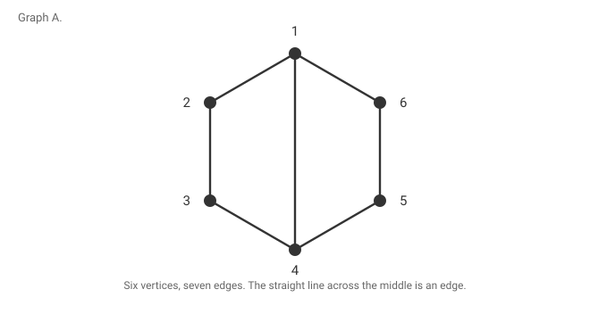
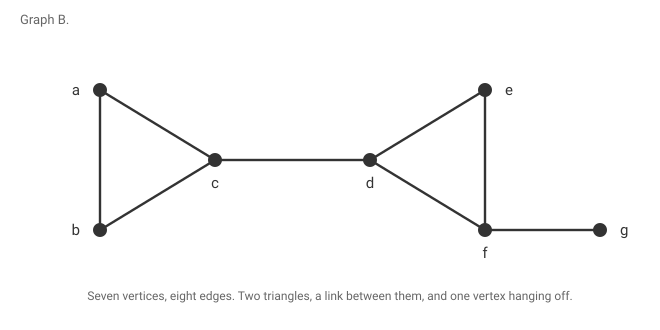
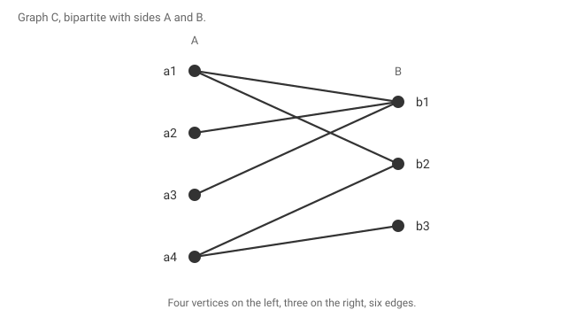
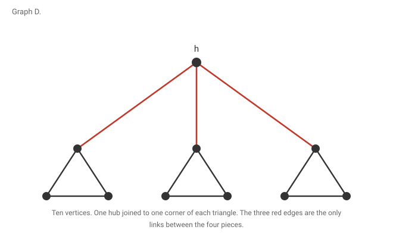

# Short questions, the ones that are not proofs

Hub: [[Graph Theory]] · Proofs: [[15 High-Yield Proofs]] · Statements: [[Takeaways]] · Ranking: [[Bare Minimum]]

The proof bank covers the long questions. This file covers everything else a paper asks: reading a drawn graph, deciding whether a statement is true, producing a counterexample, and plugging numbers into a formula. None of these needs a proof written out, and all of them are quick marks.

How to use it. Cover the answer column, work down, and write your answer before looking. A short question you get wrong is worth more attention than a proof you half remember, because it takes two minutes to fix.

Every number below was checked by computer, so if you disagree with an answer, work it again before assuming the file is wrong.

---

## Part one, read the diagram

### Graph A

The vertices are 1 to 6 around the hexagon, with the extra edge 1 to 4 across the middle.

| Ask | Answer |
|---|---|
| n and m | n = 6, m = 7. |
| δ and Δ | δ = 2, Δ = 3. Only 1 and 4 have degree 3. |
| Girth | 4. The chord makes two four cycles, 1 2 3 4 and 1 6 5 4. |
| Is it bipartite | Yes, with sides {1, 3, 5} and {2, 4, 6}. Check the chord: 1 is odd and 4 is even, so it crosses. |
| α, the independence number | 3, for example {1, 3, 5}. |
| β, the vertex cover number | 3, for example {1, 3, 5} again. In a bipartite graph a side can be both. |
| α′, the matching number | 3, for example {12, 34, 56}. |
| β′, the edge cover number | 3, since α′ + β′ = n. |
| Does Gallai check out | α + β = 3 + 3 = 6 = n, and α′ + β′ = 3 + 3 = 6 = n. |
| Does König check out | It is bipartite, and α′ = β = 3. |
| Perfect matching | Yes, {12, 34, 56} covers all six vertices. |
| κ and λ | Both 2. Delete 1 and 4 and it falls apart into {2, 3} and {5, 6}. |
| Cut vertices and bridges | None of either. |
| How many blocks | One, the whole graph, since it is 2-connected. |

### Graph B

Two triangles abc and def, the edge cd joining them, and g hanging off f.

| Ask | Answer |
|---|---|
| n and m | n = 7, m = 8. |
| δ and Δ | δ = 1 at g, Δ = 3. |
| Girth | 3, from either triangle. |
| Is it bipartite | No. A triangle is an odd cycle. |
| α′, the matching number | 3, for example {ab, cd, fg}. |
| Perfect matching | No, and you do not need to look. n = 7 is odd. |
| β, the vertex cover number | 4, for example {a, c, d, f}. |
| Does König apply | No, it is not bipartite. Here α′ = 3 and β = 4, so they differ. |
| κ and λ | Both 1. |
| Cut vertices | c, d and f. |
| Bridges | cd and fg. |
| How many blocks | Four: the triangle abc, the single edge cd, the triangle def, and the single edge fg. |
| Is the block graph a tree | Yes, always. Here it is a path. |
| Why are cd and fg blocks | A block is a maximal connected subgraph with no cut vertex, and a bridge qualifies. It is not a maximal 2-connected subgraph, which is the usual misreading. |

### Graph C

Bipartite, with A on the left and B on the right.

| Ask | Answer |
|---|---|
| n and m | n = 7, m = 6. |
| Is there a matching saturating A | No. α′ = 3 and ∣A∣ = 4. |
| Name a starved set | {a₂, a₃} has N(S) = {b₁}, so ∣N(S)∣ = 1 < 2. One violating set is all you need to kill Hall. |
| A bigger starved set | {a₁, a₂, a₃} has N(S) = {b₁, b₂}, so 2 < 3. |
| α′, the matching number | 3, for example {a₁b₂, a₃b₁, a₄b₃}. |
| β, the vertex cover number | 3, for example {b₁, b₂, b₃}. |
| Does König check out | Yes, α′ = β = 3. |
| What does defect Hall give | The largest deficiency ∣S∣ − ∣N(S)∣ is 1, so there is a matching of size ∣A∣ − 1 = 3, which is what we found. |
| Why does Hall fail here in one word | Crowding. Three vertices of A are fighting over two vertices of B. |

### Graph D

A hub h joined to one corner of each of three triangles.

| Ask | Answer |
|---|---|
| n and m | n = 10, m = 12. |
| Perfect matching | No, even though n is even. |
| Give a Tutte bad set | S = {h}. Then G − S is three triangles, so odd(G − S) = 3, and 3 > 1 = ∣S∣. |
| Why does that kill it | Each odd component has a leftover vertex that must pair into S, and S has only one vertex to offer. |
| α′, the matching number | 4. |
| Cut vertices | h and the three corners joined to it. |
| Bridges | The three edges from h. |
| How many blocks | Six: the three triangles and the three bridges. |
| Does Hall say anything here | No. Hall is a bipartite statement and this graph has triangles. What matters here is parity, not neighbourhood size. |

---

## Part two, true or false

Say which, and give the reason or the counterexample in one line. That second half is where the marks are.

| Claim | True or false, and why |
|---|---|
| Every maximal matching is maximum. | False. In the path a b c d the single edge bc is maximal, but {ab, cd} is bigger. |
| Every maximum matching is maximal. | True. Nothing bigger exists, so certainly nothing can be added. |
| Any two longest paths share a vertex. | True in a connected graph, and that is question 12. |
| Any two longest paths have the same length. | True, by the meaning of longest. |
| Every induced path is a shortest path between its ends. | False. In C₅ the long arc between two vertices at distance 2 has length 3 and carries no chord. |
| Every shortest path is induced. | True, and that is question 11. |
| κ ≤ λ ≤ δ. | True, always. |
| κ = λ. | False. Two triangles sharing one vertex has κ = 1 and λ = 2. |
| A block is a maximal 2-connected subgraph. | False. A bridge is a block and is not 2-connected. |
| The block graph of a connected graph is a tree. | True. |
| If every degree is even then an Euler circuit exists. | False. Two disjoint triangles have all degrees 2 and no Euler circuit, since the edges lie in two components. |
| A graph with a perfect matching has an even number of vertices. | True, and it is the first thing to check. |
| Hall's condition decides perfect matchings in every graph. | False. It is bipartite only. A hub joined to three triangles satisfies nothing useful about neighbourhoods and still fails on parity. |
| Every bipartite graph has a vertex lying in every maximum matching. | True when it has at least one edge, and that is question 23. |
| Every graph with an edge has such a vertex. | False. C₅ has five maximum matchings and no vertex is in all of them. |
| Subdividing an edge can destroy 2-connectedness. | False. Subdivision never changes it, and that is question 20. |
| Adding a vertex joined to k vertices of a k-connected graph keeps it k-connected. | True, and that is question 19. |
| Every 3-regular graph has a perfect matching. | False. It needs bridgeless. Petersen's theorem is exactly that hypothesis. |
| Kₙ is n-connected. | False. It is (n−1)-connected, because k-connected also demands more than k vertices. |
| Every tree is bipartite. | True. Colour by the parity of the distance from a root. |
| A connected graph on n vertices with n − 1 edges is a tree. | True. |
| α′ = β in every graph. | False. The triangle has α′ = 1 and β = 2. That is the tight end of the sandwich α′ ≤ β ≤ 2α′. |
| Q₄ is planar. | False. It is bipartite with m = 32 and 2n − 4 = 28. |
| A cycle is always a maximal trail. | False. Edges can still hang off it, and then the trail extends. |
| δ ≥ 3 forces an even cycle. | True, and that is question 2. |
| Two l-connected graphs sharing a vertex union to an l-connected graph. | False for l ≥ 2. Two triangles glued at a vertex give a cut vertex. They must share at least l vertices. |
| An open ear decomposition exists for every connected graph. | False. It characterises 2-connected graphs on at least three vertices. |

---

## Part three, give a counterexample

Examiners like asking why a hypothesis is needed, and the answer is always the smallest graph where dropping it breaks things. Learn the witness, not the sentence.

| Drop this hypothesis | Smallest witness |
|---|---|
| Euler needs at most one non-trivial component | Two disjoint triangles. Every degree is even and there is no Euler circuit. |
| König needs bipartite | The triangle. α′ = 1 and β = 2. |
| Hall needs bipartite, for perfect matchings | A hub joined to three triangles. Neighbourhood sizes look fine and parity kills it. |
| Petersen needs bridgeless | A hub joined by three bridges to three odd blobs, arranged so every degree is 3. Sixteen vertices, cubic, even order, no perfect matching. |
| The universal vertex theorem needs no odd cycle | C₅. Five maximum matchings, no vertex in all of them. |
| Whitney needs at least three vertices | K₂. Two vertices joined by an edge, and the statement stops making sense. |
| k-connected needs more than k vertices | Kₙ. Without that clause you could call it n-connected, and then nothing separates it because nothing is left. |
| Ear decomposition needs the ears open | A closed ear hangs on a single vertex, so deleting that vertex strands the whole ear and the graph was never 2-connected. |
| Union of l-connected graphs needs l shared vertices | Two triangles glued at one vertex. Each is 2-connected and the union has a cut vertex. |
| Connectedness from δ ≥ (n−1)/2 is sharp | Two disjoint complete graphs on n/2 vertices each. Every degree is (n−2)/2, one notch below, and it is disconnected. |
| Connectedness from many edges is sharp | Kₙ₋₁ plus an isolated vertex has exactly (n−1)(n−2)/2 edges and is disconnected. |
| The quiz question about β vertices needs bipartite | C₅ again. β = 3 and not one vertex lies in every maximum matching. |

---

## Part four, compute and state

| Ask | Answer |
|---|---|
| Edges of Qₙ | n·2ⁿ⁻¹. For Q₄ that is 32, on 16 vertices. |
| Girth and diameter of Qₙ | Girth 4 for n ≥ 2, diameter n. |
| Is Q₄ planar | No. Bipartite planar needs m ≤ 2n − 4, and 32 > 28. |
| Is K₅ planar | No. Simple planar needs m ≤ 3n − 6, and 10 > 9. |
| Is K₃,₃ planar | No. Use the bipartite bound: m = 9 and 2n − 4 = 8. The general bound gives 9 ≤ 12 and says nothing, which is the trap. |
| α′(C₇) | 3, which is ⌊7/2⌋. |
| α(C₇) and β(C₇) | 3 and 4. They add to 7. |
| α′ of any path or cycle on n vertices | ⌊n/2⌋. |
| α′ of the star on n vertices | 1. Every edge meets the centre. |
| α′ of K(k,l) | min(k, l). |
| Petersen: n, m, girth, κ, λ, δ | 10, 15, 5, and κ = λ = δ = 3. |
| Petersen: α, β, α′ | 4, 6 and 5. It has a perfect matching. |
| Does a graph with degrees 3, 3, 3, 3, 3, 1 exist | Yes. The sum is 16, which is even, and the sequence is graphical. Even degrees summing correctly is necessary, not sufficient, so say which test you used. |
| Does a graph with degrees 3, 3, 3, 3, 3 exist | No. The sum is 15, which is odd, so the handshake lemma forbids it. |
| A tree on 10 vertices | 9 edges, at least 2 leaves, 1-degenerate, bipartite. |
| A forest on 10 vertices with 3 components | 7 edges. |
| Six vertices and 11 edges, is it connected | Yes. The threshold is (n−1)(n−2)/2 = 10, and 11 is above it. |
| Smallest graph with κ < λ | Two triangles sharing a vertex. Five vertices, κ = 1, λ = 2. |
| Smallest cycle where an induced path is not shortest | C₅. |
| A k-regular graph of girth 5 | Needs at least k² + 1 vertices. Tight at C₅ for k = 2 and at Petersen for k = 3. |
| Edge density and average degree | m/n is half the average degree, since the degrees sum to 2m. |
| Chromatic number from degeneracy | A d-degenerate graph has χ ≤ d + 1. Trees are 1-degenerate, so χ ≤ 2. |

---

## What this file is not

It is not a substitute for the proofs. A midsem that is all short questions would be unusual, and the long questions carry most of the marks. Work [[15 High-Yield Proofs]] first and use this as the last pass, the evening before, when reading another proof has stopped helping.
