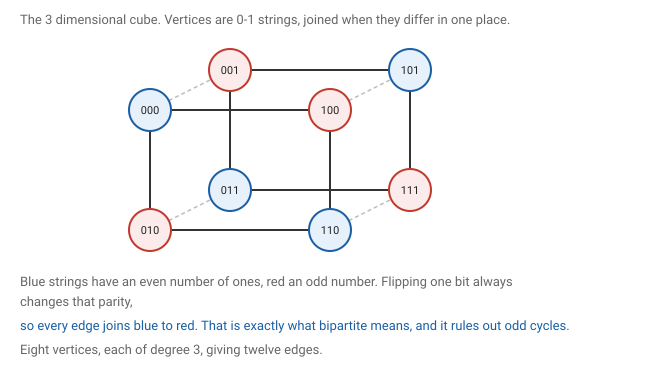
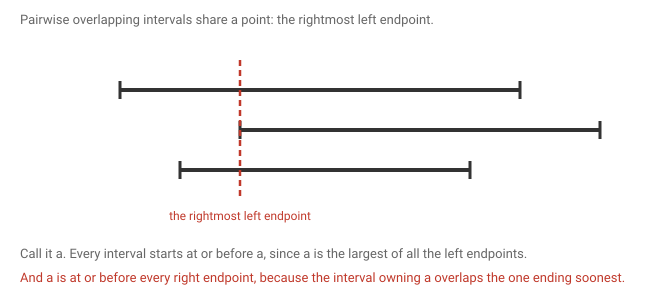

# 6 · 2026-07-31 — Tutorial 1

Previous: [[2026-07-29 Matchings 2 — Berge and König]] · Hub: [[Graph Theory]] · Next: [[2026-08-10 Matchings in Bipartite Graphs]]

Six problems. Each one states what is given and what has to be shown before the argument starts.

## How much this matters

Overall this note is core, and arguably the highest value in the vault. These questions came off your own tutorial sheet, which makes them the most likely of anything to reappear in some form.

Know cold: [[Tutorial 1#Question 3, an induced path of length two|Q3]], [[Tutorial 1#Question 5, shortest paths are induced|Q5]] and [[Tutorial 1#Question 6, intervals with pairwise overlaps|Q6]]. All three are a few lines each, and Q3 and Q5 are really one idea used twice.

Know the argument: [[Tutorial 1#Question 2, girth five forces size|Q2]] and [[Tutorial 1#Question 4, two longest paths meet|Q4]]. Both are short once you see the counting, and both are the kind of thing that gets set again with different numbers.

Know the facts: [[Tutorial 1#Question 1, the hypercube|Q1]]. Memorise the invariants rather than rederiving them, and remember the planarity test needs the bipartite bound.

If you do one section of revision, do this one.

## Notation used throughout

Qn is the n dimensional hypercube. The girth of a graph is the length of its shortest cycle. An induced path is one with no chords, meaning the subgraph on its vertices is exactly the path. A graph is k regular when every vertex has degree exactly k, and δ(G) is the minimum degree. Finally d(u,v) is the length of a shortest path between u and v.

## Question 1, the hypercube

The vertices of Qn are all strings of n zeros and ones, and two strings are joined when they differ in exactly one position.

### How many vertices

Each of the n positions is independently a zero or a one, so there are 2 to the power n strings.

### How many edges

From any string you reach a neighbour by flipping one position, and flipping different positions gives different neighbours, so every vertex has degree exactly n. The cube is n regular.

Summing degrees gives twice the edge count, so 2 to the power n times n equals twice the number of edges, and the edge count is n times 2 to the power n−1. For Q3 that is 3 times 4, which is 12, matching the picture.

### The girth

First, Qn has no odd cycle at all, which follows from the next part. Second, it has a four cycle as soon as n is at least 2: wiggle the last two positions through 00, 01, 11, 10 and back to 00, changing one bit at each step. So the girth is 4.

### Why it is bipartite

Colour each string by whether its number of ones is even or odd. Flipping one bit changes that count by exactly one, so it always changes the colour. Every edge therefore joins an even string to an odd one, and no edge lies inside either colour class. That is the definition of bipartite, and by the result in [[2026-07-24 Preliminaries]] it means all cycles are even.

### Why it has a Hamiltonian cycle

Induct on n. For n equal to 2 the cube is a four cycle, which is already Hamiltonian.

Suppose Qn has a Hamiltonian cycle. Delete one of its edges to get a Hamiltonian path running from some a to some b. Now Q(n+1) consists of two copies of Qn, those strings beginning with 0 and those beginning with 1, with each string joined to its twin in the other copy. Traverse the path in the 0 copy from 0a to 0b, cross the twin edge to 1b, traverse the path backwards in the 1 copy to 1a, then cross back to 0a. Every vertex of both copies is used exactly once, so this is a Hamiltonian cycle.

A consequence is that the circumference, the length of the longest cycle, is 2 to the power n, which is as large as possible.

### Is Q4 planar

No. The general planarity bound says a simple planar graph on n vertices has at most 3n − 6 edges. For Q4 that gives 42, and Q4 has 32 edges, so the general test says nothing.

But Q4 is bipartite, and a bipartite planar graph has at most 2n − 4 edges. The reason is Euler's formula. In a plane graph the vertex count minus the edge count plus the face count equals 2. Bipartite means no triangles, so every face is bounded by at least four edges, and each edge borders at most two faces, giving four times the face count at most twice the edge count. Substituting into Euler's formula gives the bound.

For Q4 that bound is 28, and 32 exceeds it, so Q4 is not planar.

Worth noting Q3 sits exactly at its limit, with 8 vertices and 12 edges against a bound of 12, and it is planar.

The habit to build is to check bipartiteness first. For Q4 and for K3,3 the general bound is too weak and only the bipartite one works.

## Question 2, girth five forces size

Given: G is k regular with girth at least 5.
To show: G has at least k squared plus 1 vertices.

Girth at least 5 means no cycle of length 3 or 4, and both of those get used.

Fix any vertex v and count outward in three disjoint groups.

There is v itself, which is one vertex. There are its neighbours, of which there are exactly k. Then for each neighbour u there are its other neighbours, meaning those other than v.

Each of those sets has at least k−1 members, since u has degree k, one edge goes back to v, and none of its other edges can go to another neighbour of v, because that would make a triangle.

Those sets are pairwise disjoint, because if two neighbours of v shared an outer neighbour w you would get the four cycle v, u1, w, u2, v.

Adding the three groups gives at least 1 plus k plus k times k−1, which is k squared plus 1.

The bound is tight. The Petersen graph is 3 regular with girth 5 and has exactly 10 vertices, which is 3 squared plus 1.

This is the same count as question 8 of [[Assignment 1]], read the other way round. There you fix the number of vertices and the degree is capped; here you fix the degree and the vertex count is forced up.

## Question 3, an induced path of length two

Given: G is simple, connected, and not complete.
To show: G contains three vertices a, b, c with edges ab and bc but no edge ac.

Since G is not complete, some pair of vertices u and w has no edge between them. Since G is connected, some path joins them, and that path has length at least 2 because length 1 would be the missing edge.

Take a shortest u to w path and look at its first three vertices. The first two are joined and so are the second and third, since they are consecutive on a path. The first and third are not joined, because if they were you could skip the middle vertex and get a shorter path, contradicting that this one was shortest.

Both hypotheses earn their keep. Not complete supplies the missing edge, and connected guarantees a path between those two vertices exists at all.

## Question 4, two longest paths meet

Given: G is connected, and P and Q are both longest paths.
To show: P and Q share a vertex.

One correction first. My page says the two lengths might be m and m, or m and m−1. They are always both m. Longest means maximum, and a maximum is a single number, so every longest path has exactly that length.

My page also says a connecting path between them does not exist. That is backwards. Connectivity guarantees such a path does exist, and that is precisely what creates the contradiction.

Suppose P and Q were disjoint. Since G is connected there is a path from a vertex of P to a vertex of Q, and taking a shortest such path R means its interior touches neither P nor Q. Say it runs from p on P to q on Q, and has length at least 1.

The vertex p splits P into two stretches whose lengths add to m, so the longer of them is at least half of m rounded up. The same holds for q on Q.

Now glue the longer stretch of P to R to the longer stretch of Q. That really is a path, because the two stretches are disjoint by assumption and R's interior avoids both. Its length is at least half of m rounded up, twice, plus the length of R, which is at least m plus 1.

That beats the maximum, so the assumption fails and the two paths must share a vertex.

Connectivity is essential. Two disjoint copies of a three vertex path give two longest paths with nothing in common.

## Question 5, shortest paths are induced

Given: P is a shortest path between a and b.
To show: no edge of G joins two non consecutive vertices of P.

Suppose there were such a chord. Then instead of walking the path between its two ends you could cross the chord in a single step, and since the ends are non consecutive that stretch took at least two edges. The result is a shorter a to b path, which contradicts P being shortest.

Questions 3 and 5 are the same observation used twice. A shortest path cannot contain a shortcut, because a shortcut is exactly what shortest forbids. Question 3 applies it to the first three vertices and question 5 to every pair.

## Question 6, intervals with pairwise overlaps

Given: finitely many closed intervals on the real line, every two of which intersect.
To show: some single point lies in all of them.

My page guesses the name as eli property. It is the Helly property, and this is its one dimensional case.

Write each interval as a left endpoint and a right endpoint. Let a be the largest of all the left endpoints and b the smallest of all the right endpoints.

First, a is at most b. Say a belongs to interval P and b to interval Q. Those two intersect by hypothesis, so some point t lies in both, which means a is at most t and t is at most b.

Now take any interval. Its left endpoint is at most a, because a is the largest left endpoint. And a is at most b, which is at most that interval's right endpoint, because b is the smallest right endpoint. So a lies inside it.

Since this holds for every interval, the point a lies in all of them.

Only one carefully chosen pair was ever used, in the step showing a is at most b. That is the whole role of the pairwise hypothesis.

Closedness matters. With open intervals and infinitely many of them the result fails, since the intervals from 0 to 1 over k for k running through the positive integers pairwise intersect but share no point.

The tree note on my page points at a generalisation. Subtrees of a tree also have the Helly property, and that fact underpins chordal graphs later in the course.

## What to remember

The hypercube is bipartite by the parity of its number of ones, and that single observation gives its girth and rules out odd cycles. Checking planarity means checking bipartiteness first, because the sharper bound is often the only one that bites. Girth conditions force size, by making balls around a vertex grow without collisions. Shortest forbids shortcuts, which settles two of these questions at once. Extremal choices, the longest path and the rightmost left endpoint, do the work in the other two.

## Still unclear

- My Q4 note guessed the lengths might differ. They are always equal.
- My Q4 note says the connecting path does not exist. It does, and that is the point.
- Helly, not eli.
- The subtree version of Helly comes back with chordal graphs.
